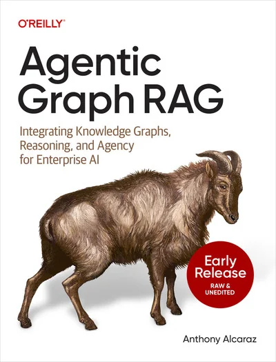

# aidesign.guide-bookmarks-resources

> Synthesis: TODO

The AI design library home page
Guides
Contact
Dashboard
Dashboard
Search...
Navigation
Bookmarks
Resources
Search...
⌘K
The Design System Guide
Newsletter
Overview
Introduction
About me
Prompting
Basics
Research
Prototyping
Documentation
Component Metadata
Design tokens
Bookmarks
Agents
Figma
Prompting
Resources
Tools
Videos
Guides
Install Cursor
Figma MCP
Key Terms
On this page
Books
General
Bookmarks
Resources
Books
Agentic Graph RAG (O’Reilly)
LLM Engineer's Handbook (Amazon)
General
2025 State of AI Report: The Builder’s Playbook
Replit Community Hub
Complete Guide to Building and Deploying Your First App with Replit
Prompting
Previous
Tools
Next
Assistant
Responses are generated using AI and may contain mistakes.

<figcaption>Figure 1. Credit: [aidesign.guide](https://mintlify.s3.us-west-1.amazonaws.com/dsg/images/download.jpeg), License: internal-copy</figcaption>
