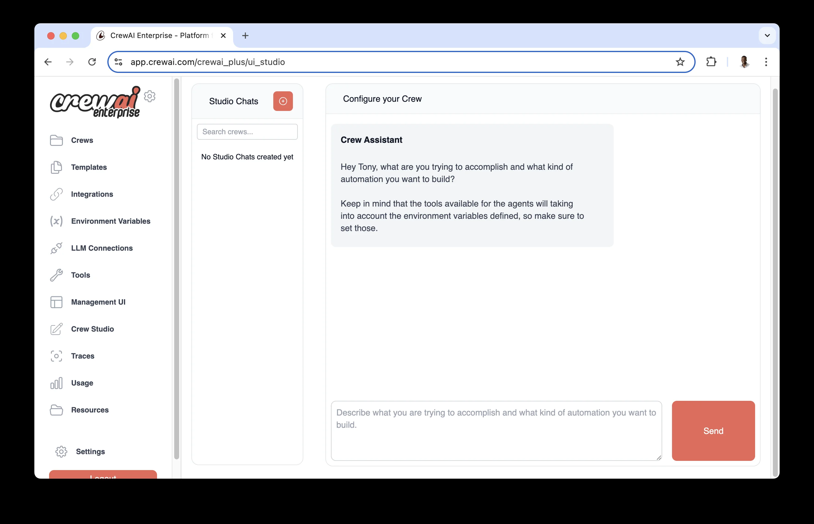

# docs.crewai.com-en-concepts-agents

> Synthesis: TODO

Detailed guide on creating and managing agents within the CrewAI framework.
Agent is an autonomous unit that can:
Researcher agent might excel at gathering and analyzing information, while a
Writer agent might be better at creating content.
|Attribute
|Parameter
|Type
|Description
Role
role
str
|Defines the agent’s function and expertise within the crew.
Goal
goal
str
|The individual objective that guides the agent’s decision-making.
Backstory
backstory
str
|Provides context and personality to the agent, enriching interactions.
LLM (optional)
llm
Union[str, LLM, Any]
|Language model that powers the agent. Defaults to the model specified in
OPENAI_MODEL_NAME or “gpt-4”.
Tools (optional)
tools
List[BaseTool]
|Capabilities or functions available to the agent. Defaults to an empty list.
Function Calling LLM (optional)
function_calling_llm
Optional[Any]
|Language model for tool calling, overrides crew’s LLM if specified.
Max Iterations (optional)
max_iter
int
|Maximum iterations before the agent must provide its best answer. Default is 20.
Max RPM (optional)
max_rpm
Optional[int]
|Maximum requests per minute to avoid rate limits.
Max Execution Time (optional)
max_execution_time
Optional[int]
|Maximum time (in seconds) for task execution.
Verbose (optional)
verbose
bool
|Enable detailed execution logs for debugging. Default is False.
Allow Delegation (optional)
allow_delegation
bool
|Allow the agent to delegate tasks to other agents. Default is False.
Step Callback (optional)
step_callback
Optional[Any]
|Function called after each agent step, overrides crew callback.
Cache (optional)
cache
bool
|Enable caching for tool usage. Default is True.
System Template (optional)
system_template
Optional[str]
|Custom system prompt template for the agent.
Prompt Template (optional)
prompt_template
Optional[str]
|Custom prompt template for the agent.
Response Template (optional)
response_template
Optional[str]
|Custom response template for the agent.
Allow Code Execution (optional)
allow_code_execution
Optional[bool]
|Enable code execution for the agent. Default is False.
Max Retry Limit (optional)
max_retry_limit
int
|Maximum number of retries when an error occurs. Default is 2.
Respect Context Window (optional)
respect_context_window
bool
|Keep messages under context window size by summarizing. Default is True.
Code Execution Mode (optional)
code_execution_mode
Literal["safe", "unsafe"]
|Mode for code execution: ‘safe’ (using Docker) or ‘unsafe’ (direct). Default is ‘safe’.
Multimodal (optional)
multimodal
bool
|Whether the agent supports multimodal capabilities. Default is False.
Inject Date (optional)
inject_date
bool
|Whether to automatically inject the current date into tasks. Default is False.
Date Format (optional)
date_format
str
|Format string for date when inject_date is enabled. Default is “%Y-%m-%d” (ISO format).
Reasoning (optional)
reasoning
bool
|Whether the agent should reflect and create a plan before executing a task. Default is False.
Max Reasoning Attempts (optional)
max_reasoning_attempts
Optional[int]
|Maximum number of reasoning attempts before executing the task. If None, will try until ready.
Embedder (optional)
embedder
Optional[Dict[str, Any]]
|Configuration for the embedder used by the agent.
Knowledge Sources (optional)
knowledge_sources
Optional[List[BaseKnowledgeSource]]
|Knowledge sources available to the agent.
Use System Prompt (optional)
use_system_prompt
Optional[bool]
|Whether to use system prompt (for o1 model support). Default is True.
src/latest_ai_development/config/agents.yaml file and modify the template to match your requirements.
\${topic}) will be replaced with values from your inputs when running the crew:
crew.kickoff(inputs={'topic': 'AI Agents'})
# src/latest_ai_development/config/agents.yaml
researcher:
role: >
\${topic} Senior Data Researcher
goal: >
Uncover cutting-edge developments in \${topic}
backstory: >
You're a seasoned researcher with a knack for uncovering the latest
developments in \${topic}. Known for your ability to find the most relevant
information and present it in a clear and concise manner.
reporting_analyst:
role: >
\${topic} Reporting Analyst
goal: >
Create detailed reports based on \${topic} data analysis and research findings
backstory: >
You're a meticulous analyst with a keen eye for detail. You're known for
your ability to turn complex data into clear and concise reports, making
it easy for others to understand and act on the information you provide.
CrewBase:
# src/latest_ai_development/crew.py
from crewai import Agent, Crew, Process
from crewai.project import CrewBase, agent, crew
from crewai_tools import SerperDevTool
@CrewBase
class LatestAiDevelopmentCrew():
"""LatestAiDevelopment crew"""
agents_config = "config/agents.yaml"
@agent
def researcher(self) -> Agent:
return Agent(
config=self.agents_config['researcher'], # type: ignore[index]
verbose=True,
tools=[SerperDevTool()]
)
@agent
def reporting_analyst(self) -> Agent:
return Agent(
config=self.agents_config['reporting_analyst'], # type: ignore[index]
verbose=True
)
agents.yaml) should match the method names in your Python code.
Agent class. Here’s a comprehensive example showing all available parameters:
from crewai import Agent
from crewai_tools import SerperDevTool
# Create an agent with all available parameters
agent = Agent(
role="Senior Data Scientist",
goal="Analyze and interpret complex datasets to provide actionable insights",
backstory="With over 10 years of experience in data science and machine learning, "
"you excel at finding patterns in complex datasets.",
llm="gpt-4", # Default: OPENAI_MODEL_NAME or "gpt-4"
function_calling_llm=None, # Optional: Separate LLM for tool calling
verbose=False, # Default: False
allow_delegation=False, # Default: False
max_iter=20, # Default: 20 iterations
max_rpm=None, # Optional: Rate limit for API calls
max_execution_time=None, # Optional: Maximum execution time in seconds
max_retry_limit=2, # Default: 2 retries on error
allow_code_execution=False, # Default: False
code_execution_mode="safe", # Default: "safe" (options: "safe", "unsafe")
respect_context_window=True, # Default: True
use_system_prompt=True, # Default: True
multimodal=False, # Default: False
inject_date=False, # Default: False
date_format="%Y-%m-%d", # Default: ISO format
reasoning=False, # Default: False
max_reasoning_attempts=None, # Default: None
tools=[SerperDevTool()], # Optional: List of tools
knowledge_sources=None, # Optional: List of knowledge sources
embedder=None, # Optional: Custom embedder configuration
system_template=None, # Optional: Custom system prompt template
prompt_template=None, # Optional: Custom prompt template
response_template=None, # Optional: Custom response template
step_callback=None, # Optional: Callback function for monitoring
)
research_agent = Agent(
role="Research Analyst",
goal="Find and summarize information about specific topics",
backstory="You are an experienced researcher with attention to detail",
tools=[SerperDevTool()],
verbose=True # Enable logging for debugging
)
dev_agent = Agent(
role="Senior Python Developer",
goal="Write and debug Python code",
backstory="Expert Python developer with 10 years of experience",
allow_code_execution=True,
code_execution_mode="safe", # Uses Docker for safety
max_execution_time=300, # 5-minute timeout
max_retry_limit=3 # More retries for complex code tasks
)
analysis_agent = Agent(
role="Data Analyst",
goal="Perform deep analysis of large datasets",
backstory="Specialized in big data analysis and pattern recognition",
memory=True,
respect_context_window=True,
max_rpm=10, # Limit API calls
function_calling_llm="gpt-4o-mini" # Cheaper model for tool calls
)
custom_agent = Agent(
role="Customer Service Representative",
goal="Assist customers with their inquiries",
backstory="Experienced in customer support with a focus on satisfaction",
system_template="""<|start_header_id|>system<|end_header_id|>
\${ .System }<|eot_id|>""",
prompt_template="""<|start_header_id|>user<|end_header_id|>
\${ .Prompt }<|eot_id|>""",
response_template="""<|start_header_id|>assistant<|end_header_id|>
\${ .Response }<|eot_id|>""",
)
strategic_agent = Agent(
role="Market Analyst",
goal="Track market movements with precise date references and strategic planning",
backstory="Expert in time-sensitive financial analysis and strategic reporting",
inject_date=True, # Automatically inject current date into tasks
date_format="%B %d, %Y", # Format as "May 21, 2025"
reasoning=True, # Enable strategic planning
max_reasoning_attempts=2, # Limit planning iterations
verbose=True
)
reasoning_agent = Agent(
role="Strategic Planner",
goal="Analyze complex problems and create detailed execution plans",
backstory="Expert strategic planner who methodically breaks down complex challenges",
reasoning=True, # Enable reasoning and planning
max_reasoning_attempts=3, # Limit reasoning attempts
max_iter=30, # Allow more iterations for complex planning
verbose=True
)
multimodal_agent = Agent(
role="Visual Content Analyst",
goal="Analyze and process both text and visual content",
backstory="Specialized in multimodal analysis combining text and image understanding",
multimodal=True, # Enable multimodal capabilities
verbose=True
)
role,
goal, and
backstory are required and shape the agent’s behavior
llm determines the language model used (default: OpenAI’s GPT-4)
memory: Enable to maintain conversation history
respect_context_window: Prevents token limit issues
knowledge_sources: Add domain-specific knowledge bases
max_iter: Maximum attempts before giving best answer
max_execution_time: Timeout in seconds
max_rpm: Rate limiting for API calls
max_retry_limit: Retries on error
allow_code_execution: Must be True to run code
code_execution_mode:
"safe": Uses Docker (recommended for production)
"unsafe": Direct execution (use only in trusted environments)
multimodal: Enable multimodal capabilities for processing text and visual content
reasoning: Enable agent to reflect and create plans before executing tasks
inject_date: Automatically inject current date into task descriptions
system_template: Defines agent’s core behavior
prompt_template: Structures input format
response_template: Formats agent responses
system_template and
prompt_template are defined. The
response_template is optional but recommended for consistent output formatting.
\${role},
\${goal}, and
\${backstory} in your templates. These will be automatically populated during execution.
from crewai import Agent
from crewai_tools import SerperDevTool, WikipediaTools
# Create tools
search_tool = SerperDevTool()
wiki_tool = WikipediaTools()
# Add tools to agent
researcher = Agent(
role="AI Technology Researcher",
goal="Research the latest AI developments",
tools=[search_tool, wiki_tool],
verbose=True
)
from crewai import Agent
analyst = Agent(
role="Data Analyst",
goal="Analyze and remember complex data patterns",
memory=True, # Enable memory
verbose=True
)
memory is enabled, the agent will maintain context across multiple interactions, improving its ability to handle complex, multi-step tasks.
respect_context_window parameter.
respect_context_window=True)
respect_context_window=False)
respect_context_window=True)
# Agent with automatic context management (default)
smart_agent = Agent(
role="Research Analyst",
goal="Analyze large documents and datasets",
backstory="Expert at processing extensive information",
respect_context_window=True, # 🔑 Default: auto-handle context limits
verbose=True
)
"Context length exceeded. Summarizing content to fit the model context window."
respect_context_window=False)
# Agent with strict context limits
strict_agent = Agent(
role="Legal Document Reviewer",
goal="Provide precise legal analysis without information loss",
backstory="Legal expert requiring complete context for accurate analysis",
respect_context_window=False, # ❌ Stop execution on context limit
verbose=True
)
"Context length exceeded. Consider using smaller text or RAG tools from crewai_tools."
respect_context_window=True (Default) when:
# Perfect for document processing
document_processor = Agent(
role="Document Analyst",
goal="Extract insights from large research papers",
backstory="Expert at analyzing extensive documentation",
respect_context_window=True, # Handle large documents gracefully
max_iter=50, # Allow more iterations for complex analysis
verbose=True
)
respect_context_window=False when:
# Perfect for precision tasks
precision_agent = Agent(
role="Code Security Auditor",
goal="Identify security vulnerabilities in code",
backstory="Security expert requiring complete code context",
respect_context_window=False, # Prefer failure over incomplete analysis
max_retry_limit=1, # Fail fast on context issues
verbose=True
)
from crewai_tools import RagTool
# Create RAG tool for large document processing
rag_tool = RagTool()
rag_agent = Agent(
role="Research Assistant",
goal="Query large knowledge bases efficiently",
backstory="Expert at using RAG tools for information retrieval",
tools=[rag_tool], # Use RAG instead of large context windows
respect_context_window=True,
verbose=True
)
# Use knowledge sources instead of large prompts
knowledge_agent = Agent(
role="Knowledge Expert",
goal="Answer questions using curated knowledge",
backstory="Expert at leveraging structured knowledge sources",
knowledge_sources=[your_knowledge_sources], # Pre-processed knowledge
respect_context_window=True,
verbose=True
)
verbose=True to see context management in action
True and
False to see which works better for your use case
# Quick fix: Enable automatic handling
agent.respect_context_window = True
# Better solution: Use RAG tools for large data
from crewai_tools import RagTool
agent.tools = [RagTool()]
# Alternative: Break tasks into smaller pieces
# Or use knowledge sources instead of large prompts
# Disable auto-summarization and use RAG instead
agent = Agent(
role="Detailed Analyst",
goal="Maintain complete information accuracy",
backstory="Expert requiring full context",
respect_context_window=False, # No summarization
tools=[RagTool()], # Use RAG for large data
verbose=True
)
respect_context_window to your preferred behavior and CrewAI handles the rest!
kickoff()
kickoff() method. This provides a simpler way to interact with an agent when you don’t need the full crew orchestration capabilities.
kickoff() Works
kickoff() method allows you to send messages directly to an agent and get a response, similar to how you would interact with an LLM but with all the agent’s capabilities (tools, reasoning, etc.).
from crewai import Agent
from crewai_tools import SerperDevTool
# Create an agent
researcher = Agent(
role="AI Technology Researcher",
goal="Research the latest AI developments",
tools=[SerperDevTool()],
verbose=True
)
# Use kickoff() to interact directly with the agent
result = researcher.kickoff("What are the latest developments in language models?")
# Access the raw response
print(result.raw)
|Parameter
|Type
|Description
messages
Union[str, List[Dict[str, str]]]
|Either a string query or a list of message dictionaries with role/content
response_format
Optional[Type[Any]]
|Optional Pydantic model for structured output
LiteAgentOutput object with the following properties:
raw: String containing the raw output text
pydantic: Parsed Pydantic model (if a
response_format was provided)
agent_role: Role of the agent that produced the output
usage_metrics: Token usage metrics for the execution
response_format:
from pydantic import BaseModel
from typing import List
class ResearchFindings(BaseModel):
main_points: List[str]
key_technologies: List[str]
future_predictions: str
# Get structured output
result = researcher.kickoff(
"Summarize the latest developments in AI for 2025",
response_format=ResearchFindings
)
# Access structured data
print(result.pydantic.main_points)
print(result.pydantic.future_predictions)
messages = [
\{"role": "user", "content": "I need information about large language models"\},
\{"role": "assistant", "content": "I'd be happy to help with that! What specifically would you like to know?"\},
\{"role": "user", "content": "What are the latest developments in 2025?"\}
]
result = researcher.kickoff(messages)
kickoff_async() with the same parameters:
import asyncio
async def main():
result = await researcher.kickoff_async("What are the latest developments in AI?")
print(result.raw)
asyncio.run(main())
kickoff() method uses a
LiteAgent internally, which provides a simpler execution flow while preserving all of the agent’s configuration (role, goal, backstory, tools, etc.).
allow_code_execution, be cautious with user input and always validate it
code_execution_mode: "safe" (Docker) in production environments
max_execution_time limits to prevent infinite loops
respect_context_window: true to prevent token limit issues
max_rpm to avoid rate limiting
cache: true to improve performance for repetitive tasks
max_iter and
max_retry_limit based on task complexity
knowledge_sources for domain-specific information
embedder when using custom embedding models
system_template,
prompt_template,
response_template) for fine-grained control over agent behavior
reasoning: true for agents that need to plan and reflect before executing complex tasks
max_reasoning_attempts to control planning iterations (None for unlimited attempts)
inject_date: true to provide agents with current date awareness for time-sensitive tasks
date_format using standard Python datetime format codes
multimodal: true for agents that need to process both text and visual content
allow_delegation: true when agents need to work together
step_callback to monitor and log agent interactions
llm for complex reasoning
function_calling_llm for efficient tool usage
inject_date: true to provide agents with current date awareness for time-sensitive tasks
date_format using standard Python datetime format codes
reasoning: true for complex tasks that benefit from upfront planning and reflection
use_system_prompt: false for older models that don’t support system messages
llm supports the features you need (like function calling)
max_rpm
respect_context_window
Was this page helpful?

<figcaption>Figure 1. Credit: [docs.crewai.com](https://mintlify.s3.us-west-1.amazonaws.com/crewai/images/crew_only_logo.png), License: internal-copy</figcaption>

<figcaption>Figure 2. Credit: [docs.crewai.com](https://mintlify.s3.us-west-1.amazonaws.com/crewai/images/crew_only_logo.png), License: internal-copy</figcaption>

<figcaption>Figure 3. Credit: [docs.crewai.com](https://mintlify.s3.us-west-1.amazonaws.com/crewai/images/enterprise/crew-studio-interface.png), License: internal-copy</figcaption>
