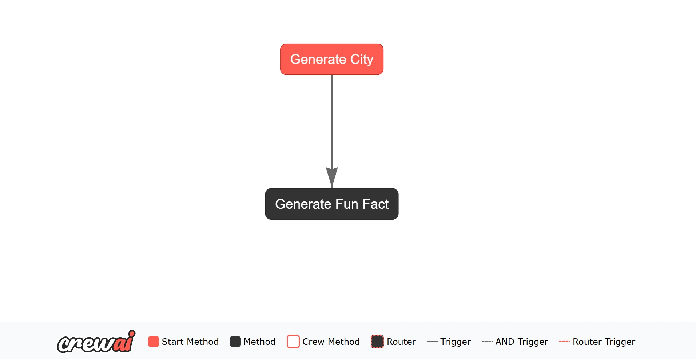
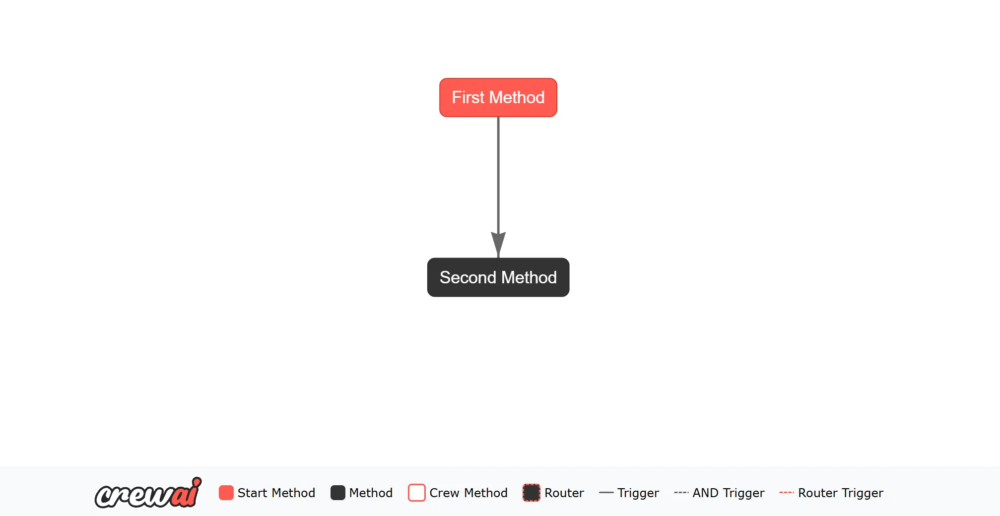
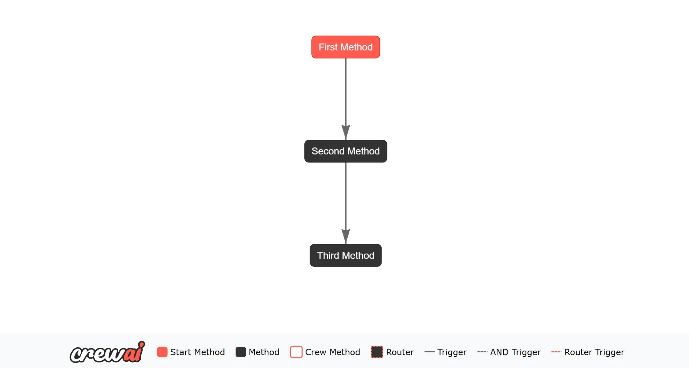
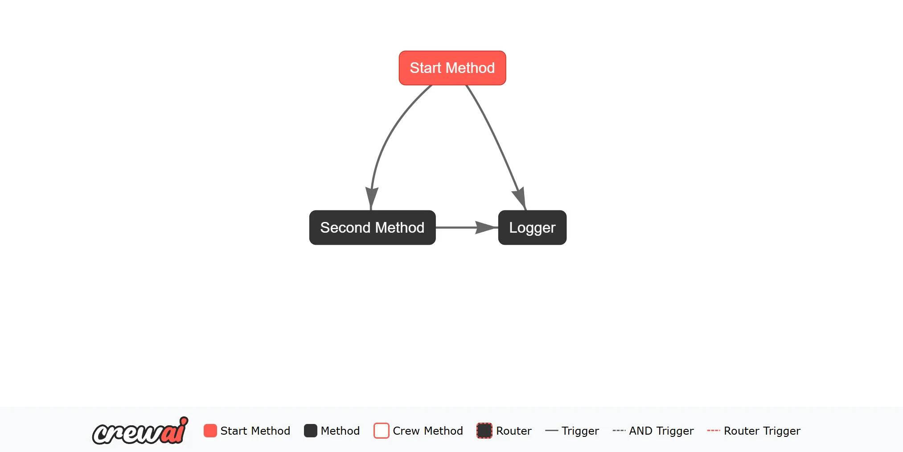
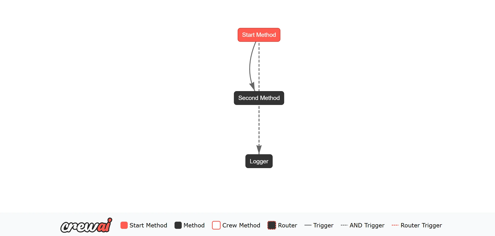
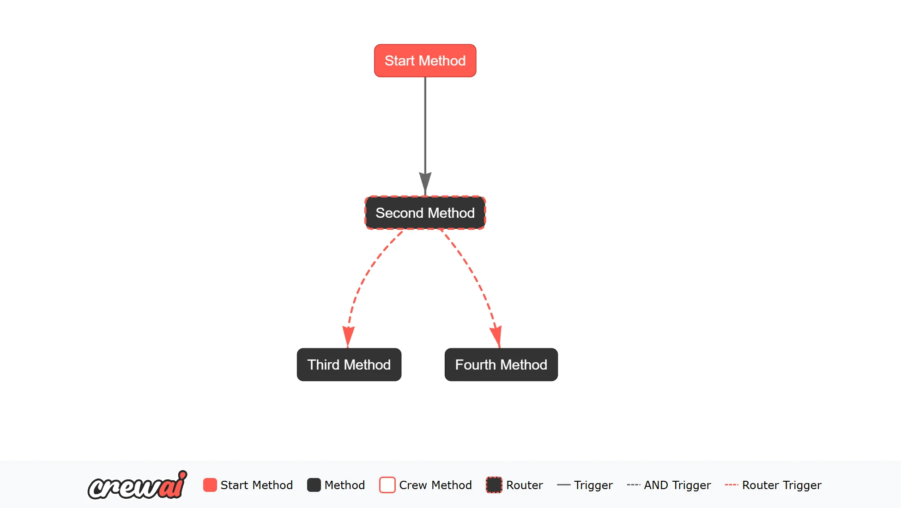
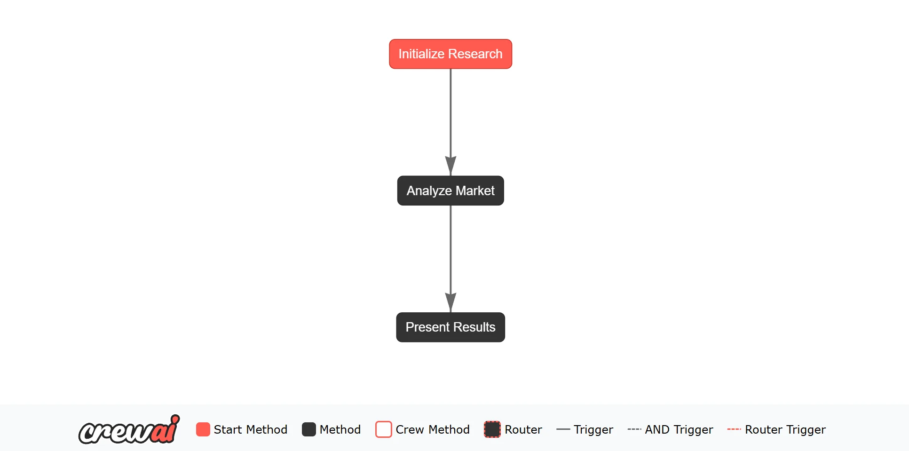

# docs.crewai.com-en-concepts-flows

> Synthesis: TODO

Learn how to create and manage AI workflows using CrewAI Flows.
from crewai.flow.flow import Flow, listen, start
from dotenv import load_dotenv
from litellm import completion
class ExampleFlow(Flow):
model = "gpt-4o-mini"
@start()
def generate_city(self):
print("Starting flow")
# Each flow state automatically gets a unique ID
print(f"Flow State ID: {self.state['id']}")
response = completion(
model=self.model,
messages=[
{
"role": "user",
"content": "Return the name of a random city in the world.",
},
],
)
random_city = response["choices"][0]["message"]["content"]
# Store the city in our state
self.state["city"] = random_city
print(f"Random City: {random_city}")
return random_city
@listen(generate_city)
def generate_fun_fact(self, random_city):
response = completion(
model=self.model,
messages=[
{
"role": "user",
"content": f"Tell me a fun fact about {random_city}",
},
],
)
fun_fact = response["choices"][0]["message"]["content"]
# Store the fun fact in our state
self.state["fun_fact"] = fun_fact
return fun_fact
flow = ExampleFlow()
flow.plot()
result = flow.kickoff()
print(f"Generated fun fact: {result}")
generate_city and
generate_fun_fact. The
generate_city task is the starting point of the Flow, and the
generate_fun_fact task listens for the output of the
generate_city task.
Each Flow instance automatically receives a unique identifier (UUID) in its state, which helps track and manage flow executions. The state can also store additional data (like the generated city and fun fact) that persists throughout the flow’s execution.
When you run the Flow, it will:
.env file to store your
OPENAI_API_KEY. This key is necessary for authenticating requests to the OpenAI API.
@start() decorator is used to mark a method as the starting point of a Flow. When a Flow is started, all the methods decorated with
@start() are executed in parallel. You can have multiple start methods in a Flow, and they will all be executed when the Flow is started.
@listen() decorator is used to mark a method as a listener for the output of another task in the Flow. The method decorated with
@listen() will be executed when the specified task emits an output. The method can access the output of the task it is listening to as an argument.
@listen() decorator can be used in several ways:
@listen("generate_city")
def generate_fun_fact(self, random_city):
# Implementation
@listen(generate_city)
def generate_fun_fact(self, random_city):
# Implementation
kickoff() method returns the output of this final method.
Here’s how you can access the final output:
from crewai.flow.flow import Flow, listen, start
class OutputExampleFlow(Flow):
@start()
def first_method(self):
return "Output from first_method"
@listen(first_method)
def second_method(self, first_output):
return f"Second method received: {first_output}"
flow = OutputExampleFlow()
flow.plot("my_flow_plot")
final_output = flow.kickoff()
print("---- Final Output ----")
print(final_output)
second_method is the last method to complete, so its output will be the final output of the Flow.
The
kickoff() method will return the final output, which is then printed to the console. The
plot() method will generate the HTML file, which will help you understand the flow.
from crewai.flow.flow import Flow, listen, start
from pydantic import BaseModel
class ExampleState(BaseModel):
counter: int = 0
message: str = ""
class StateExampleFlow(Flow[ExampleState]):
@start()
def first_method(self):
self.state.message = "Hello from first_method"
self.state.counter += 1
@listen(first_method)
def second_method(self):
self.state.message += " - updated by second_method"
self.state.counter += 1
return self.state.message
flow = StateExampleFlow()
flow.plot("my_flow_plot")
final_output = flow.kickoff()
print(f"Final Output: {final_output}")
print("Final State:")
print(flow.state)
first_method and
second_method.
After the Flow has run, you can access the final state to see the updates made by these methods.
By ensuring that the final method’s output is returned and providing access to the state, CrewAI Flows make it easy to integrate the results of your AI workflows into larger applications or systems,
while also maintaining and accessing the state throughout the Flow’s execution.
state attribute of the
Flow class.
This approach offers flexibility, enabling developers to add or modify state attributes on the fly without defining a strict schema.
Even with unstructured states, CrewAI Flows automatically generates and maintains a unique identifier (UUID) for each state instance.
from crewai.flow.flow import Flow, listen, start
class UnstructuredExampleFlow(Flow):
@start()
def first_method(self):
# The state automatically includes an 'id' field
print(f"State ID: {self.state['id']}")
self.state['counter'] = 0
self.state['message'] = "Hello from structured flow"
@listen(first_method)
def second_method(self):
self.state['counter'] += 1
self.state['message'] += " - updated"
@listen(second_method)
def third_method(self):
self.state['counter'] += 1
self.state['message'] += " - updated again"
print(f"State after third_method: {self.state}")
flow = UnstructuredExampleFlow()
flow.plot("my_flow_plot")
flow.kickoff()
id field is automatically generated and preserved throughout the flow’s execution. You don’t need to manage or set it manually, and it will be maintained even when updating the state with new data.
self.state without predefined constraints.
BaseModel, developers can define the exact shape of the state, enabling better validation and auto-completion in development environments.
Each state in CrewAI Flows automatically receives a unique identifier (UUID) to help track and manage state instances. This ID is automatically generated and managed by the Flow system.
from crewai.flow.flow import Flow, listen, start
from pydantic import BaseModel
class ExampleState(BaseModel):
# Note: 'id' field is automatically added to all states
counter: int = 0
message: str = ""
class StructuredExampleFlow(Flow[ExampleState]):
@start()
def first_method(self):
# Access the auto-generated ID if needed
print(f"State ID: {self.state.id}")
self.state.message = "Hello from structured flow"
@listen(first_method)
def second_method(self):
self.state.counter += 1
self.state.message += " - updated"
@listen(second_method)
def third_method(self):
self.state.counter += 1
self.state.message += " - updated again"
print(f"State after third_method: {self.state}")
flow = StructuredExampleFlow()
flow.kickoff()
ExampleState clearly outlines the state structure, enhancing code readability and maintainability.
@persist # Using SQLiteFlowPersistence by default
class MyFlow(Flow[MyState]):
@start()
def initialize_flow(self):
# This method will automatically have its state persisted
self.state.counter = 1
print("Initialized flow. State ID:", self.state.id)
@listen(initialize_flow)
def next_step(self):
# The state (including self.state.id) is automatically reloaded
self.state.counter += 1
print("Flow state is persisted. Counter:", self.state.counter)
class AnotherFlow(Flow[dict]):
@persist # Persists only this method's state
@start()
def begin(self):
if "runs" not in self.state:
self.state["runs"] = 0
self.state["runs"] += 1
print("Method-level persisted runs:", self.state["runs"])
id field is automatically added if not present
or
or_ function in Flows allows you to listen to multiple methods and trigger the listener method when any of the specified methods emit an output.
from crewai.flow.flow import Flow, listen, or_, start
class OrExampleFlow(Flow):
@start()
def start_method(self):
return "Hello from the start method"
@listen(start_method)
def second_method(self):
return "Hello from the second method"
@listen(or_(start_method, second_method))
def logger(self, result):
print(f"Logger: {result}")
flow = OrExampleFlow()
flow.plot("my_flow_plot")
flow.kickoff()
logger method will be triggered by the output of either the
start_method or the
second_method.
The
or_ function is used to listen to multiple methods and trigger the listener method when any of the specified methods emit an output.
and
and_ function in Flows allows you to listen to multiple methods and trigger the listener method only when all the specified methods emit an output.
from crewai.flow.flow import Flow, and_, listen, start
class AndExampleFlow(Flow):
@start()
def start_method(self):
self.state["greeting"] = "Hello from the start method"
@listen(start_method)
def second_method(self):
self.state["joke"] = "What do computers eat? Microchips."
@listen(and_(start_method, second_method))
def logger(self):
print("---- Logger ----")
print(self.state)
flow = AndExampleFlow()
flow.plot()
flow.kickoff()
logger method will be triggered only when both the
start_method and the
second_method emit an output.
The
and_ function is used to listen to multiple methods and trigger the listener method only when all the specified methods emit an output.
@router() decorator in Flows allows you to define conditional routing logic based on the output of a method.
You can specify different routes based on the output of the method, allowing you to control the flow of execution dynamically.
import random
from crewai.flow.flow import Flow, listen, router, start
from pydantic import BaseModel
class ExampleState(BaseModel):
success_flag: bool = False
class RouterFlow(Flow[ExampleState]):
@start()
def start_method(self):
print("Starting the structured flow")
random_boolean = random.choice([True, False])
self.state.success_flag = random_boolean
@router(start_method)
def second_method(self):
if self.state.success_flag:
return "success"
else:
return "failed"
@listen("success")
def third_method(self):
print("Third method running")
@listen("failed")
def fourth_method(self):
print("Fourth method running")
flow = RouterFlow()
flow.plot("my_flow_plot")
flow.kickoff()
start_method generates a random boolean value and sets it in the state.
The
second_method uses the
@router() decorator to define conditional routing logic based on the value of the boolean.
If the boolean is
True, the method returns
"success", and if it is
False, the method returns
"failed".
The
third_method and
fourth_method listen to the output of the
second_method and execute based on the returned value.
When you run this Flow, the output will change based on the random boolean value generated by the
start_method.
import asyncio
from typing import Any, Dict, List
from crewai_tools import SerperDevTool
from pydantic import BaseModel, Field
from crewai.agent import Agent
from crewai.flow.flow import Flow, listen, start
# Define a structured output format
class MarketAnalysis(BaseModel):
key_trends: List[str] = Field(description="List of identified market trends")
market_size: str = Field(description="Estimated market size")
competitors: List[str] = Field(description="Major competitors in the space")
# Define flow state
class MarketResearchState(BaseModel):
product: str = ""
analysis: MarketAnalysis | None = None
# Create a flow class
class MarketResearchFlow(Flow[MarketResearchState]):
@start()
def initialize_research(self) -> Dict[str, Any]:
print(f"Starting market research for {self.state.product}")
return {"product": self.state.product}
@listen(initialize_research)
async def analyze_market(self) -> Dict[str, Any]:
# Create an Agent for market research
analyst = Agent(
role="Market Research Analyst",
goal=f"Analyze the market for {self.state.product}",
backstory="You are an experienced market analyst with expertise in "
"identifying market trends and opportunities.",
tools=[SerperDevTool()],
verbose=True,
)
# Define the research query
query = f"""
Research the market for {self.state.product}. Include:
1. Key market trends
2. Market size
3. Major competitors
Format your response according to the specified structure.
"""
# Execute the analysis with structured output format
result = await analyst.kickoff_async(query, response_format=MarketAnalysis)
if result.pydantic:
print("result", result.pydantic)
else:
print("result", result)
# Return the analysis to update the state
return {"analysis": result.pydantic}
@listen(analyze_market)
def present_results(self, analysis) -> None:
print("\nMarket Analysis Results")
print("=====================")
if isinstance(analysis, dict):
# If we got a dict with 'analysis' key, extract the actual analysis object
market_analysis = analysis.get("analysis")
else:
market_analysis = analysis
if market_analysis and isinstance(market_analysis, MarketAnalysis):
print("\nKey Market Trends:")
for trend in market_analysis.key_trends:
print(f"- {trend}")
print(f"\nMarket Size: {market_analysis.market_size}")
print("\nMajor Competitors:")
for competitor in market_analysis.competitors:
print(f"- {competitor}")
else:
print("No structured analysis data available.")
print("Raw analysis:", analysis)
# Usage example
async def run_flow():
flow = MarketResearchFlow()
flow.plot("MarketResearchFlowPlot")
result = await flow.kickoff_async(inputs={"product": "AI-powered chatbots"})
return result
# Run the flow
if __name__ == "__main__":
asyncio.run(run_flow())
MarketAnalysis) ensures type safety and structured data throughout the flow.
MarketResearchState) maintains context between steps and stores both inputs and outputs.
WebsiteSearchTool) to enhance their capabilities.
crewai create flow name_of_flow
poem_crew that is already working. You can use this crew as a template by copying, pasting, and editing it to create other crews.
crewai create flow name_of_flow command, you will see a folder structure similar to the following:
|Directory/File
|Description
name_of_flow/
|Root directory for the flow.
|├──
crews/
|Contains directories for specific crews.
|│ └──
poem_crew/
|Directory for the “poem_crew” with its configurations and scripts.
|│ ├──
config/
|Configuration files directory for the “poem_crew”.
|│ │ ├──
agents.yaml
|YAML file defining the agents for “poem_crew”.
|│ │ └──
tasks.yaml
|YAML file defining the tasks for “poem_crew”.
|│ ├──
poem_crew.py
|Script for “poem_crew” functionality.
|├──
tools/
|Directory for additional tools used in the flow.
|│ └──
custom_tool.py
|Custom tool implementation.
|├──
main.py
|Main script for running the flow.
|├──
README.md
|Project description and instructions.
|├──
pyproject.toml
|Configuration file for project dependencies and settings.
|└──
.gitignore
|Specifies files and directories to ignore in version control.
crews folder, you can define multiple crews. Each crew will have its own folder containing configuration files and the crew definition file. For example, the
poem_crew folder contains:
config/agents.yaml: Defines the agents for the crew.
config/tasks.yaml: Defines the tasks for the crew.
poem_crew.py: Contains the crew definition, including agents, tasks, and the crew itself.
poem_crew to create other crews.
main.py
main.py file is where you create your flow and connect the crews together. You can define your flow by using the
Flow class and the decorators
@start and
@listen to specify the flow of execution.
Here’s an example of how you can connect the
poem_crew in the
main.py file:
#!/usr/bin/env python
from random import randint
from pydantic import BaseModel
from crewai.flow.flow import Flow, listen, start
from .crews.poem_crew.poem_crew import PoemCrew
class PoemState(BaseModel):
sentence_count: int = 1
poem: str = ""
class PoemFlow(Flow[PoemState]):
@start()
def generate_sentence_count(self):
print("Generating sentence count")
self.state.sentence_count = randint(1, 5)
@listen(generate_sentence_count)
def generate_poem(self):
print("Generating poem")
result = PoemCrew().crew().kickoff(inputs={"sentence_count": self.state.sentence_count})
print("Poem generated", result.raw)
self.state.poem = result.raw
@listen(generate_poem)
def save_poem(self):
print("Saving poem")
with open("poem.txt", "w") as f:
f.write(self.state.poem)
def kickoff():
poem_flow = PoemFlow()
poem_flow.kickoff()
def plot():
poem_flow = PoemFlow()
poem_flow.plot("PoemFlowPlot")
if __name__ == "__main__":
kickoff()
plot()
PoemFlow class defines a flow that generates a sentence count, uses the
PoemCrew to generate a poem, and then saves the poem to a file. The flow is kicked off by calling the
kickoff() method. The PoemFlowPlot will be generated by
plot() method.
crewai install
source .venv/bin/activate
crewai flow kickoff
uv run kickoff
plot() Method
plot() method on your flow object. This method will create an HTML file containing the interactive plot of your flow.
# Assuming you have a flow instance
flow.plot("my_flow_plot")
my_flow_plot.html in your current directory. You can open this file in a web browser to view the interactive plot.
crewai flow plot
plot() method. The file will be saved in your project directory, and you can open it in a web browser to explore the flow.
plot() method or the command line, generating plots will provide you with a visual representation of your workflows, aiding in both development and presentation.
kickoff() method:
flow = ExampleFlow()
result = flow.kickoff()
crewai run command:
crewai run
type = "flow" setting in your pyproject.toml) and runs it accordingly. This is the recommended way to run flows from the command line.
For backward compatibility, you can also use:
crewai flow kickoff
crewai run command is now the preferred method as it works for both crews and flows.

<figcaption>Figure 1. Credit: [docs.crewai.com](https://mintlify.s3.us-west-1.amazonaws.com/crewai/images/crew_only_logo.png), License: internal-copy</figcaption>

<figcaption>Figure 2. Credit: [docs.crewai.com](https://mintlify.s3.us-west-1.amazonaws.com/crewai/images/crew_only_logo.png), License: internal-copy</figcaption>

<figcaption>Figure 3. Credit: [docs.crewai.com](https://mintlify.s3.us-west-1.amazonaws.com/crewai/images/crewai-flow-1.png), License: internal-copy</figcaption>

<figcaption>Figure 4. Credit: [docs.crewai.com](https://mintlify.s3.us-west-1.amazonaws.com/crewai/images/crewai-flow-2.png), License: internal-copy</figcaption>

<figcaption>Figure 5. Credit: [docs.crewai.com](https://mintlify.s3.us-west-1.amazonaws.com/crewai/images/crewai-flow-2.png), License: internal-copy</figcaption>

<figcaption>Figure 6. Credit: [docs.crewai.com](https://mintlify.s3.us-west-1.amazonaws.com/crewai/images/crewai-flow-3.png), License: internal-copy</figcaption>

<figcaption>Figure 7. Credit: [docs.crewai.com](https://mintlify.s3.us-west-1.amazonaws.com/crewai/images/crewai-flow-3.png), License: internal-copy</figcaption>

<figcaption>Figure 8. Credit: [docs.crewai.com](https://mintlify.s3.us-west-1.amazonaws.com/crewai/images/crewai-flow-4.png), License: internal-copy</figcaption>

<figcaption>Figure 9. Credit: [docs.crewai.com](https://mintlify.s3.us-west-1.amazonaws.com/crewai/images/crewai-flow-5.png), License: internal-copy</figcaption>

<figcaption>Figure 10. Credit: [docs.crewai.com](https://mintlify.s3.us-west-1.amazonaws.com/crewai/images/crewai-flow-6.png), License: internal-copy</figcaption>

<figcaption>Figure 11. Credit: [docs.crewai.com](https://mintlify.s3.us-west-1.amazonaws.com/crewai/images/crewai-flow-7.png), License: internal-copy</figcaption>
