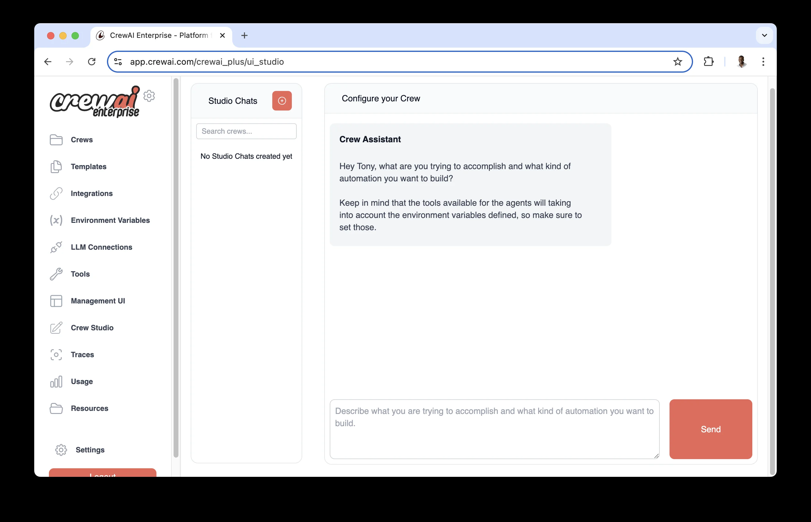

# docs.crewai.com-en-concepts-tasks

> Synthesis: TODO

Detailed guide on managing and creating tasks within the CrewAI framework.
Task is a specific assignment completed by an
Agent.
Tasks provide all necessary details for execution, such as a description, the agent responsible, required tools, and more, facilitating a wide range of action complexities.
Tasks within CrewAI can be collaborative, requiring multiple agents to work together. This is managed through the task properties and orchestrated by the Crew’s process, enhancing teamwork and efficiency.
crew = Crew(
agents=[agent1, agent2],
tasks=[task1, task2],
process=Process.sequential # or Process.hierarchical
)
|Attribute
|Parameters
|Type
|Description
Description
description
str
|A clear, concise statement of what the task entails.
Expected Output
expected_output
str
|A detailed description of what the task’s completion looks like.
Name (optional)
name
Optional[str]
|A name identifier for the task.
Agent (optional)
agent
Optional[BaseAgent]
|The agent responsible for executing the task.
Tools (optional)
tools
List[BaseTool]
|The tools/resources the agent is limited to use for this task.
Context (optional)
context
Optional[List["Task"]]
|Other tasks whose outputs will be used as context for this task.
Async Execution (optional)
async_execution
Optional[bool]
|Whether the task should be executed asynchronously. Defaults to False.
Human Input (optional)
human_input
Optional[bool]
|Whether the task should have a human review the final answer of the agent. Defaults to False.
Markdown (optional)
markdown
Optional[bool]
|Whether the task should instruct the agent to return the final answer formatted in Markdown. Defaults to False.
Config (optional)
config
Optional[Dict[str, Any]]
|Task-specific configuration parameters.
Output File (optional)
output_file
Optional[str]
|File path for storing the task output.
Create Directory (optional)
create_directory
Optional[bool]
|Whether to create the directory for output_file if it doesn’t exist. Defaults to True.
Output JSON (optional)
output_json
Optional[Type[BaseModel]]
|A Pydantic model to structure the JSON output.
Output Pydantic (optional)
output_pydantic
Optional[Type[BaseModel]]
|A Pydantic model for task output.
Callback (optional)
callback
Optional[Any]
|Function/object to be executed after task completion.
Guardrail (optional)
guardrail
Optional[Callable]
|Function to validate task output before proceeding to next task.
src/latest_ai_development/config/tasks.yaml file and modify the template to match your specific task requirements.
{topic}) will be replaced with values from your inputs when running the crew:
crew.kickoff(inputs={'topic': 'AI Agents'})
research_task:
description: >
Conduct a thorough research about {topic}
Make sure you find any interesting and relevant information given
the current year is 2025.
expected_output: >
A list with 10 bullet points of the most relevant information about {topic}
agent: researcher
reporting_task:
description: >
Review the context you got and expand each topic into a full section for a report.
Make sure the report is detailed and contains any and all relevant information.
expected_output: >
A fully fledge reports with the mains topics, each with a full section of information.
Formatted as markdown without '```'
agent: reporting_analyst
markdown: true
output_file: report.md
CrewBase:
# src/latest_ai_development/crew.py
from crewai import Agent, Crew, Process, Task
from crewai.project import CrewBase, agent, crew, task
from crewai_tools import SerperDevTool
@CrewBase
class LatestAiDevelopmentCrew():
"""LatestAiDevelopment crew"""
@agent
def researcher(self) -> Agent:
return Agent(
config=self.agents_config['researcher'], # type: ignore[index]
verbose=True,
tools=[SerperDevTool()]
)
@agent
def reporting_analyst(self) -> Agent:
return Agent(
config=self.agents_config['reporting_analyst'], # type: ignore[index]
verbose=True
)
@task
def research_task(self) -> Task:
return Task(
config=self.tasks_config['research_task'] # type: ignore[index]
)
@task
def reporting_task(self) -> Task:
return Task(
config=self.tasks_config['reporting_task'] # type: ignore[index]
)
@crew
def crew(self) -> Crew:
return Crew(
agents=[
self.researcher(),
self.reporting_analyst()
],
tasks=[
self.research_task(),
self.reporting_task()
],
process=Process.sequential
)
agents.yaml and
tasks.yaml) should match the method names in your Python code.
from crewai import Task
research_task = Task(
description="""
Conduct a thorough research about AI Agents.
Make sure you find any interesting and relevant information given
the current year is 2025.
""",
expected_output="""
A list with 10 bullet points of the most relevant information about AI Agents
""",
agent=researcher
)
reporting_task = Task(
description="""
Review the context you got and expand each topic into a full section for a report.
Make sure the report is detailed and contains any and all relevant information.
""",
expected_output="""
A fully fledge reports with the mains topics, each with a full section of information.
""",
agent=reporting_analyst,
markdown=True, # Enable markdown formatting for the final output
output_file="report.md"
)
agent for assignment or let the
hierarchical CrewAI’s process decide based on roles, availability, etc.
TaskOutput class, which supports multiple output formats and can be easily passed between tasks.
The output of a task in CrewAI framework is encapsulated within the
TaskOutput class. This class provides a structured way to access results of a task, including various formats such as raw output, JSON, and Pydantic models.
By default, the
TaskOutput will only include the
raw output. A
TaskOutput will only include the
pydantic or
json_dict output if the original
Task object was configured with
output_pydantic or
output_json, respectively.
|Attribute
|Parameters
|Type
|Description
Description
description
str
|Description of the task.
Summary
summary
Optional[str]
|Summary of the task, auto-generated from the first 10 words of the description.
Raw
raw
str
|The raw output of the task. This is the default format for the output.
Pydantic
pydantic
Optional[BaseModel]
|A Pydantic model object representing the structured output of the task.
JSON Dict
json_dict
Optional[Dict[str, Any]]
|A dictionary representing the JSON output of the task.
Agent
agent
str
|The agent that executed the task.
Output Format
output_format
OutputFormat
|The format of the task output, with options including RAW, JSON, and Pydantic. The default is RAW.
|Method/Property
|Description
json |Returns the JSON string representation of the task output if the output format is JSON.
to_dict |Converts the JSON and Pydantic outputs to a dictionary.
str |Returns the string representation of the task output, prioritizing Pydantic, then JSON, then raw.
output attribute of the
Task object. The
TaskOutput class provides various ways to interact with and present this output.
# Example task
task = Task(
description='Find and summarize the latest AI news',
expected_output='A bullet list summary of the top 5 most important AI news',
agent=research_agent,
tools=[search_tool]
)
# Execute the crew
crew = Crew(
agents=[research_agent],
tasks=[task],
verbose=True
)
result = crew.kickoff()
# Accessing the task output
task_output = task.output
print(f"Task Description: {task_output.description}")
print(f"Task Summary: {task_output.summary}")
print(f"Raw Output: {task_output.raw}")
if task_output.json_dict:
print(f"JSON Output: {json.dumps(task_output.json_dict, indent=2)}")
if task_output.pydantic:
print(f"Pydantic Output: {task_output.pydantic}")
markdown parameter enables automatic markdown formatting for task outputs. When set to
True, the task will instruct the agent to format the final answer using proper Markdown syntax.
# Example task with markdown formatting enabled
formatted_task = Task(
description="Create a comprehensive report on AI trends",
expected_output="A well-structured report with headers, sections, and bullet points",
agent=reporter_agent,
markdown=True # Enable automatic markdown formatting
)
markdown=True, the agent will receive additional instructions to format the output using:
# for headers
**text** for bold text
*text* for italic text
- or
* for bullet points
`code` for inline code
language ``` for code blocks
analysis_task:
description: >
Analyze the market data and create a detailed report
expected_output: >
A comprehensive analysis with charts and key findings
agent: analyst
markdown: true # Enable markdown formatting
output_file: analysis.md
markdown=True, so you don’t need to specify formatting requirements in your task description.
context attribute. For example:
research_task = Task(
description="Research the latest developments in AI",
expected_output="A list of recent AI developments",
agent=researcher
)
analysis_task = Task(
description="Analyze the research findings and identify key trends",
expected_output="Analysis report of AI trends",
agent=analyst,
context=[research_task] # This task will wait for research_task to complete
)
guardrail parameter:
from typing import Tuple, Union, Dict, Any
from crewai import TaskOutput
def validate_blog_content(result: TaskOutput) -> Tuple[bool, Any]:
"""Validate blog content meets requirements."""
try:
# Check word count
word_count = len(result.split())
if word_count > 200:
return (False, "Blog content exceeds 200 words")
# Additional validation logic here
return (True, result.strip())
except Exception as e:
return (False, "Unexpected error during validation")
blog_task = Task(
description="Write a blog post about AI",
expected_output="A blog post under 200 words",
agent=blog_agent,
guardrail=validate_blog_content # Add the guardrail function
)
(bool, Any)
(bool, Any). For example:
(True, validated_result)
(bool, str). For example:
(False, "Error message explain the failure")
from crewai import TaskOutput, LLMGuardrail
def validate_with_context(result: TaskOutput) -> Tuple[bool, Any]:
try:
# Main validation logic
validated_data = perform_validation(result)
return (True, validated_data)
except ValidationError as e:
return (False, f"VALIDATION_ERROR: {str(e)}")
except Exception as e:
return (False, str(e))
from typing import Any, Dict, List, Tuple, Union
from crewai import TaskOutput
def complex_validation(result: TaskOutput) -> Tuple[bool, Any]:
"""Chain multiple validation steps."""
# Step 1: Basic validation
if not result:
return (False, "Empty result")
# Step 2: Content validation
try:
validated = validate_content(result)
if not validated:
return (False, "Invalid content")
# Step 3: Format validation
formatted = format_output(validated)
return (True, formatted)
except Exception as e:
return (False, str(e))
(False, error):
(True, result)
from typing import Optional, Tuple, Union
from crewai import TaskOutput, Task
def validate_json_output(result: TaskOutput) -> Tuple[bool, Any]:
"""Validate and parse JSON output."""
try:
# Try to parse as JSON
data = json.loads(result)
return (True, data)
except json.JSONDecodeError as e:
return (False, "Invalid JSON format")
task = Task(
description="Generate a JSON report",
expected_output="A valid JSON object",
agent=analyst,
guardrail=validate_json_output,
max_retries=3 # Limit retry attempts
)
output_pydantic
output_pydantic property allows you to define a Pydantic model that the task output should conform to. This ensures that the output is not only structured but also validated according to the Pydantic model.
Here’s an example demonstrating how to use output_pydantic:
import json
from crewai import Agent, Crew, Process, Task
from pydantic import BaseModel
class Blog(BaseModel):
title: str
content: str
blog_agent = Agent(
role="Blog Content Generator Agent",
goal="Generate a blog title and content",
backstory="""You are an expert content creator, skilled in crafting engaging and informative blog posts.""",
verbose=False,
allow_delegation=False,
llm="gpt-4o",
)
task1 = Task(
description="""Create a blog title and content on a given topic. Make sure the content is under 200 words.""",
expected_output="A compelling blog title and well-written content.",
agent=blog_agent,
output_pydantic=Blog,
)
# Instantiate your crew with a sequential process
crew = Crew(
agents=[blog_agent],
tasks=[task1],
verbose=True,
process=Process.sequential,
)
result = crew.kickoff()
# Option 1: Accessing Properties Using Dictionary-Style Indexing
print("Accessing Properties - Option 1")
title = result["title"]
content = result["content"]
print("Title:", title)
print("Content:", content)
# Option 2: Accessing Properties Directly from the Pydantic Model
print("Accessing Properties - Option 2")
title = result.pydantic.title
content = result.pydantic.content
print("Title:", title)
print("Content:", content)
# Option 3: Accessing Properties Using the to_dict() Method
print("Accessing Properties - Option 3")
output_dict = result.to_dict()
title = output_dict["title"]
content = output_dict["content"]
print("Title:", title)
print("Content:", content)
# Option 4: Printing the Entire Blog Object
print("Accessing Properties - Option 5")
print("Blog:", result)
output_json
output_json property allows you to define the expected output in JSON format. This ensures that the task’s output is a valid JSON structure that can be easily parsed and used in your application.
Here’s an example demonstrating how to use
output_json:
import json
from crewai import Agent, Crew, Process, Task
from pydantic import BaseModel
# Define the Pydantic model for the blog
class Blog(BaseModel):
title: str
content: str
# Define the agent
blog_agent = Agent(
role="Blog Content Generator Agent",
goal="Generate a blog title and content",
backstory="""You are an expert content creator, skilled in crafting engaging and informative blog posts.""",
verbose=False,
allow_delegation=False,
llm="gpt-4o",
)
# Define the task with output_json set to the Blog model
task1 = Task(
description="""Create a blog title and content on a given topic. Make sure the content is under 200 words.""",
expected_output="A JSON object with 'title' and 'content' fields.",
agent=blog_agent,
output_json=Blog,
)
# Instantiate the crew with a sequential process
crew = Crew(
agents=[blog_agent],
tasks=[task1],
verbose=True,
process=Process.sequential,
)
# Kickoff the crew to execute the task
result = crew.kickoff()
# Option 1: Accessing Properties Using Dictionary-Style Indexing
print("Accessing Properties - Option 1")
title = result["title"]
content = result["content"]
print("Title:", title)
print("Content:", content)
# Option 2: Printing the Entire Blog Object
print("Accessing Properties - Option 2")
print("Blog:", result)
import os
os.environ["OPENAI_API_KEY"] = "Your Key"
os.environ["SERPER_API_KEY"] = "Your Key" # serper.dev API key
from crewai import Agent, Task, Crew
from crewai_tools import SerperDevTool
research_agent = Agent(
role='Researcher',
goal='Find and summarize the latest AI news',
backstory="""You're a researcher at a large company.
You're responsible for analyzing data and providing insights
to the business.""",
verbose=True
)
# to perform a semantic search for a specified query from a text's content across the internet
search_tool = SerperDevTool()
task = Task(
description='Find and summarize the latest AI news',
expected_output='A bullet list summary of the top 5 most important AI news',
agent=research_agent,
tools=[search_tool]
)
crew = Crew(
agents=[research_agent],
tasks=[task],
verbose=True
)
result = crew.kickoff()
print(result)
context attribute of the task:
# ...
research_ai_task = Task(
description="Research the latest developments in AI",
expected_output="A list of recent AI developments",
async_execution=True,
agent=research_agent,
tools=[search_tool]
)
research_ops_task = Task(
description="Research the latest developments in AI Ops",
expected_output="A list of recent AI Ops developments",
async_execution=True,
agent=research_agent,
tools=[search_tool]
)
write_blog_task = Task(
description="Write a full blog post about the importance of AI and its latest news",
expected_output="Full blog post that is 4 paragraphs long",
agent=writer_agent,
context=[research_ai_task, research_ops_task]
)
#...
context attribute to define in a future task that it should wait for the output of the asynchronous task to be completed.
#...
list_ideas = Task(
description="List of 5 interesting ideas to explore for an article about AI.",
expected_output="Bullet point list of 5 ideas for an article.",
agent=researcher,
async_execution=True # Will be executed asynchronously
)
list_important_history = Task(
description="Research the history of AI and give me the 5 most important events.",
expected_output="Bullet point list of 5 important events.",
agent=researcher,
async_execution=True # Will be executed asynchronously
)
write_article = Task(
description="Write an article about AI, its history, and interesting ideas.",
expected_output="A 4 paragraph article about AI.",
agent=writer,
context=[list_ideas, list_important_history] # Will wait for the output of the two tasks to be completed
)
#...
# ...
def callback_function(output: TaskOutput):
# Do something after the task is completed
# Example: Send an email to the manager
print(f"""
Task completed!
Task: {output.description}
Output: {output.raw}
""")
research_task = Task(
description='Find and summarize the latest AI news',
expected_output='A bullet list summary of the top 5 most important AI news',
agent=research_agent,
tools=[search_tool],
callback=callback_function
)
#...
output attribute of the task object:
# ...
task1 = Task(
description='Find and summarize the latest AI news',
expected_output='A bullet list summary of the top 5 most important AI news',
agent=research_agent,
tools=[search_tool]
)
#...
crew = Crew(
agents=[research_agent],
tasks=[task1, task2, task3],
verbose=True
)
result = crew.kickoff()
# Returns a TaskOutput object with the description and results of the task
print(f"""
Task completed!
Task: {task1.output.description}
Output: {task1.output.raw}
""")
id attribute to uphold the integrity of the unique identifier system.
create_directory parameter controls whether CrewAI should automatically create directories when saving task outputs to files. This feature is particularly useful for organizing outputs and ensuring that file paths are correctly structured, especially when working with complex project hierarchies.
create_directory=True, which means CrewAI will automatically create any missing directories in the output file path:
# Default behavior - directories are created automatically
report_task = Task(
description='Generate a comprehensive market analysis report',
expected_output='A detailed market analysis with charts and insights',
agent=analyst_agent,
output_file='reports/2025/market_analysis.md', # Creates 'reports/2025/' if it doesn't exist
markdown=True
)
create_directory=False:
# Strict mode - directory must already exist
strict_output_task = Task(
description='Save critical data that requires existing infrastructure',
expected_output='Data saved to pre-configured location',
agent=data_agent,
output_file='secure/vault/critical_data.json',
create_directory=False # Will raise RuntimeError if 'secure/vault/' doesn't exist
)
analysis_task:
description: >
Generate quarterly financial analysis
expected_output: >
A comprehensive financial report with quarterly insights
agent: financial_analyst
output_file: reports/quarterly/q4_2024_analysis.pdf
create_directory: true # Automatically create 'reports/quarterly/' directory
audit_task:
description: >
Perform compliance audit and save to existing audit directory
expected_output: >
A compliance audit report
agent: auditor
output_file: audit/compliance_report.md
create_directory: false # Directory must already exist
create_directory=True):
create_directory=False):
create_directory=False and the directory doesn’t exist, CrewAI will raise a
RuntimeError:
try:
result = crew.kickoff()
except RuntimeError as e:
# Handle missing directory error
print(f"Directory creation failed: {e}")
# Create directory manually or use fallback location


<figcaption>Figure 1. Credit: [docs.crewai.com](https://mintlify.s3.us-west-1.amazonaws.com/crewai/images/crew_only_logo.png), License: internal-copy</figcaption>


<figcaption>Figure 2. Credit: [docs.crewai.com](https://mintlify.s3.us-west-1.amazonaws.com/crewai/images/crew_only_logo.png), License: internal-copy</figcaption>


<figcaption>Figure 3. Credit: [docs.crewai.com](https://mintlify.s3.us-west-1.amazonaws.com/crewai/images/enterprise/crew-studio-interface.png), License: internal-copy</figcaption>
