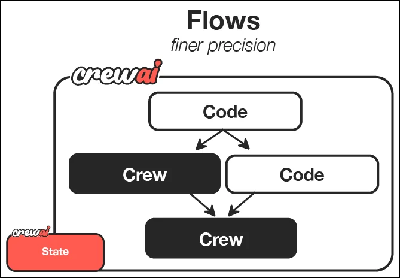

# docs.crewai.com-en-guides-flows-first-flow

> Synthesis: TODO

Learn how to create structured, event-driven workflows with precise control over execution.
crewai create flow guide_creator_flow
cd guide_creator_flow
CrewAI Framework Overview
guide_creator_flow/
├── .gitignore
├── pyproject.toml
├── README.md
├── .env
├── main.py
├── crews/
│ └── poem_crew/
│ ├── config/
│ │ ├── agents.yaml
│ │ └── tasks.yaml
│ └── poem_crew.py
└── tools/
└── custom_tool.py
main.py file
crews directory
tools directory
crewai flow add-crew content-crew
llm to the provider you are using.
# src/guide_creator_flow/crews/content_crew/config/agents.yaml
content_writer:
role: >
Educational Content Writer
goal: >
Create engaging, informative content that thoroughly explains the assigned topic
and provides valuable insights to the reader
backstory: >
You are a talented educational writer with expertise in creating clear, engaging
content. You have a gift for explaining complex concepts in accessible language
and organizing information in a way that helps readers build their understanding.
llm: provider/model-id # e.g. openai/gpt-4o, google/gemini-2.0-flash, anthropic/claude...
content_reviewer:
role: >
Educational Content Reviewer and Editor
goal: >
Ensure content is accurate, comprehensive, well-structured, and maintains
consistency with previously written sections
backstory: >
You are a meticulous editor with years of experience reviewing educational
content. You have an eye for detail, clarity, and coherence. You excel at
improving content while maintaining the original author's voice and ensuring
consistent quality across multiple sections.
llm: provider/model-id # e.g. openai/gpt-4o, google/gemini-2.0-flash, anthropic/claude...
# src/guide_creator_flow/crews/content_crew/config/tasks.yaml
write_section_task:
description: >
Write a comprehensive section on the topic: "{section_title}"
Section description: {section_description}
Target audience: {audience_level} level learners
Your content should:
1. Begin with a brief introduction to the section topic
2. Explain all key concepts clearly with examples
3. Include practical applications or exercises where appropriate
4. End with a summary of key points
5. Be approximately 500-800 words in length
Format your content in Markdown with appropriate headings, lists, and emphasis.
Previously written sections:
{previous_sections}
Make sure your content maintains consistency with previously written sections
and builds upon concepts that have already been explained.
expected_output: >
A well-structured, comprehensive section in Markdown format that thoroughly
explains the topic and is appropriate for the target audience.
agent: content_writer
review_section_task:
description: >
Review and improve the following section on "{section_title}":
{draft_content}
Target audience: {audience_level} level learners
Previously written sections:
{previous_sections}
Your review should:
1. Fix any grammatical or spelling errors
2. Improve clarity and readability
3. Ensure content is comprehensive and accurate
4. Verify consistency with previously written sections
5. Enhance the structure and flow
6. Add any missing key information
Provide the improved version of the section in Markdown format.
expected_output: >
An improved, polished version of the section that maintains the original
structure but enhances clarity, accuracy, and consistency.
agent: content_reviewer
context:
- write_section_task
context parameter in the review task creates a workflow where the reviewer has access to the writer’s output.
# src/guide_creator_flow/crews/content_crew/content_crew.py
from crewai import Agent, Crew, Process, Task
from crewai.project import CrewBase, agent, crew, task
from crewai.agents.agent_builder.base_agent import BaseAgent
from typing import List
@CrewBase
class ContentCrew():
"""Content writing crew"""
agents: List[BaseAgent]
tasks: List[Task]
@agent
def content_writer(self) -> Agent:
return Agent(
config=self.agents_config['content_writer'], # type: ignore[index]
verbose=True
)
@agent
def content_reviewer(self) -> Agent:
return Agent(
config=self.agents_config['content_reviewer'], # type: ignore[index]
verbose=True
)
@task
def write_section_task(self) -> Task:
return Task(
config=self.tasks_config['write_section_task'] # type: ignore[index]
)
@task
def review_section_task(self) -> Task:
return Task(
config=self.tasks_config['review_section_task'], # type: ignore[index]
context=[self.write_section_task()]
)
@crew
def crew(self) -> Crew:
"""Creates the content writing crew"""
return Crew(
agents=self.agents,
tasks=self.tasks,
process=Process.sequential,
verbose=True,
)
main.py file:
#!/usr/bin/env python
import json
import os
from typing import List, Dict
from pydantic import BaseModel, Field
from crewai import LLM
from crewai.flow.flow import Flow, listen, start
from guide_creator_flow.crews.content_crew.content_crew import ContentCrew
# Define our models for structured data
class Section(BaseModel):
title: str = Field(description="Title of the section")
description: str = Field(description="Brief description of what the section should cover")
class GuideOutline(BaseModel):
title: str = Field(description="Title of the guide")
introduction: str = Field(description="Introduction to the topic")
target_audience: str = Field(description="Description of the target audience")
sections: List[Section] = Field(description="List of sections in the guide")
conclusion: str = Field(description="Conclusion or summary of the guide")
# Define our flow state
class GuideCreatorState(BaseModel):
topic: str = ""
audience_level: str = ""
guide_outline: GuideOutline = None
sections_content: Dict[str, str] = {}
class GuideCreatorFlow(Flow[GuideCreatorState]):
"""Flow for creating a comprehensive guide on any topic"""
@start()
def get_user_input(self):
"""Get input from the user about the guide topic and audience"""
print("\n=== Create Your Comprehensive Guide ===\n")
# Get user input
self.state.topic = input("What topic would you like to create a guide for? ")
# Get audience level with validation
while True:
audience = input("Who is your target audience? (beginner/intermediate/advanced) ").lower()
if audience in ["beginner", "intermediate", "advanced"]:
self.state.audience_level = audience
break
print("Please enter 'beginner', 'intermediate', or 'advanced'")
print(f"\nCreating a guide on {self.state.topic} for {self.state.audience_level} audience...\n")
return self.state
@listen(get_user_input)
def create_guide_outline(self, state):
"""Create a structured outline for the guide using a direct LLM call"""
print("Creating guide outline...")
# Initialize the LLM
llm = LLM(model="openai/gpt-4o-mini", response_format=GuideOutline)
# Create the messages for the outline
messages = [
{"role": "system", "content": "You are a helpful assistant designed to output JSON."},
{"role": "user", "content": f"""
Create a detailed outline for a comprehensive guide on "{state.topic}" for {state.audience_level} level learners.
The outline should include:
1. A compelling title for the guide
2. An introduction to the topic
3. 4-6 main sections that cover the most important aspects of the topic
4. A conclusion or summary
For each section, provide a clear title and a brief description of what it should cover.
"""}
]
# Make the LLM call with JSON response format
response = llm.call(messages=messages)
# Parse the JSON response
outline_dict = json.loads(response)
self.state.guide_outline = GuideOutline(**outline_dict)
# Ensure output directory exists before saving
os.makedirs("output", exist_ok=True)
# Save the outline to a file
with open("output/guide_outline.json", "w") as f:
json.dump(outline_dict, f, indent=2)
print(f"Guide outline created with {len(self.state.guide_outline.sections)} sections")
return self.state.guide_outline
@listen(create_guide_outline)
def write_and_compile_guide(self, outline):
"""Write all sections and compile the guide"""
print("Writing guide sections and compiling...")
completed_sections = []
# Process sections one by one to maintain context flow
for section in outline.sections:
print(f"Processing section: {section.title}")
# Build context from previous sections
previous_sections_text = ""
if completed_sections:
previous_sections_text = "# Previously Written Sections\n\n"
for title in completed_sections:
previous_sections_text += f"## {title}\n\n"
previous_sections_text += self.state.sections_content.get(title, "") + "\n\n"
else:
previous_sections_text = "No previous sections written yet."
# Run the content crew for this section
result = ContentCrew().crew().kickoff(inputs={
"section_title": section.title,
"section_description": section.description,
"audience_level": self.state.audience_level,
"previous_sections": previous_sections_text,
"draft_content": ""
})
# Store the content
self.state.sections_content[section.title] = result.raw
completed_sections.append(section.title)
print(f"Section completed: {section.title}")
# Compile the final guide
guide_content = f"# {outline.title}\n\n"
guide_content += f"## Introduction\n\n{outline.introduction}\n\n"
# Add each section in order
for section in outline.sections:
section_content = self.state.sections_content.get(section.title, "")
guide_content += f"\n\n{section_content}\n\n"
# Add conclusion
guide_content += f"## Conclusion\n\n{outline.conclusion}\n\n"
# Save the guide
with open("output/complete_guide.md", "w") as f:
f.write(guide_content)
print("\nComplete guide compiled and saved to output/complete_guide.md")
return "Guide creation completed successfully"
def kickoff():
"""Run the guide creator flow"""
GuideCreatorFlow().kickoff()
print("\n=== Flow Complete ===")
print("Your comprehensive guide is ready in the output directory.")
print("Open output/complete_guide.md to view it.")
def plot():
"""Generate a visualization of the flow"""
flow = GuideCreatorFlow()
flow.plot("guide_creator_flow")
print("Flow visualization saved to guide_creator_flow.html")
if __name__ == "__main__":
kickoff()
@start() decorator
@listen() decorator to establish event-driven relationships between steps
.env file in your project root with your API keys. See the LLM setup
guide for details on configuring a provider.
OPENAI_API_KEY=your_openai_api_key
# or
GEMINI_API_KEY=your_gemini_api_key
# or
ANTHROPIC_API_KEY=your_anthropic_api_key
crewai install
crewai flow kickoff
crewai flow plot
output directory:
guide_outline.json: Contains the structured outline of the guide
complete_guide.md: The comprehensive guide with all sections
@listen decorator to respond to events
llm = LLM(
model="model-id-here", # gpt-4o, gemini-2.0-flash, anthropic/claude...
response_format=GuideOutline
)
response = llm.call(messages=messages)
@start()
def get_user_input(self):
# First step in the flow
# ...
@listen(get_user_input)
def create_guide_outline(self, state):
# This runs when get_user_input completes
# ...
class GuideCreatorState(BaseModel):
topic: str = ""
audience_level: str = ""
guide_outline: GuideOutline = None
sections_content: Dict[str, str] = {}
result = ContentCrew().crew().kickoff(inputs={
"section_title": section.title,
# ...
})
@router() to create conditional branches in your flows
and_ and
or_ functions for more complex parallel execution
Was this page helpful?

<figcaption>Figure 1. Credit: [docs.crewai.com](https://mintlify.s3.us-west-1.amazonaws.com/crewai/images/crew_only_logo.png), License: internal-copy</figcaption>

<figcaption>Figure 2. Credit: [docs.crewai.com](https://mintlify.s3.us-west-1.amazonaws.com/crewai/images/crew_only_logo.png), License: internal-copy</figcaption>

<figcaption>Figure 3. Credit: [docs.crewai.com](https://mintlify.s3.us-west-1.amazonaws.com/crewai/images/flows.png), License: internal-copy</figcaption>
