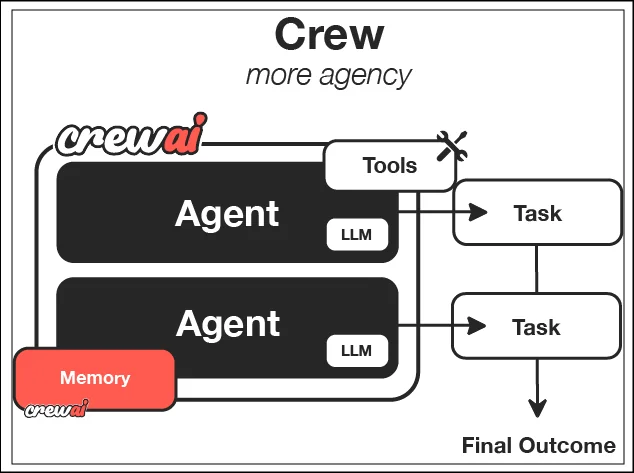

# docs.crewai.com-en-tools-web-scraping-browsing

> Synthesis: TODO

Build AI agent teams that work together to tackle complex tasks
CrewAI Framework Overview
|Component
|Description
|Key Features
Crew |The top-level organization
|• Manages AI agent teams
• Oversees workflows
• Ensures collaboration
• Delivers outcomes
AI Agents |Specialized team members
|• Have specific roles (researcher, writer)
• Use designated tools
• Can delegate tasks
• Make autonomous decisions
Process |Workflow management system
|• Defines collaboration patterns
• Controls task assignments
• Manages interactions
• Ensures efficient execution
Tasks |Individual assignments
|• Have clear objectives
• Use specific tools
• Feed into larger process
• Produce actionable results
CrewAI Framework Overview
|Component
|Description
|Key Features
Flow |Structured workflow orchestration
|• Manages execution paths
• Handles state transitions
• Controls task sequencing
• Ensures reliable execution
Events |Triggers for workflow actions
|• Initiate specific processes
• Enable dynamic responses
• Support conditional branching
• Allow for real-time adaptation
States |Workflow execution contexts
|• Maintain execution data
• Enable persistence
• Support resumability
• Ensure execution integrity
Crew Support |Enhances workflow automation
|• Injects pockets of agency when needed
• Complements structured workflows
• Balances automation with intelligence
• Enables adaptive decision-making
|Use Case
|Recommended Approach
|Why?
Open-ended research |Crews
|When tasks require creative thinking, exploration, and adaptation
Content generation |Crews
|For collaborative creation of articles, reports, or marketing materials
Decision workflows |Flows
|When you need predictable, auditable decision paths with precise control
API orchestration |Flows
|For reliable integration with multiple external services in a specific sequence
Hybrid applications |Combined approach
|Use Flows to orchestrate overall process with Crews handling complex subtasks
Was this page helpful?

<figcaption>Figure 1. Credit: [docs.crewai.com](https://mintlify.s3.us-west-1.amazonaws.com/crewai/images/crew_only_logo.png), License: internal-copy</figcaption>

<figcaption>Figure 2. Credit: [docs.crewai.com](https://mintlify.s3.us-west-1.amazonaws.com/crewai/images/crew_only_logo.png), License: internal-copy</figcaption>

<figcaption>Figure 3. Credit: [docs.crewai.com](https://mintlify.s3.us-west-1.amazonaws.com/crewai/images/crews.png), License: internal-copy</figcaption>

<figcaption>Figure 4. Credit: [docs.crewai.com](https://mintlify.s3.us-west-1.amazonaws.com/crewai/images/flows.png), License: internal-copy</figcaption>
