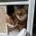

# github.com-anthropics-prompt-eng-interactive-tutorial-tree-master-Anthropic%201P

> Synthesis: TODO

We read every piece of feedback, and take your input very seriously.
To see all available qualifiers, see our documentation.
There was an error while loading. Please reload this page.

<figcaption>Figure 1. Credit: [github.com](https://avatars.githubusercontent.com/u/143411590?v=4&size=40), License: internal-copy</figcaption>
