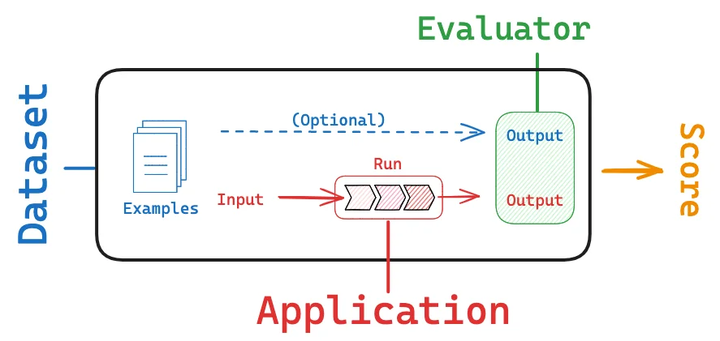

# python.langchain.com-docs-concepts-evaluation

> Synthesis: TODO

# Evaluation
Evaluation is the process of assessing the performance and effectiveness of your LLM-powered applications. It involves testing the model's responses against a set of predefined criteria or benchmarks to ensure it meets the desired quality standards and fulfills the intended purpose. This process is vital for building reliable applications.
LangSmith helps with this process in a few ways:
- It makes it easier to create and curate datasets via its tracing and annotation features
- It provides an evaluation framework that helps you define metrics and run your app against your dataset
- It allows you to track results over time and automatically run your evaluators on a schedule or as part of CI/Code
To learn more, check out this LangSmith guide.

<figcaption>Figure 1. Credit: [python.langchain.com](https://python.langchain.com/assets/images/langsmith_evaluate-7d48643f3e4c50d77234e13feb95144d.png), License: internal-copy</figcaption>
