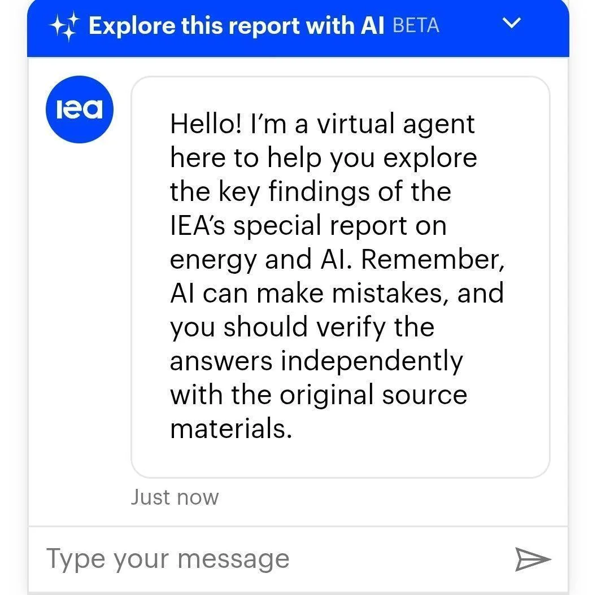
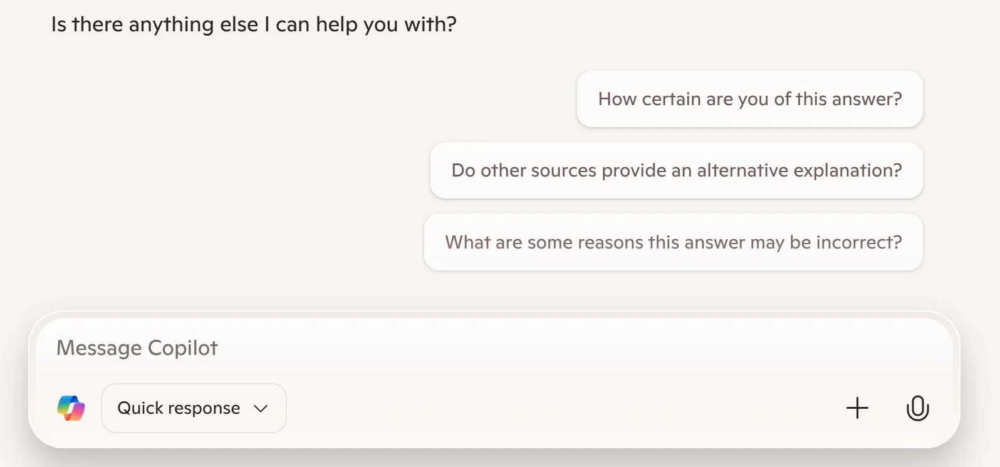

# www.nngroup.com-articles-ai-chatbots-discourage-error-checking

> Synthesis: TODO

Large language models (LLMs) are being widely introduced into professional workflows through both new standalone software and integrations with existing tools. One of the most important ways that these tools increase users’ productivity is through text generation. But
**generated content is ** **prone to hallucinations** **,** with the AI extrapolating outside of its training data to return outputs that are truth-like *, *but incorrect.
Designers of generative AI (genAI) products must help users identify and correct these errors. Most genAI tools currently fail in this responsibility.
## Users Struggle to Verify AI Outputs Successfully
When humans produce text, they alternate between writing and editing. GenAI tools make people more productive by accelerating the pace at which they can create content — the AI will near-instantaneously generate some the text based on the prompt, and the user needs to spend time only on editing.
Since LLMs are trained on a corpus of grammatically and syntactically correct content, their outputs may not need much copyediting. But for professional writing, editing also includes fact-checking and ensuring that any argument follows from the facts.
This work is not an afterthought — it is a difficult and time-consuming process. Users of genAI tools have been struggling to error-check their outputs successfully. Lawyers have been caught citing cases that don’t exist. Scientists refer to hallucinated papers and journals. Doctors end up trusting erroneous AI diagnoses over their own expertise.
**It is irresponsible to blame the users for misinformation generated by LLMs. **People are efficient (not lazy). Users adopt genAI tools precisely because they come with the promise of greater efficiency. They will not go out of their way to check the work if the effort of doing so does not seem proportional to the AI’s likelihood of being wrong.
## Reducing Errors Increases Interaction Cost
It’s true that an exceptionally careful user can reduce the number of mistakes the LLM will produce. But doing so requires additional knowledge and user effort.
To verify the answers provided by a chatbot, the user will need to follow the same steps as they would when reviewing any other text, and then some.
**Review the entire output:**Writers build up a mental model of their work in their heads as they go and maintain a sense of its structure. Editing an LLM output requires the user to understand the structure of the answer and build up that mental model from scratch — even between prompts on the same topic, as LLM outputs are nondeterministic. **Identify items that need verification:**The text will present and connect different key ideas. It is those ideas — facts and claims made on their basis — that the editor needs to pay attention to. **Validate the claims being made:**In situations where the LLM has provided a citation, the editor needs to track down the text (assuming that it exists) and find the content being cited within it. The editor also needs to determine whether the source is *authoritative*. If the LLM has not cited a source, the editor must perform research from scratch to confirm the claim as factual (or ask the LLM for supporting evidence). **Verify that the arguments follow from the claims:**The editor must separate facts and the conclusions being drawn from those facts. This often requires a significant degree of subject-matter expertise. **Articulate corrections:**If the editor is not willing to rewrite the output themselves, they must update the prompt to tell the LLM what needs changing. **Verify the response again:**Due to the limited context window and nondeterministic output of LLMs, there is no guarantee that any given error was fixed or new errors were not introduced.
Some of these steps may be shortened with careful prompt engineering. For example, asking the LLM to generate one small and digestible part of a text at a time allows users greater control over what is written and how it is incorporated into the larger whole of the work. But these strategies are workarounds that require user effort and an in-depth understanding of how AIs hallucinate. And working through a document one part at a time is possible only for expert users who already know what those parts ought to be.
## LLM Outputs Signal Authoritativeness
Humans do not check every single novel piece of information for accuracy; the effort to do so would be unjustifiable. The extent to which we take a claim at its value is based on how closely it fits with what we already know and the trustworthiness of the source.
Outputs of genAI tools mimic certain attributes that we associate with authoritative sources. Their tone is unerringly confident, regardless of the accuracy of the response. They are grammatically correct and meticulously formatted. Through a phenomenon called the halo effect, users’ positive perception of one attribute of the LLM’s responses causes them to have a positive predisposition about all its other attributes — including accuracy.
While we ought to consider AI-generated content an early draft, due to these signals we often treat it as finished work. Users frequently have such confidence in an LLM output that they do not even read through it end to end. For example, in our recent round of intern hiring, we were disappointed to see cover letters ending in “Let me know if you need anything else!”
Additionally, nothing about the chat interface (a plain text box) acknowledges that the LLM’s outputs might not be entirely accurate outside of a small label:
*XYZ bot can make mistakes, please check responses.* Instead, chatbots typically encourage users to move on from the response by prompting them with a new question.
## Users Are Not Building Expertise to Spot Errors
Improving writing productivity is not the only application of genAI. These tools are often used as virtual experts, providing advice or performing tasks outside of the user’s field of expertise. In practices such as vibe coding, where an AI generates code based on plain-language prompts, the user does not need to know anything about software development to create a usable program.
A side effect of this mode of usage is that users lack a sufficient understanding of the subject matter to meaningfully validate the LLM’s outputs. A vibe coder has no way of evaluating the quality of the code for security vulnerabilities, and a guidebook author might find out they gave bad advice only when customers start getting poisoned.
But far from all AI-generated answers are hallucinations. As genAI performance progresses to a point where the majority of LLM responses are correct, even users who started out by verifying every statement may start to feel that their effort is not paying off. As users increasingly take AI outputs at face value, they might lose the expertise necessary to evaluate the accuracy of those outputs. As a Microsoft paper by Hank Lee identifies, operators who come to rely on genAI for routine decisions end up being unprepared for situations that require their intervention.
## A Finished Product Is Harder to Evaluate
While users can choose to collaborate with an LLM section by section to create a document or a working program, they can also just ask it to produce the entire text by itself. While this is a much faster way of getting an output, it creates additional problems when it comes to verifying the output’s quality and troubleshooting its constituent parts.
Safety-systems researcher David D. Woods observed that the task of analyzing a whole is made far more difficult without having worked on the parts. The human counterpart has no context for any of the AI’s decisions because they have no access to the system’s “thought process.” To effectively correct any technical issues in the solution, the user has to effectively solve the entire problem on their own in order to reconstruct the mental model necessary for identifying flaws.
## Designing Checkable AI Tools
The particulars of LLM technology may mean that, at least for the time being, hallucinations are here to stay. Responsibly engineered models should structure their outputs in a way that helps users identify these errors, by exposing the reasoning that leads to a conclusion or clearly communicating the degree of confidence for generated assertions. But the designers of genAI tools also have an opportunity to make error checking easier and more salient during interactions between users and LLMs.
### Followup Questions that Encourage Critical Thinking
Today’s genAI chatbots often prompt followup questions; this feature could be used to embed fact-checking best practices into the tool. Rather than urging users to move on, these prompts could
**empower them to investigate the response** with the same amount of skepticism that an editor should have for any submission. Prompts that ask for more details about sources or for the degree of certainty about the LLM’s conclusion would encourage critical thinking and prevent users from taking the LLM’s answer at face value.
### Highlight Referenced Text in the Source
Some existing chatbots can already provide citations for assertions in their responses . These citations are usually links to relevant webpages. However, users still need to do the work of verifying the accuracy of the citation: they have to click on the link, find the passage being referenced, and ensure that the context supports the meaning of the excerpt. Providing a deep link to the referenced passage or showing it in a preview of the source would greatly reduce the interaction cost of checking the LLM’s assertions.
### Make It Easy to Ask Clarifying Questions
Another opportunity to help the user engage more critically with the answer is to make the content more interactive. Allowing users to
**ask clarifying questions about details of the answer** simply by clicking on selected parts of the response would make it easier for users to dig deeper into the statements being made by the LLM and leverage the AI’s own knowledge to spot and resolve any hallucinations.
### References
Aminu Abdullahi. 2025. Developers Beware: Slopsquatting & Vibe Coding Can Increase Risk of AI-Powered Attacks. (April 2025). Retrieved April 20, 2025 from https://www.techrepublic.com/article/news-slopsquatting-vibe-coding-ai-cybersecurity-risk/
Constance Grady. 2024. The AI grift that can literally poison you. (April 2024). Retrieved April 20, 2025 from https://www.vox.com/24141648/ai-ebook-grift-mushroom-foraging-mycological-society
David Woods. 1985. Cognitive technologies: The design of joint human-machine cognitive systems.
*AI Magazine* 6, 4 (1985).
Klaudia Jaźwińska, Aisvarya Chandrasekar. 2025. AI search has a citation problem. (March 2025). Retrieved April 10, 2025 from https://www.cjr.org/tow_center/we-compared-eight-ai-search-engines-theyre-all-bad-at-citing-news.php
Hao-Ping (Hank) Lee , Advait Sarkar, Lev Tankelevitch, Ian Drosos, Sean Rintel, Richard Banks, and Nicholas Wilson. The impact of generative ai on critical thinking: self-reported reductions in cognitive effort and confidence effects from a survey of knowledge workers.
*CHI Conference on Human Factors in Computing Systems (CHI ’25).* ACM, New York, NY, USA.

<figcaption>Figure 1. Credit: [www.nngroup.com](https://media.nngroup.com/media/people/photos/pavel.jpg.256x256_q75_autocrop_crop-smart_upscale.jpg), License: internal-copy</figcaption>

<figcaption>Figure 2. Credit: [www.nngroup.com](https://media.nngroup.com/media/editor/2025/05/06/ieaorg-chatbot-error.jpg), License: internal-copy</figcaption>

<figcaption>Figure 3. Credit: [www.nngroup.com](https://media.nngroup.com/media/editor/2025/05/06/copilot-alt-prompts.jpg), License: internal-copy</figcaption>

<figcaption>Figure 4. Credit: [www.nngroup.com](https://media.nngroup.com/media/editor/2025/05/06/chatgpt-highlight-response.jpg), License: internal-copy</figcaption>

<figcaption>Figure 5. Credit: [www.nngroup.com](https://media.nngroup.com/media/videos/thumbnails/CARE_Structure_for_Crafting_AI_Prompts_Thumbnail.jpg.650x364_q75_autocrop_crop-smart_upscale.jpg), License: internal-copy</figcaption>

<figcaption>Figure 6. Credit: [www.nngroup.com](https://media.nngroup.com/media/videos/thumbnails/Synthetic_AI_Users_Thumbnail.jpg.650x364_q75_autocrop_crop-smart_upscale.jpg), License: internal-copy</figcaption>

<figcaption>Figure 7. Credit: [www.nngroup.com](https://media.nngroup.com/media/videos/thumbnails/Your_AI_UX_Intern_Thumbnail.jpg.650x364_q75_autocrop_crop-smart_upscale.jpg), License: internal-copy</figcaption>
