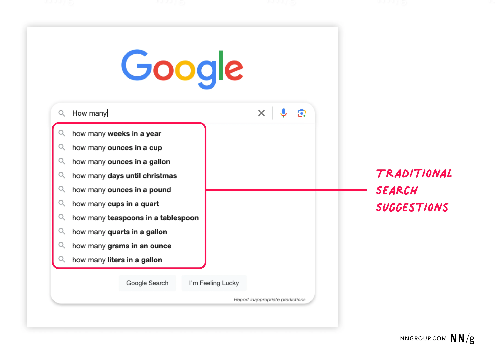
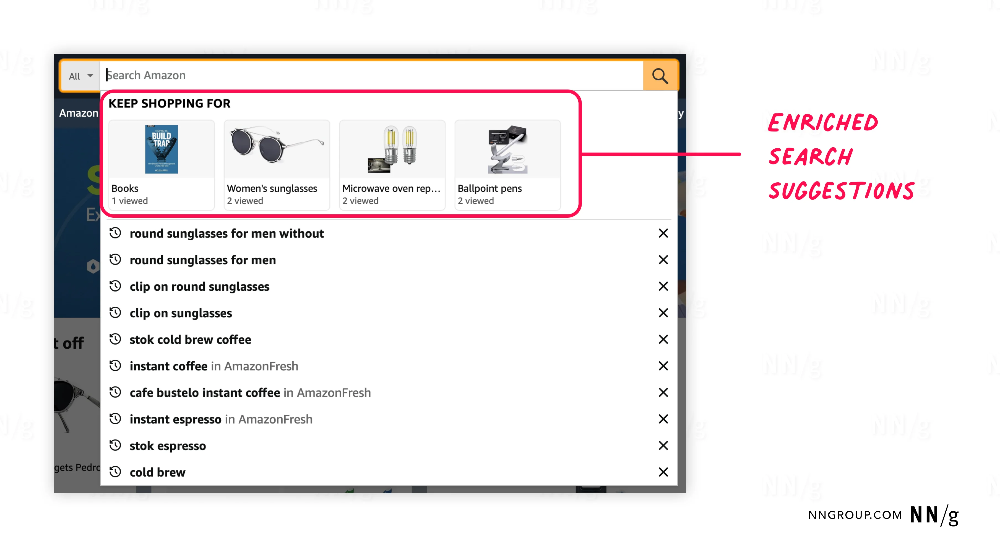
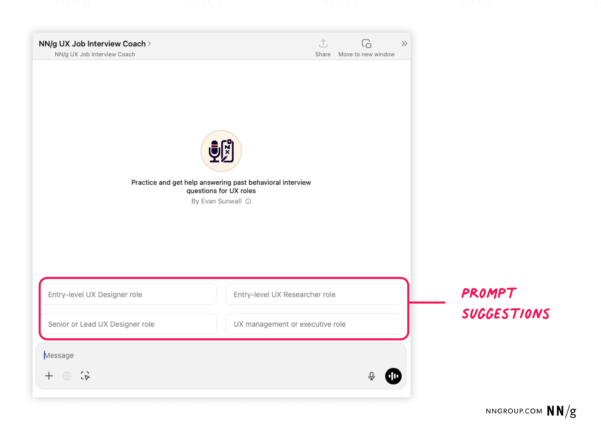
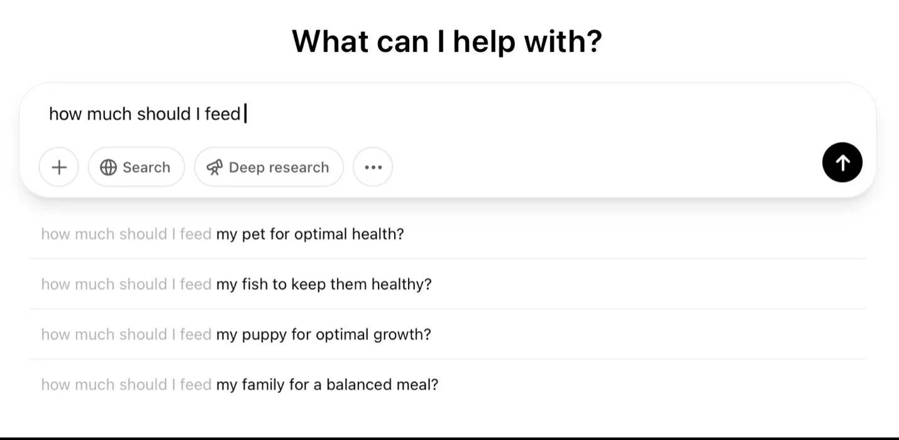
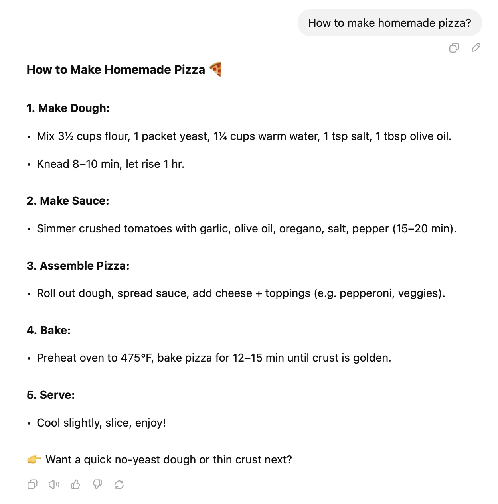

# www.nngroup.com-articles-prompt-suggestions

> Synthesis: TODO

Prompt suggestions are a common design element in AI-chat features, but users often ignore them, especially when they’re not in the right place or don’t feel useful. Done well, though, prompt suggestions can guide, inspire, and help users complete tasks efficiently.
## What Are Prompt Suggestions?
Prompt suggestions are typically used in generative-AI (genAI) systems that accept open-text prompts from users. When people first begin using an AI system, they’re often faced with the “blank page” problem and must think about how they could use the product.
Prompt suggestionsare system-generated hints that guide users in forming queries or commands for AI tools. These can be full questions, phrases, or even single keywords that aim to showcase system capabilities, reduce user effort, or encourage exploration.
### Prompt Suggestions vs. Search Suggestions
Prompt suggestions play a similar role to search suggestions.
Traditional search suggestionsare recommended queries that appear below the search box as users type in their search query. They change as users type each letter of their query.
Enriched search suggestionsare expanded recommendations for site content presented to the user during on-site search and shown under the search box, before or while the user types a query. Before the user starts typing, for example, the system may suggest popular, trending, or frequently searched items.
Unlike search suggestions, prompt suggestions are not just about predicting the end of a sentence. Instead, they often aim to inspire interaction and guide discovery of the AI tool’s capabilities. They set expectations for what the system can do, and how they should interact with it.
Especially for new genAI users (which is still a large segment of the population currently),
** this feature is critical for supporting ** **discoverability** ** and ** **learnability** **.**
## The Purpose of Prompt Suggestions
When designed thoughtfully, prompt suggestions can significantly improve the user experience of AI tools. Well-designed prompt suggestions can:
**Reduce** **cognitive load**: By offering ideas or phrasing, prompt suggestions lower the effort required to get started. **Reduce** **interaction cost**: If the prompt suggestion is right, users can skip typing. **Encourage engagement**: Good suggestions lead users to explore topics and tasks they might have missed (or considered impossible to perform with the AI tool). **Improve task efficiency**: They help users formulate better prompts, especially when they’re unsure how to begin or what to ask.
One participant in a recent genAI study that we conducted told us:
“I do really like [the prompt suggestions] because they [included] a lot of questions [...] I didn't even realize I had. [...] I definitely like that it triggered a thought process that I forgot I even had in my head.”
## Three Types of AI-Prompt Suggestions
There are currently three different approaches to prompt suggestions, each with a slightly different purpose:
**Use-case prompt suggestions:**support system learnability and creativity **Prompt-autocomplete suggestions:**increase efficiency **Followup-question suggestions:**increase engagement
This article provides a
**high-level overview of all three types of prompt suggestions. **Separate articles will discuss design considerations and best practices for each.
### Use-Case Prompt Suggestions
**Use-case prompt suggestions** are examples of good AI prompts. They are displayed within most AI tools, usually (but not only) to novice users. They are intended to help users understand what they can use the AI tool for and how to interact with it. When designed well, they set accurate expectations for the system and guide users toward effective prompting.
### Prompt Autocomplete
**A prompt autocomplete **is a continuation of a user prompt displayed below the chat box. Like search autocomplete, prompt autocomplete aims to increase efficiency for users — that is, help them complete their input quickly and accurately, following AI-usage best practices and avoiding mistakes, like typos.
### Followup Questions
**Followup questions **are prompt suggestions related to a preestablished context (such as an ongoing conversation). They are usually displayed below the answer to the user’s previous prompt.
Followup questions aim to create engagement and make it easier for the user to continue the existing conversation. Based on previous inputs and outputs, the system suggests alternative followup actions or information that users may want or need.
Currently, these tend to be the most relevant and useful for users, because they’re tailored to a specific need or interest.

<figcaption>Figure 1. Credit: [www.nngroup.com](https://media.nngroup.com/media/people/photos/Kate-Headshot-2022.jpg.256x256_q75_autocrop_crop-smart_upscale.jpg), License: internal-copy</figcaption>

<figcaption>Figure 2. Credit: [www.nngroup.com](https://media.nngroup.com/media/people/photos/Tim-portrait-2022.jpg.256x256_q75_autocrop_crop-smart_upscale.jpg), License: internal-copy</figcaption>

<figcaption>Figure 3. Credit: [www.nngroup.com](https://media.nngroup.com/media/editor/2025/04/23/333.png), License: internal-copy</figcaption>

<figcaption>Figure 4. Credit: [www.nngroup.com](https://media.nngroup.com/media/editor/2025/04/23/222.png), License: internal-copy</figcaption>

<figcaption>Figure 5. Credit: [www.nngroup.com](https://media.nngroup.com/media/editor/2025/04/23/3-prompt-suggestion.png), License: internal-copy</figcaption>

<figcaption>Figure 6. Credit: [www.nngroup.com](https://media.nngroup.com/media/editor/2025/04/15/usecasepromptsuggestion1.png), License: internal-copy</figcaption>

<figcaption>Figure 7. Credit: [www.nngroup.com](https://media.nngroup.com/media/editor/2025/04/15/gpt1.png), License: internal-copy</figcaption>

<figcaption>Figure 8. Credit: [www.nngroup.com](https://media.nngroup.com/media/editor/2025/04/15/followup-question-suggestion-chatgpt.png), License: internal-copy</figcaption>

<figcaption>Figure 9. Credit: [www.nngroup.com](https://media.nngroup.com/media/videos/thumbnails/CARE_Structure_for_Crafting_AI_Prompts_Thumbnail.jpg.650x364_q75_autocrop_crop-smart_upscale.jpg), License: internal-copy</figcaption>

<figcaption>Figure 10. Credit: [www.nngroup.com](https://media.nngroup.com/media/videos/thumbnails/Synthetic_AI_Users_Thumbnail.jpg.650x364_q75_autocrop_crop-smart_upscale.jpg), License: internal-copy</figcaption>

<figcaption>Figure 11. Credit: [www.nngroup.com](https://media.nngroup.com/media/videos/thumbnails/Your_AI_UX_Intern_Thumbnail.jpg.650x364_q75_autocrop_crop-smart_upscale.jpg), License: internal-copy</figcaption>
