# www.promptingguide.ai-guides-4o-image-generation

> Synthesis: TODO

## OpenAI 4o Image Generation Guide
A practical guide to using the 4o Image Generation Model
### What is the 4o Image Generation model?
4o Image Generation is OpenAI’s latest image model embedded into ChatGPT. It can create photorealistic outputs, take images as inputs and transform them, and follow detailed instructions, including generating text into images. OpenAI has confirmed that the model is autoregressive, and uses the same architecture as the GPT-4o LLM. The model essentially generates images in the same way as the LLM generates text. This enables improved capabilities in rendering text on top of images, more granular image editing, and editing images based on image inputs.
### How to access 4o Image Generation
Access 4o Image Generation in the ChatGPT application (web or mobile) by prompting with text, or by selecting “Create an image” from the tools. The model is also accessible in Sora, or via OpenAI API with gpt-image-1.
Text prompting: “Generate an image of…”
Selecting "Create an image" from the toolbox:
With the OpenAI API OpenAI API (opens in a new tab).
**The 4o image generation is accessible with these models:**
- gpt-4o
- gpt-4o-mini
- gpt-4.1
- gpt-4.1-mini
- gpt-4.1-nano
- o3
### What can the 4o image generation model do?
**Create images in aspect ratios of:**
- Square 1:1 1024x1024 (default)
- Landscape 3:2 1536x1024
- Portrait 2:3 1024x1536
**Use reference images in the file types:**
- PNG
- JPEG
- WEBP
- Non-animated GIF
**Edit images by:** **Inpainting** (only images generated in that chat)
**Prompting** (“what would it look like during the winter?”)
**Reference images & transfer the style**
The model is very good at retexturing and changing image styles when provided a reference image. The ability to ‘Ghiblify’ images went viral when the model was launched.
**Transparent backgrounds (png)**
Needs to be specified in the prompt by mentioning “transparent PNG” or “transparent background”.
**Generate text in images**
**Generate the same image in different styles**
**Combine images**
### Prompting Tips for 4o Image Generation
#### Detailed prompts give you more control.
If your prompt is not descriptive, ChatGPT often fills in additional details. This can be useful for quick tests or exploration, but if you have something specific in mind, write a detailed and descriptive prompt.
If you are struggling with descriptions, ask o3 to write 3 varied prompts optimized for 4o image generation based on your own description, with the details filled in. Then select the parts you like most and use that as the prompt.
#### Lighting, Composition, Style
Define these in your prompt if you have a specific goal in mind. The model is quite good at estimating them based on the general information in a prompt, but when you need specific results you must define them accurately. If you want the image to resemble a photo taken with a specific camera and lens type, add it to the prompt.
Other details to consider:
- Subject
- Medium
- Environment
- Color
- Mood
#### Select different models for different image generation tasks
4o is fastest for one-off edits or simple image generation tasks.
If you expect the generation to take multiple steps, use a reasoning model. If you are iteratively adding or removing elements when doing creative exploration, the reasoning model will perform better at keeping the consistent elements of an image ‘in mind’. E.g., your image needs a specific style, font, colors, etc. You can find an example in this link to a thumbnail creation process (opens in a new tab).
#### Image aspect ratio
It helps to specify the aspect ratio you want in your prompt, even when using a reference image. The model can select the correct aspect ratio if it has clues in the prompt (e.g. images of rockets are often 2:3), but defaults to 1:1 when not clearly instructed otherwise.
*Prompt to test:*
A high-resolution photograph of a majestic Art Deco-style rocket inspired by the scale and grandeur of the SpaceX Starship, standing on a realistic launch pad during golden hour. The rocket has monumental vertical lines, stepped geometric ridges like the American Radiator Building, and a mirror-polished metallic surface reflecting a vivid sunset sky. The rocket is photorealistic, awe-inspiring, and elegant, bathed in cinematic warm light with strong shadows and a vast landscape stretching to the horizon.
#### Be aware of consistency in the model’s generations
This can be good if you want to change minor details on an image, but a challenge if you want to be more creative. The model ‘remembers’ images generated in the same chat. For independent and different image generation tasks it's good to start fresh in a new chat every time.
If the first few iterations on an image are not even close to what you were going for,
**ask the model to output the prompt that was used in generating the image**, and try to see if you spot the misplaced emphasis. Then start a new chat and continue generating with a revised prompt.
#### Generating multiple images with one prompt
Reasoning models such as o3 and o4-mini can generate multiple images with a single prompt, but this needs to be explicitly stated in the prompt, and does not always work. Example: Chat Link (opens in a new tab)
*Prompt to test:*
Generate an image of [decide this yourself], in the style of an oil painting by Van Gogh. Use a 3:2 aspect ratio. Before you generate the image, recite the rules of this image generation task. Then send the prompt to the 4o Image Generation model. Do not use DALL-E 3. If the 4o Image Generation model is timed out, tell me how much time is left until you can queue the next prompt to the model.
Rules:
- Use only the aspect ratio mentioned earlier.
- Output the prompt you sent to the image generation model exactly as you sent it, do this every time in between image generations
- Create three variations with a different subject, but the same rules. After an image is generated, immediately start creating the next one, without ending your turn or asking me for confirmation for moving forward.
#### Enforcing strict prompt adherence is difficult
Prompts with multiple components sometimes get changed somewhere between the chat model and the 4o Image Generation model. If you have generated multiple images in the same chat, the previously generated images may affect outputs despite the changes you make in the prompts.
### Limitations
- ChatGPT can change your initial prompt before it is sent to the image 4o Image Generation model. This is more likely to happen in multi-turn generation tasks, if the prompt lacks description, or when using a long prompt.
- It is not clear what the generation amount per user or subscription are. OpenAI has stated that the system is dynamic, so it likely depends on your subscription, and server load in your region.
- Generations on the free tier often get queued, and can take a long time to generate.
- Generated images may have a yellow tint.
- Generated images may be too dark if dark elements are in the prompt or reference image(s).
- Generation refusals: The image generation is subject to the same general rules as the rest of OpenAI’s services: Usage Policies (opens in a new tab). If prohibited subjects are detected inside the prompt, reference images or the generated output image, the generation often gets refused and the partially generated image is deleted.
- No upscaling feature inside ChatGPT.
- The model can make errors in cropping, and output images with only a part of the generated image.
- Hallucinations similar to LLMs.
- Generating images with many concepts or individual subjects at once is difficult.
- Generating images which visualize graph data is not precise.
- Difficulty in generating non-Latin language text in images.
- Requests to edit specific portions of an image generation, such as typos are not always effective.
- Model naming: This model has been given multiple names, which can get confusing: Imagegen, gpt-image-1, 4o Image Generation, image_gen.text2im…
- In some cases the aspect ratio will be wrong, regardless of being specified in the prompt.
### Tips & Best Practices
**Use ChatGPT Personalization:** To avoid switching to the older DALL-E 3 model, add this instruction to the ‘What traits should ChatGPT have’ section in your settings:
"Never use the DALL-E tool. Always generate images with the new image gen tool. If the image tool is timed out, tell me instead of generating with DALL-E."
- If you hit the generation limit, ask ChatGPT how much time is left until you can generate more images. The backend has this information available for the user.
- Image generation and editing works best when you use clear terms like "draw" or "edit" in your prompt.
- Using reasoning models to generate images gives you the added benefit of seeing how the model reasons through the prompt creation and revision process. Open the thinking traces to see what the model is focusing on.
### Use Cases to try
**Generating a logo:**Use reference images and detailed descriptions. This is often a multi-turn task, so use a reasoning model. Example Chat (opens in a new tab). **Generating marketing assets:**Use your existing visual assets as references and prompt the model to change text, products, or environments. **Generating coloring book pages:**Use the 2:3 aspect ratio to create custom coloring book pages. Example Chat (opens in a new tab). **Sticker images:**Remember to mention a transparent background. Example Chat (opens in a new tab). **Material transfer:**Use a reference image for a material and apply it to a subject from a second image or prompt. Example Chat (opens in a new tab). **Interior design:**Take a picture of a room and prompt for specific furniture and feature changes. Example Chat (opens in a new tab).
### Prompt & Chat Examples
- Course thumbnail image generation process (opens in a new tab)
- Subject revision in multi-turn image generation (opens in a new tab)
- Textured icon on a transparent background (opens in a new tab)
- Logo design for a drone flower delivery start-up (opens in a new tab)
- White outline sticker of a raccoon eating a strawberry (opens in a new tab)
- Generate multiple images with one prompt (opens in a new tab)
- Editing an image with a text prompt (summer to winter) (opens in a new tab)
- A bumblebee napping in the style of Studio Ghibli (opens in a new tab)
- Interior design by adding furniture to your own images (opens in a new tab)
- Material transfer using two reference images (opens in a new tab)
### References
- Introducing 4o Image Generation (opens in a new tab)
- Addendum to GPT-4o System Card: Native Image Generation (opens in a new tab)
- Gpt-image-1 in the OpenAI API (opens in a new tab)
- OpenAI Docs: gpt-image-1 (opens in a new tab)
- OpenAI Docs: Image Generation Guide (opens in a new tab)
- More prompt and image examples from OpenAI (opens in a new tab)

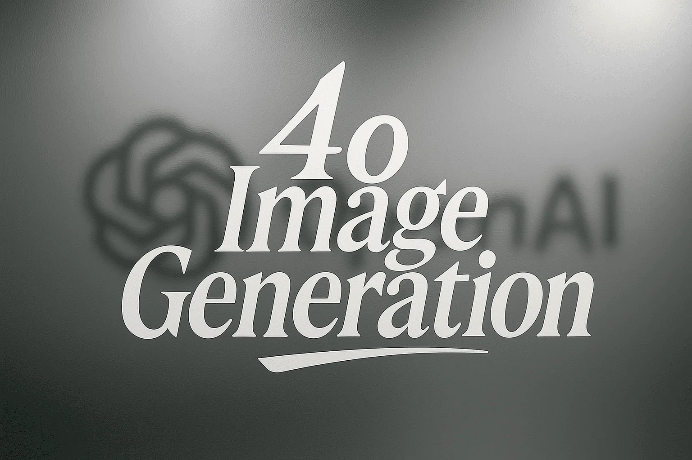
<figcaption>Figure 1. Credit: [www.promptingguide.ai](https://www.promptingguide.ai/_next/image?url=%2F_next%2Fstatic%2Fmedia%2F4o_image_generation.1b6c25d7.png&w=3840&q=75), License: internal-copy</figcaption>

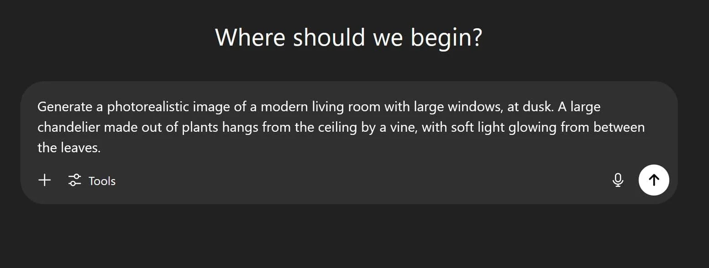
<figcaption>Figure 2. Credit: [www.promptingguide.ai](https://www.promptingguide.ai/_next/image?url=%2F_next%2Fstatic%2Fmedia%2Ftext_prompt_3.a471d216.JPG&w=3840&q=75), License: internal-copy</figcaption>

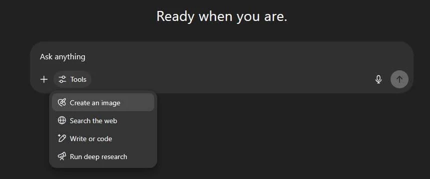
<figcaption>Figure 3. Credit: [www.promptingguide.ai](https://www.promptingguide.ai/_next/image?url=%2F_next%2Fstatic%2Fmedia%2Ftool_select.0114733e.JPG&w=1920&q=75), License: internal-copy</figcaption>

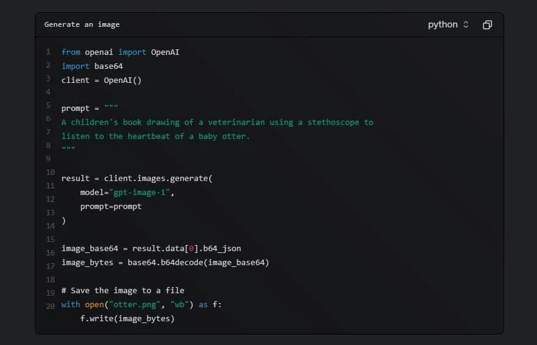
<figcaption>Figure 4. Credit: [www.promptingguide.ai](https://www.promptingguide.ai/_next/image?url=%2F_next%2Fstatic%2Fmedia%2Fimage_gen_API.37ac7655.JPG&w=1920&q=75), License: internal-copy</figcaption>

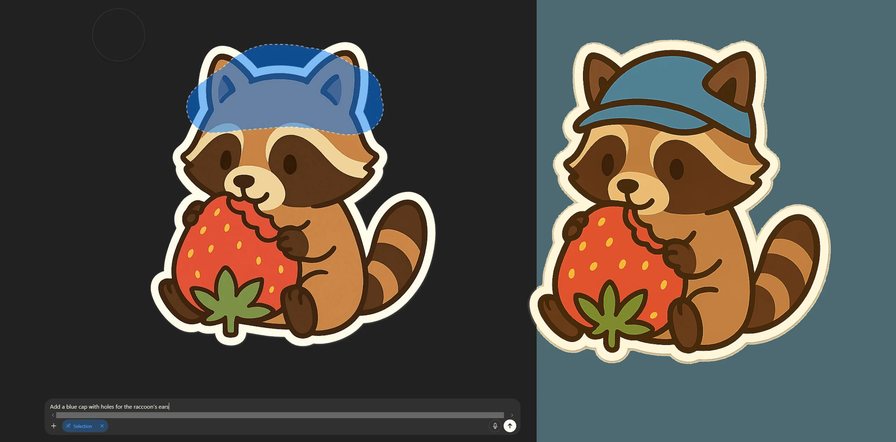
<figcaption>Figure 5. Credit: [www.promptingguide.ai](https://www.promptingguide.ai/_next/image?url=%2F_next%2Fstatic%2Fmedia%2Finpainting_combined.0639a745.png&w=3840&q=75), License: internal-copy</figcaption>

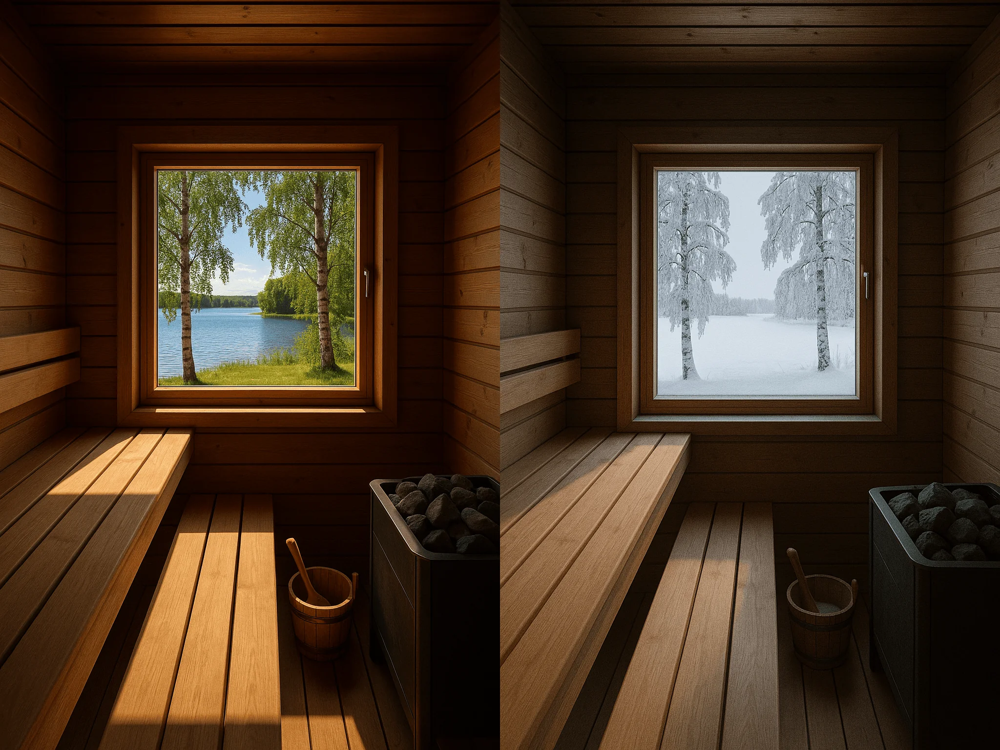
<figcaption>Figure 6. Credit: [www.promptingguide.ai](https://www.promptingguide.ai/_next/image?url=%2F_next%2Fstatic%2Fmedia%2Ftext_edit_combined.b81115bc.png&w=3840&q=75), License: internal-copy</figcaption>

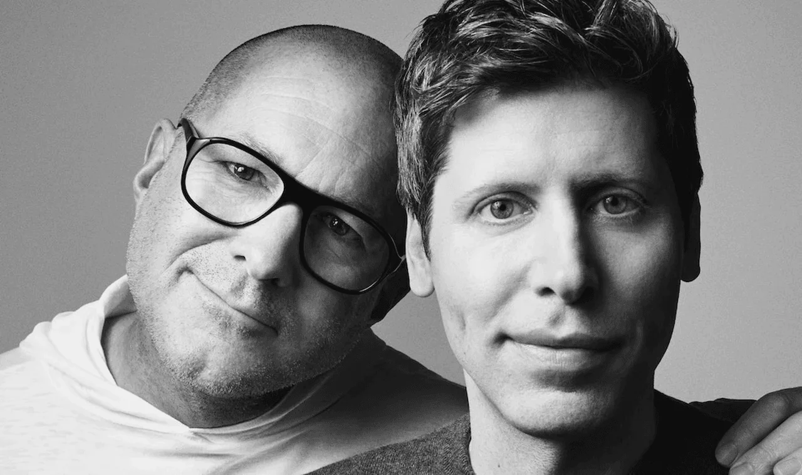
<figcaption>Figure 7. Credit: [www.promptingguide.ai](https://www.promptingguide.ai/_next/image?url=%2F_next%2Fstatic%2Fmedia%2Fsam_and_jony.d560d2b1.png&w=3840&q=75), License: internal-copy</figcaption>

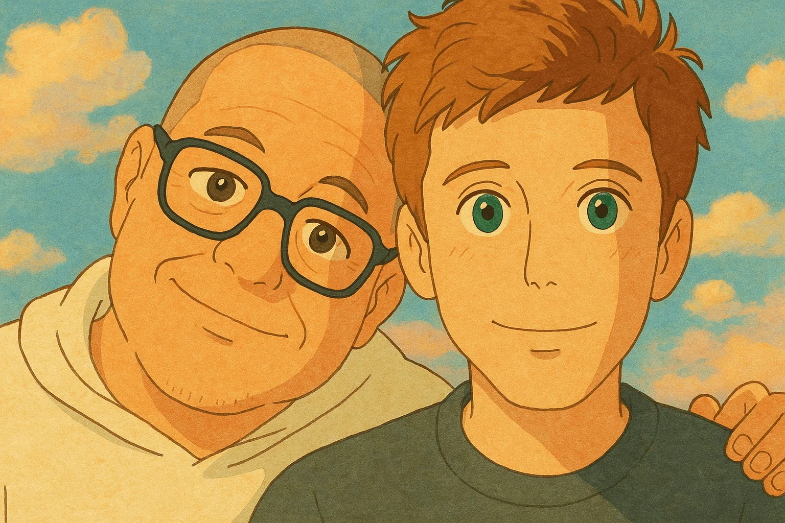
<figcaption>Figure 8. Credit: [www.promptingguide.ai](https://www.promptingguide.ai/_next/image?url=%2F_next%2Fstatic%2Fmedia%2Fsam_and_jony_ghiblified.e4789419.png&w=3840&q=75), License: internal-copy</figcaption>

<figcaption>Figure 9. Credit: [www.promptingguide.ai](https://www.promptingguide.ai/_next/image?url=%2F_next%2Fstatic%2Fmedia%2Finpainting_combined.0639a745.png&w=3840&q=75), License: internal-copy</figcaption>

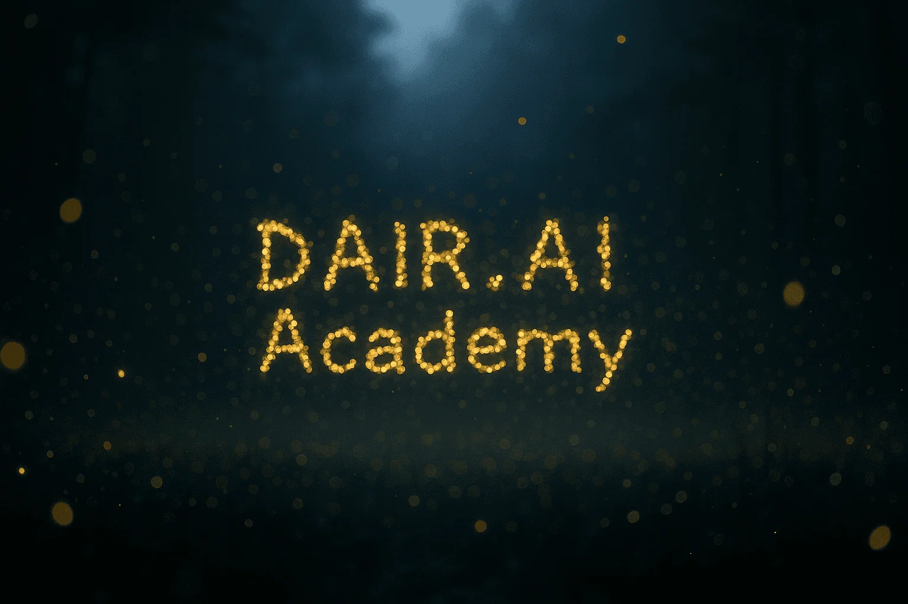
<figcaption>Figure 10. Credit: [www.promptingguide.ai](https://www.promptingguide.ai/_next/image?url=%2F_next%2Fstatic%2Fmedia%2Ftext_in_images.0f8d24b5.png&w=3840&q=75), License: internal-copy</figcaption>

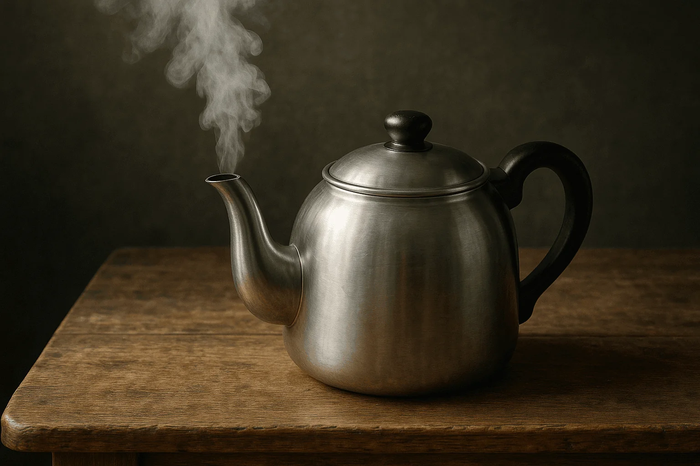
<figcaption>Figure 11. Credit: [www.promptingguide.ai](https://www.promptingguide.ai/_next/image?url=%2F_next%2Fstatic%2Fmedia%2Fteapot_1.f208d800.png&w=3840&q=75), License: internal-copy</figcaption>

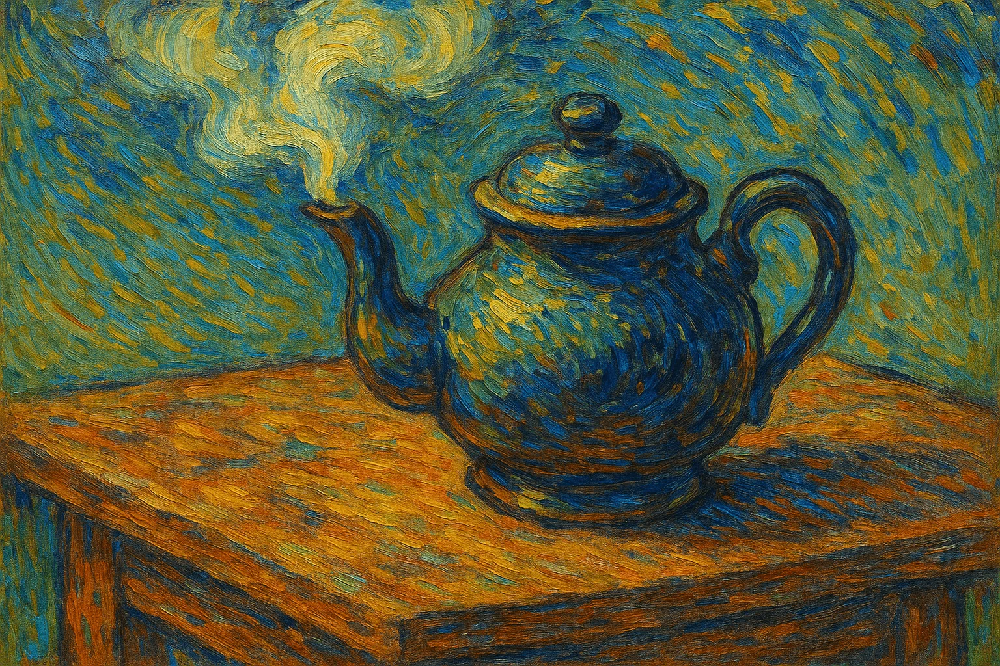
<figcaption>Figure 12. Credit: [www.promptingguide.ai](https://www.promptingguide.ai/_next/image?url=%2F_next%2Fstatic%2Fmedia%2Fteapot_2.38b84a13.png&w=3840&q=75), License: internal-copy</figcaption>
