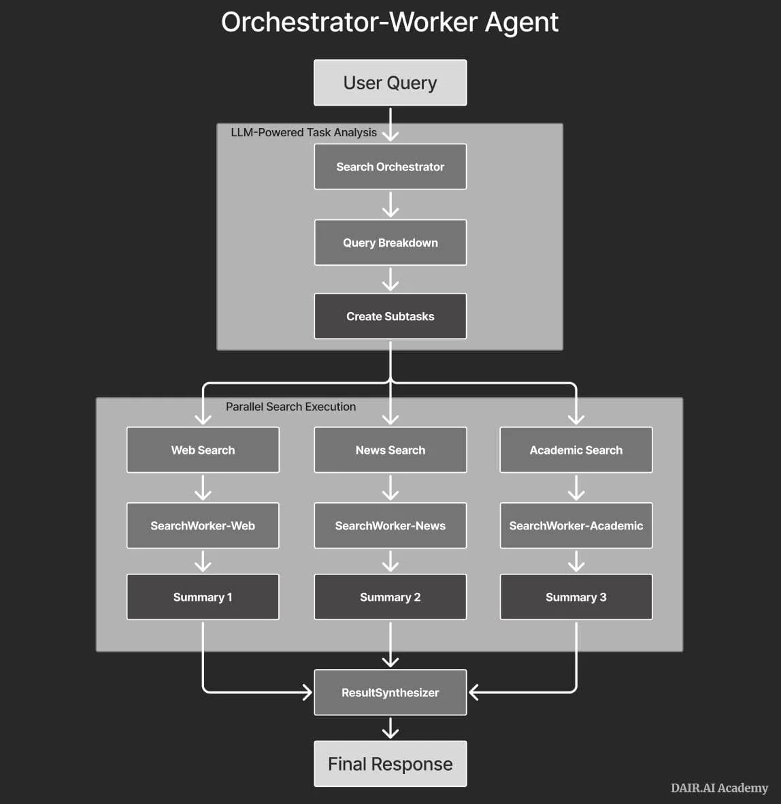
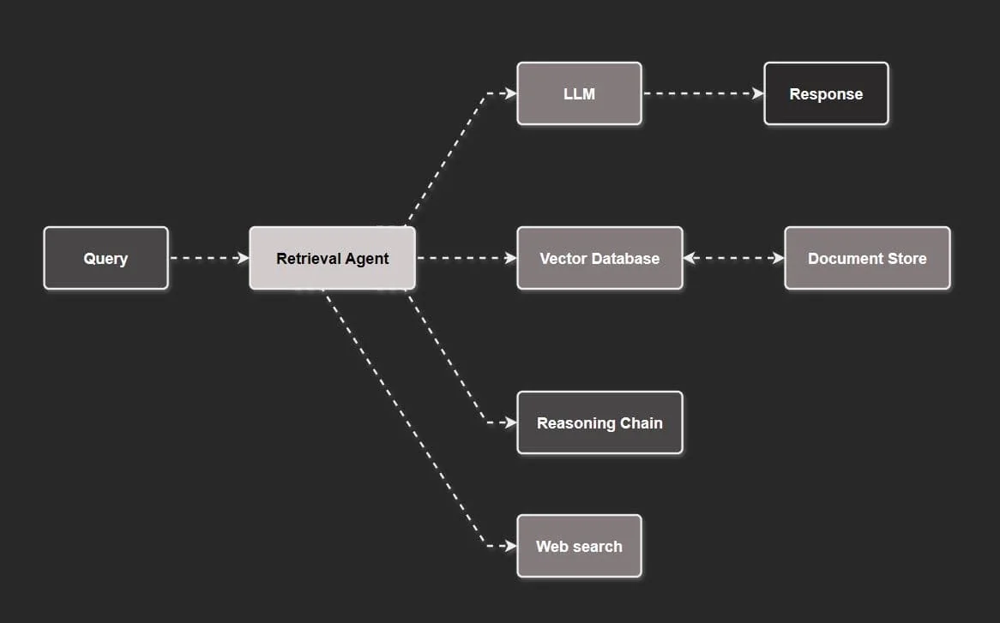
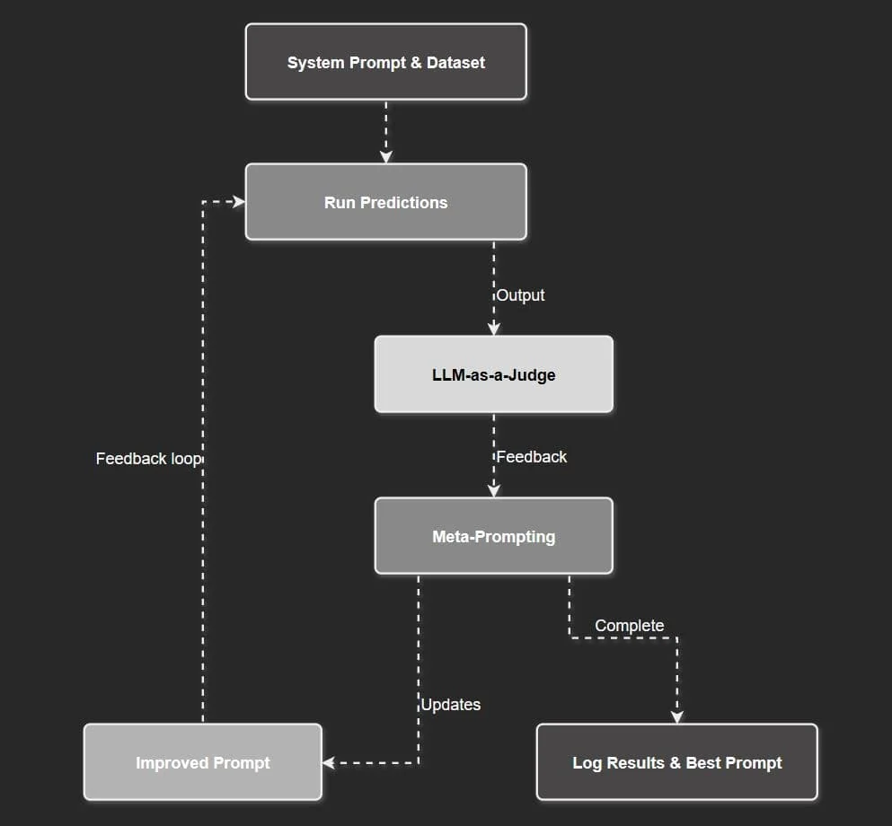
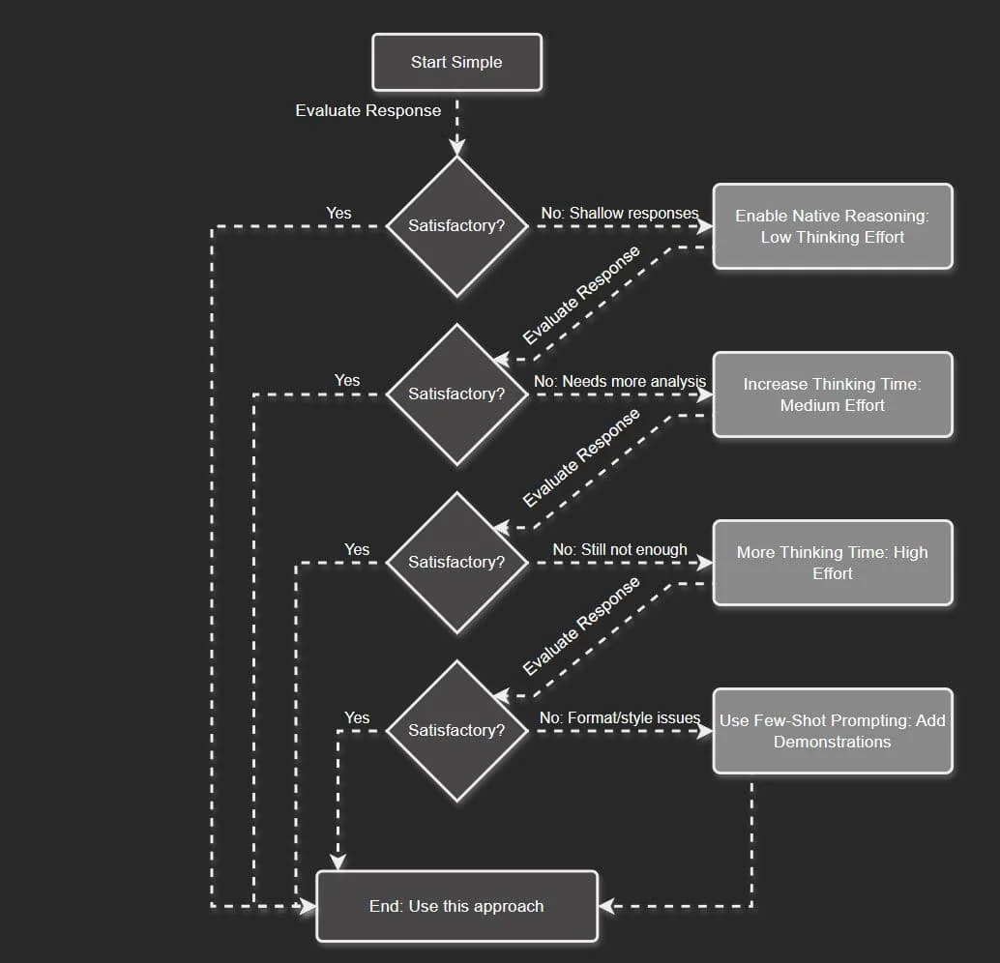

# www.promptingguide.ai-guides-reasoning-llms

> Synthesis: TODO

## Reasoning LLMs Guide
### Table of Contents
- What are Reasoning LLMs?
- Top Reasoning Models
- Reasoning Model Design Patterns & Use Cases
- Reasoning LLM Usage Tips
- Limitations with Reasoning Models
- Next Steps
### What are Reasoning LLMs?
Large reasoning models (LRMs) or simply, reasoning LLMs, are models explicitly trained to perform native thinking or chain-of-thought. Popular examples of reasoning models include Gemini 2.5 Pro, Claude 3.7 Sonnet, and o3.
**Prompt to try with ChatGPT (o3) and Gemini 2.5 Pro (AI Google Studio):**
What is the sum of the first 50 prime numbers? Generate and run Python code for the calculation, and make sure you get all 50. Provide the final sum clearly.
### Top Reasoning Models
Below is a summary of popular reasoning models, along with features and strengths.
Reasoning LLMs [WIP] (opens in a new tab)
Here are a few sources to keep track of the benchmark performance of reasoning models:
- Chatbot Arena LLM Leaderboard (opens in a new tab)
- General Reasoning (opens in a new tab)
- Agent Leaderboard - a Hugging Face Space by galileo-ai (opens in a new tab)
### Reasoning Model Design Patterns & Use Cases
#### Planning for Agentic Systems
When building agentic systems,
**planning** is an important component to enable the system to better perform complex tasks. As an example, when building deep research agentic systems, planning helps in planning the actual searches and guiding the agentic system as it progresses through the task. The example below shows a search agent that first plans (breaks down queries) before orchestrating and executing searches:
#### Agentic RAG
**Agentic RAG** is a system that leverages reasoning models for building agentic RAG applications that involve advanced tool use and reasoning on complex knowledge bases or sources. It can involve leveraging a **retrieval agent** with a reasoning chain/tool to route complex queries/contexts (via tool/function calling) that require complex reasoning.
Here is a basic implementation of an agentic RAG system using n8n: n8n templates (opens in a new tab)
Here is the video tutorial of the agentic RAG system: Building with Reasoning LLMs | n8n Agentic RAG Demo + Template (opens in a new tab)
#### LLM-as-a-Judge
When building applications that require automated evaluation/assessment, LLM-as-a-Judge is an option. LLM-as-a-Judge leverages the complex understanding and reasoning of large amounts of information. Reasoning LLMs are ideal for this type of use case. The example below shows an evaluator-optimizer agentic system that loops with an LLM-as-a-Judge agent (powered by a reasoning model) that first assesses the predictions and generates feedback. The feedback is used by a meta-prompt that takes in the current prompt, feedback, and tries to optimize the base system prompt.
#### Visual Reasoning
Models like o3 can leverage multi-tool use capabilities to perform advanced visual reasoning (opens in a new tab) and perform tasks such as reasoning about images and even modifying images (e.g., zoom, crop, rotate, etc.) with available tools. The model can reason with images in their chain-of-thought.
**🧩Crossword puzzle:** https://chatgpt.com/share/681fcc32-58fc-8000-b2dc-5da7e84cf8bf (opens in a new tab)
#### Other Use Cases
Other use cases include:
- Finding relationships and answering questions on large, complex datasets (e.g., a large set of distinct documents) in technical domains
- Reviewing, understanding, and debugging large codebases; it's also great at algorithmic development and scientific coding
- Scientific tasks that might require advanced mathematical problem-solving, experimental design, and deeper reasoning
- Literature review & synthesis
- Routine generation for KBs to optimize the step-by-step instructions for LLMs (e.g., meta-prompting)
- Data validation to improve the quality and reliability of datasets
- Multi-step agentic planning (e.g., deep research)
- Recognizing and extracting relevant information for QA systems
- Knowledge-intensive and ambiguous tasks
**Reasoning LLM Usage Tips**
**General Usage Patterns & Prompting Tips**
-
**Strategic Reasoning:**Use reasoning models for reasoning-heavy modules or components of your LLM-based applications, not for every part of the application. Apply the separation of concerns (modularize your application) so it’s easy to identify where in your application you will find reasoning useful.
-
**Inference-time scaling (test-time compute):**In general, the more thinking time (i.e., compute), the better the performance for most of the reasoning models.
-
**Thinking time:**You can use different reasoning efforts options, such as ` **low**` for lower costs and faster responses, or ` **high**` for higher thinking time and more tokens, which also results in slower responses. ` **medium**` is a balance between accuracy and speed.
-
**Be explicit with instructions:**As with other standard chat LLMs, provide reasoning models with clear and explicit instructions for what you want to achieve. You don’t need to provide details on the step-by-step (more on this below), but it’s important to give the model the necessary high-level instructions, constraints, and desired output to eliminate any assumptions the model might try to make.
-
**Avoid manual CoT:**Avoid chain-of-thought (step-by-step) prompting in the instructions. The instructions should be simple and direct. Add response constraints in the instruction whenever applicable.
-
**Structure inputs and outputs:**Similar to standard LLMs, it’s good practice to structure your inputs with delimiters. You can also leverage structured outputs, especially when building complex agentic applications. Most reasoning models are effective at following instructions for structuring output using JSON or XML. We recommend using XML as the default mode for structuring generated content unless there is a hard requirement to output the content in JSON. **The output format from models like Claude 4 tends to be influenced by how the prompt is structured (e.g., leans heavily on Markdown output if Markdown is used to format the prompt).**
-
**Few-shot Prompting**: Add few-shot demonstrations/exemplars if you need to meet a desired output that the model is struggling with. Make sure to align these with your high-level instructions to avoid confusion. Few-shot prompting is particularly useful when it’s hard to explain the desired output and to provide examples of the behavior you want the model to avoid.
-
**Use descriptive and clear modifiers when instructing the models:**You can steer models like o3 and Claude 4 to produce more complex and higher-quality outputs (e.g., for code and search results) by using clear modifiers and more details in the instructions. Obtained from the Claude 4 documentation (opens in a new tab), an example for generating front-end code would be “Add thoughtful details like hover states, transitions, and micro-interactions”.
### Using Hybrid Reasoning Models
-
**Start simple:**Use the standard mode first (thinking mode off) and evaluate the response. You can also try using a manual chain-of-thought prompt here.
-
**Enable native reasoning:**If you see mistakes and shallow responses, but you believe the task can benefit from more extensive analysis/reasoning, then enable thinking. Start with low thinking effort and evaluate the quality of the response.
-
**Increase thinking time:**If low thinking is not enough, switch to medium effort.
-
**More thinking time:**If medium effort is not enough, switch to high effort.
-
**Use few-shot prompting:**Use demonstrations if you need to improve the style and format of the outputs.
🧑💻 Code Demo: reasoning.ipynb (opens in a new tab)
**Limitations with Reasoning Models**
Here is a list of common ongoing issues to keep in mind when using reasoning models
-
**Output quality**
-
Reasoning models can sometimes produce mixed-language content, repeated content, inconsistent outputs, formatting issues, and low-quality output style.
-
Some of these issues can be mitigated by following the prompting best practices for the models. Avoid ambiguous and unnecessary instructions.
-
-
**Reasoning affects Instruction-Following**
-
When using explicit Chain-of-Thought prompting with reasoning models, it can hurt the instruction-following performance of the model (ref (opens in a new tab)). This means that you want to be more careful with how you use CoT, and potentially avoid using it with reasoning models altogether.
-
This paper (opens in a new tab) suggests the following mitigation strategies:
- few-shot in-context learning with carefully chosen examples
- self-reflection (models critique and revise their own answers)
- self-selective reasoning (models decide when to reason)
- classifier-selective reasoning (an external classifier predicts if reasoning will help)
-
-
**Overthinking & Underthinking**
-
If not properly prompted, reasoning models tend to either overthink or underthink.
-
You can improve this by being very specific about tasks, processes, and expected output format.
-
Other developers address this by creating subtasks and routing complex tasks to a reasoning tool if needed (powered by the reasoning model).
-
-
**Cost**
-
Reasoning models are significantly more costly than standard chat LLMs, so ensure experimenting with a debugging tool and always evaluate the quality of responses.
-
Track token usage and costs that emerge from inconsistent outputs.
-
-
**Latency**
-
Reasoning models are relatively slow and sometimes output unnecessary content not relevant to the task at hand, which leads to latency issues.
-
These latency issues can be avoided by more concise prompting. On the application side of things, you can also leverage streaming tokens to improve perceived latency.
-
Smaller reasoning models and other models like Claude 3.7 Sonnet produce better latency.
-
**Try to optimize for accuracy first and then optimize for latency and cost.**
-
-
**Poor tool calling and agentic capabilities**
-
While reasoning models like o3 have improved multi-tool calling, parallel tool calling might still be an issue.
-
Other reasoning models also show poor tool-calling capabilities (e.g., DeepSeek-R1 and Qwen series) unless explicitly trained to do this.
-
With advanced and more reliable tool calling, this could unlock agentic systems that can take action in the real world. Reasoning LLMs are already very knowledgeable but need more improvements on
**decision making**through **robust and dynamic tool calling capabilities**and understanding of both the physical and digital world. Multi-modal reasoning is an ongoing area of research.
-
You can also find the most up-to-date guide on reasoning LLMs here: Reasoning LLMs Guide (opens in a new tab)
**Next Steps**
We recommend the following courses to learn more about the applications of reasoning LLMs and improve LLM-based agentic systems workflow development:
- Prompt Engineering for Developers (opens in a new tab)
- Covers more tips on prompting reasoning LLMs and applications
- Advanced AI Agents (opens in a new tab)
- Covers how to leverage reasoning LLMs with multi-agent systems, and for other advanced ideas like LLM-as-a-Judge and supervisor-worker agentic architectures
- Introduction to AI Agents (opens in a new tab)
- Covers how to build with concepts like ReAct Agents
- Introduction to RAG (opens in a new tab)
- Covers how to build with popular design patterns like Agentic RAG
We also have an active community forum to get support, guidance, join live office hours, join live events with experts, and more.
Reach out to academy@dair.ai if you have any questions.
Learn how to build advanced agents with reasoning LLMs in our new course: Advanced AI Agents (opens in a new tab)
Use code PROMPTING20 to get an extra 20% off.
**References**
- Claude 4 prompt engineering best practices (opens in a new tab)
- LLM Reasoning | Prompt Engineering Guide<!-- --> (opens in a new tab)
- Reasoning Models Don’t Always Say What They Think (opens in a new tab)
- Gemini thinking | Gemini API | Google AI for Developers (opens in a new tab)
- Introducing OpenAI o3 and o4-mini (opens in a new tab)
- Understanding Reasoning LLMs (opens in a new tab)
- Thinking with images | OpenAI (opens in a new tab)
- DeepSeek R1 Paper (opens in a new tab)
- General Reasoning (opens in a new tab)
- Llama-Nemotron: Efficient Reasoning Models (opens in a new tab)
- Phi-4-Mini Reasoning (opens in a new tab)
- The CoT Encyclopedia (opens in a new tab)
- Towards a deeper understanding of Reasoning in LLMs (opens in a new tab)
- The Pitfalls of Reasoning for Instruction Following in LLMs (opens in a new tab)
- The Illusion of Thinking: Understanding the Strengths and Limitations of Reasoning Models via the Lens of Problem Complexity (opens in a new tab)

<figcaption>Figure 1. Credit: [www.promptingguide.ai](https://www.promptingguide.ai/_next/image?url=%2F_next%2Fstatic%2Fmedia%2Forchestrator_worker_LI_1.4d950bc8.JPG&w=3840&q=75), License: internal-copy</figcaption>

<figcaption>Figure 2. Credit: [www.promptingguide.ai](https://www.promptingguide.ai/_next/image?url=%2F_next%2Fstatic%2Fmedia%2Fagentic_rag.405e1d65.JPG&w=3840&q=75), License: internal-copy</figcaption>

<figcaption>Figure 3. Credit: [www.promptingguide.ai](https://www.promptingguide.ai/_next/image?url=%2F_next%2Fstatic%2Fmedia%2Fllm_as_a_judge.27685735.JPG&w=2048&q=75), License: internal-copy</figcaption>

<figcaption>Figure 4. Credit: [www.promptingguide.ai](https://www.promptingguide.ai/_next/image?url=%2F_next%2Fstatic%2Fmedia%2Fhybrid_reasoning_models.843a095d.JPG&w=3840&q=75), License: internal-copy</figcaption>
