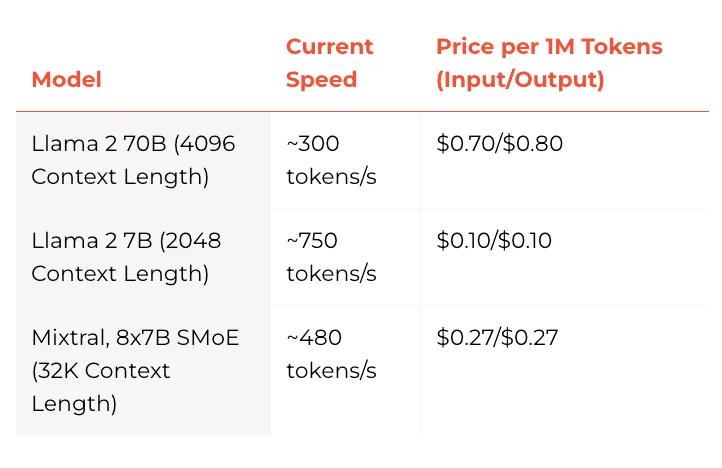
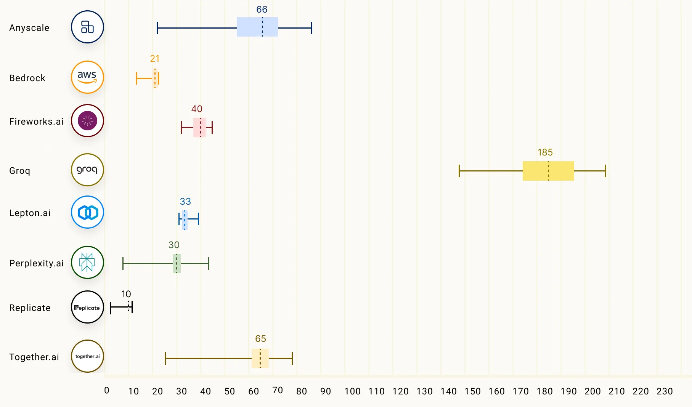
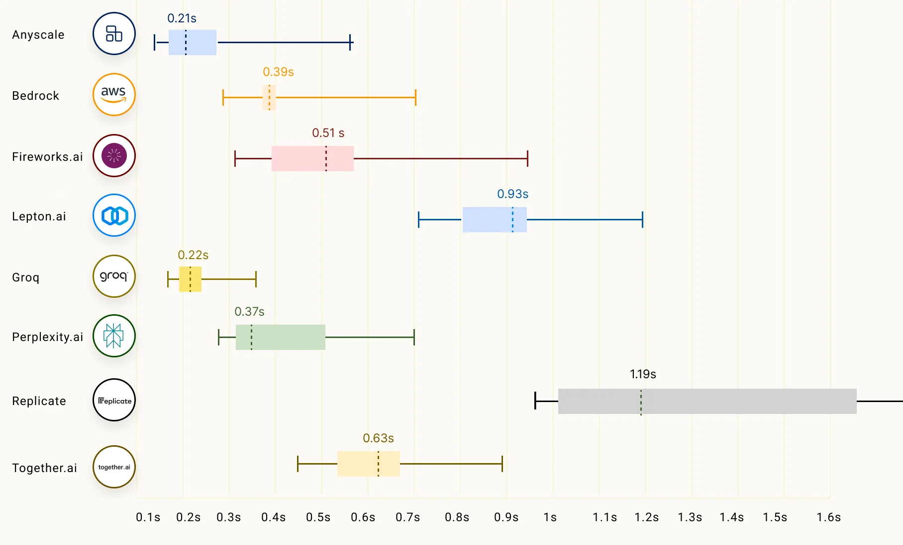

# www.promptingguide.ai-research-groq

> Synthesis: TODO

# What is Groq?
Groq (opens in a new tab) recently made a lot of headlines as one of the fastest LLM inference solutions available today. There is a lot of interest from LLM practitioners to reduce the latency in LLM responses. Latency is an important metric to optimize and enable real-time AI applications. There are many companies now in the space competing around LLM inference.
Groq is one of those LLM inference companies that claim, at the time of writing this post, 18x faster inference performance on Anyscale's LLMPerf Leaderboard (opens in a new tab) compared to other top cloud-based providers. Groq currently makes available models like Meta AI's Llama 2 70B and Mixtral 8x7B via their APIs. These models are powered by Groq LPU™ Inference Engine which is built with their own custom hardware designed for running LLMs called language processing units (LPUs).
According to to Groq's FAQs, LPU helps to reduce the amount of time per word calculated, enabling faster text sequence generation. You can read more about the technical details of LPU and its benefits in their ISCA-awarded 2020 (opens in a new tab) and 2022 (opens in a new tab) papers.
Here is a chart with the speed and pricing for their models:
The chart below compares the output tokens throughput (tokens/s) which is the average number of output tokens returned per second. The numbers in the chart correspond to the mean output tokens throughput (based on 150 requests) of the LLM inference providers on the Llama 2 70B model.
Another important factor of LLM inference, especially for streaming applications, is called time to first token (TTFT) which corresponds to the duration of time that the LLM returns the first token. Below is a chart showing how different LLM inference providers perform:
You can read more about Groq's LLM inference performance on Anyscale’s LLMPerf Leaderboard here (opens in a new tab).

<figcaption>Figure 1. Credit: [www.promptingguide.ai](https://www.promptingguide.ai/_next/image?url=%2F_next%2Fstatic%2Fmedia%2Fgroq.0d4130ed.png&w=1920&q=75), License: internal-copy</figcaption>

<figcaption>Figure 2. Credit: [www.promptingguide.ai](https://github.com/ray-project/llmperf-leaderboard/blob/main/.assets/output_tokens_per_s.jpg?raw=true), License: internal-copy</figcaption>

<figcaption>Figure 3. Credit: [www.promptingguide.ai](https://github.com/ray-project/llmperf-leaderboard/blob/main/.assets/ttft.jpg?raw=true), License: internal-copy</figcaption>
