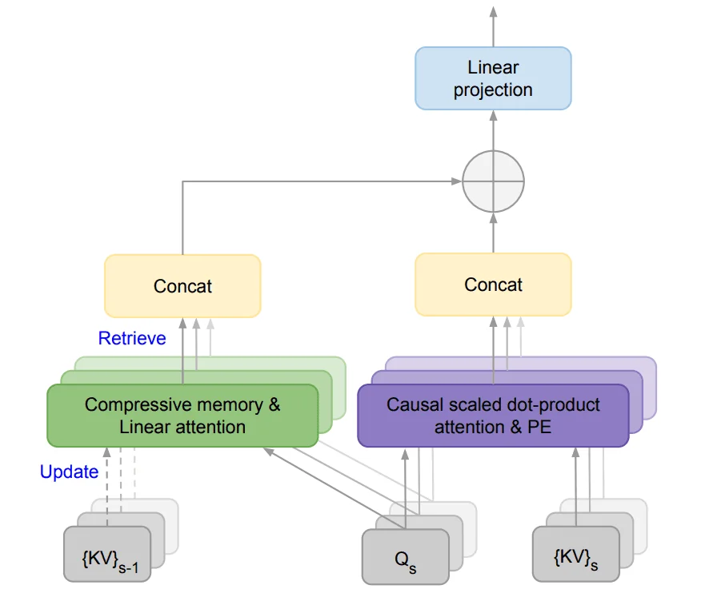

# www.promptingguide.ai-research-infini-attention

> Synthesis: TODO

# Efficient Infinite Context Transformers
A new paper (opens in a new tab) by Google integrates compressive memory into a vanilla dot-product attention layer.
The goal is to enable Transformer LLMs to effectively process infinitely long inputs with bounded memory footprint and computation.
They propose a new attention technique called Infini-attention which incorporates a compressive memory module into a vanilla attention mechanism.
It builds in both masked local attention and long-term linear attention into a single Transformer block. This allows the Infini-Transformer model to efficiently handle both long and short-range contextual dependencies.
This approach outperforms baseline models on long-context language modeling with a 114x compression ratio of memory!
They also show that a 1B LLM can naturally scale to a 1M sequence length and a 8B model achieves a new SoTA result on a 500K length book summarization task.
Given how important long-context LLMs are becoming having an effective memory system could unlock powerful reasoning, planning, continual adaption, and capabilities not seen before in LLMs.

<figcaption>Figure 1. Credit: [www.promptingguide.ai](https://www.promptingguide.ai/_next/image?url=%2F_next%2Fstatic%2Fmedia%2Finfini-attention.8330113a.png&w=1920&q=75), License: internal-copy</figcaption>
