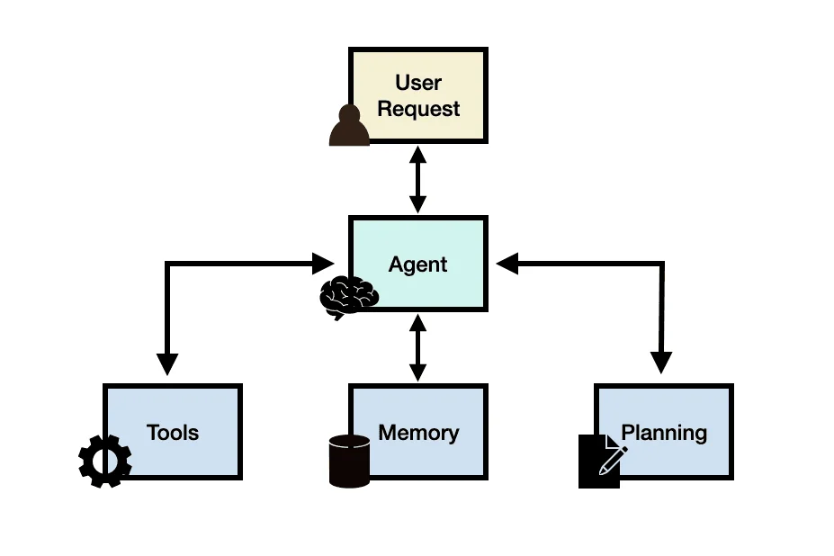
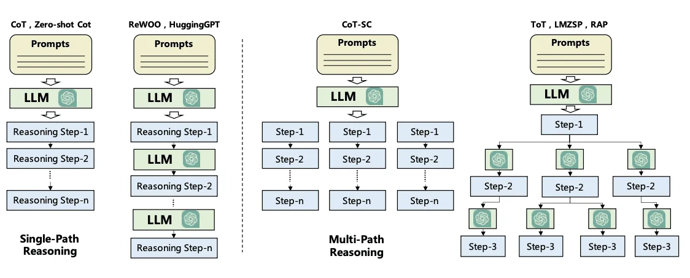
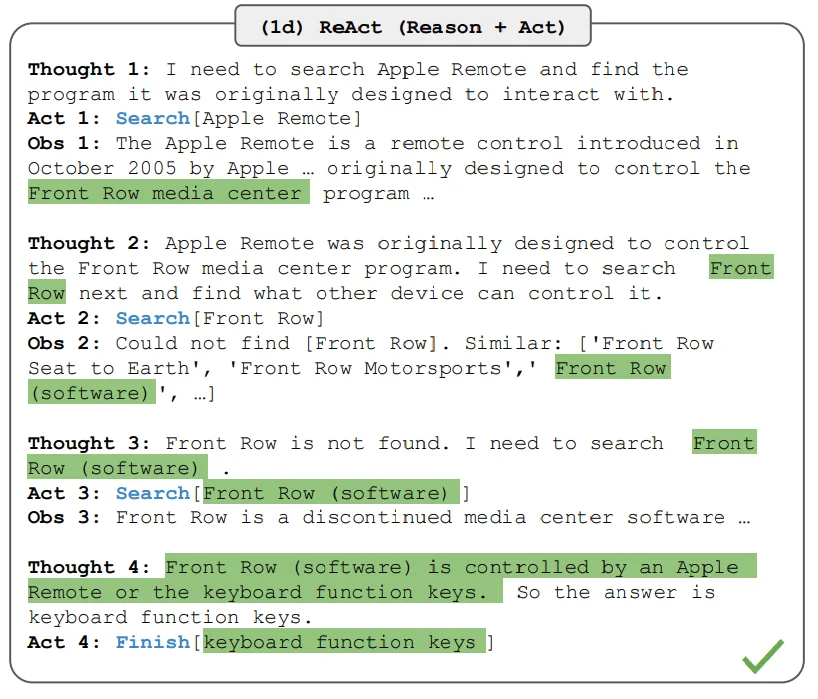
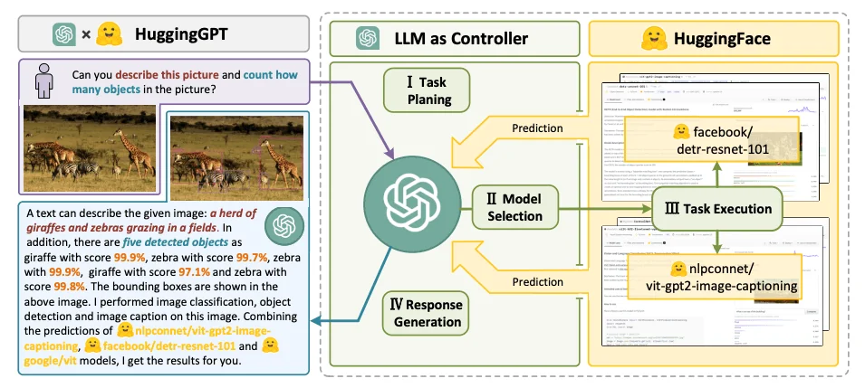
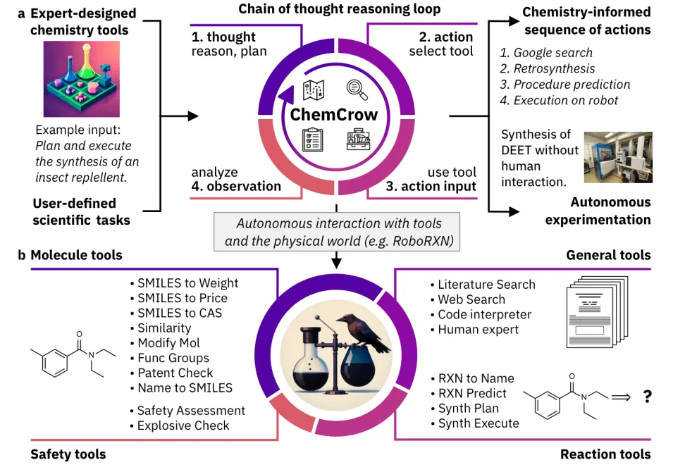
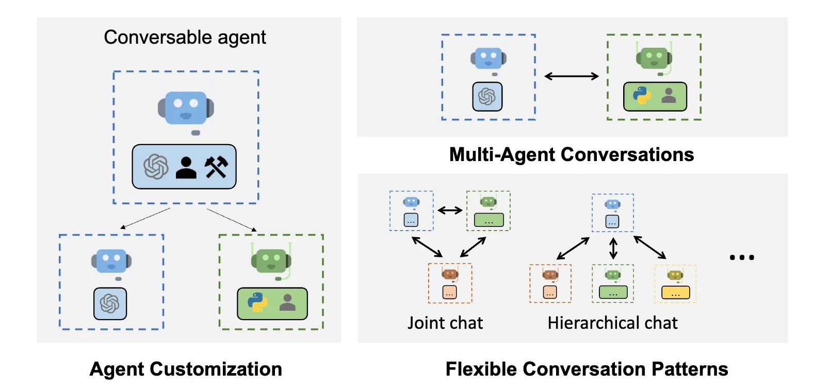
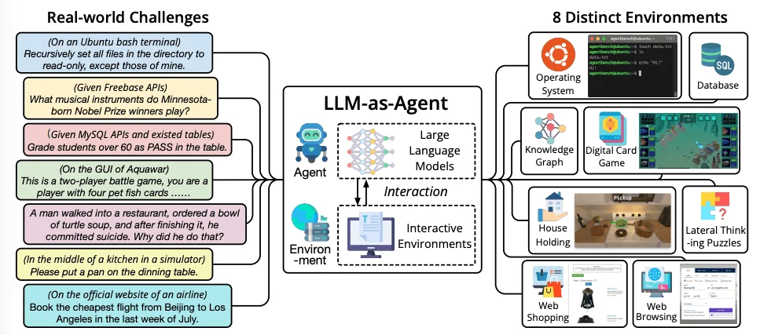

# www.promptingguide.ai-research-llm-agents

> Synthesis: TODO

# LLM Agents
LLM based agents, hereinafter also referred to as LLM agents for short, involve LLM applications that can execute complex tasks through the use of an architecture that combines LLMs with key modules like planning and memory. When building LLM agents, an LLM serves as the main controller or "brain" that controls a flow of operations needed to complete a task or user request. The LLM agent may require key modules such as planning, memory, and tool usage.
To better motivate the usefulness of an LLM agent, let's say that we were interested in building a system that can help answer the following question:
What's the average daily calorie intake for 2023 in the United States?
The question above could potentially be answered using an LLM that already has the knowledge needed to answer the question directly. If the LLM doesn't have the relevant knowledge to answer the question, it's possible to use a simple RAG system where an LLM has access to health related information or reports. Now let's give the system a more complex question like the following:
How has the trend in the average daily calorie intake among adults changed over the last decade in the United States, and what impact might this have on obesity rates? Additionally, can you provide a graphical representation of the trend in obesity rates over this period?
To answer such a question, just using an LLM alone wouldn't be enough. You can combine the LLM with an external knowledge base to form a RAG system but this is still probably not enough to answer the complex query above. This is because the complex question above requires an LLM to break the task into subparts which can be addressed using tools and a flow of operations that leads to a desired final response. A possible solution is to build an LLM agent that has access to a search API, health-related publications, and public/private health database to provide relevant information related to calorie intake and obesity.
In addition, the LLM will need access to a "code interpreter" tool that helps take relevant data to produce useful charts that help understand trends in obesity. These are the possible high-level components of the hypothetical LLM agent but there are still important considerations such as creating a plan to address the task and potential access to a memory module that helps the agent keep track of the state of the flow of operations, observations, and overall progress.
Learn more about LLM-based agents and advanced prompting methods in our new AI courses. Join now! (opens in a new tab)
Use code PROMPTING20 to get an extra 20% off.
## LLM Agent Framework
Generally speaking, an LLM agent framework can consist of the following core components:
- User Request - a user question or request
- Agent/Brain - the agent core acting as coordinator
- Planning - assists the agent in planning future actions
- Memory - manages the agent's past behaviors
### Agent
A large language model (LLM) with general-purpose capabilities serves as the main brain, agent module, or coordinator of the system. This component will be activated using a prompt template that entails important details about how the agent will operate, and the tools it will have access to (along with tool details).
While not mandatory, an agent can be profiled or be assigned a persona to define its role. This profiling information is typically written in the prompt which can include specific details like role details, personality, social information, and other demographic information. According to [Wang et al. 2023], the strategies to define an agent profile include handcrafting, LLM-generated or data-driven.
### Planning
#### Planning Without Feedback
The planning module helps to break down the necessary steps or subtasks the agent will solve individually to answer the user request. This step is important to enable the agent to reason better about the problem and reliably find a solution. The planning module will leverage an LLM to decompose a detailed plan which will include subtasks to help address the user question. Popular techniques for task decomposition include Chain of Thought (opens in a new tab) and Tree of Thoughts (opens in a new tab) which can be categorized as single-path reasoning and multi-path reasoning, respectively. Below is a figure comparing different strategies as formalized in Wang et al., 2023 (opens in a new tab):
#### Planning With Feedback
The planning modules above don't involve any feedback which makes it challenging to achieve long-horizon planning to solve complex tasks. To address this challenge, you can leverage a mechanism that enables the model to iteratively reflect and refine the execution plan based on past actions and observations. The goal is to correct and improve on past mistakes which helps to improve the quality of final results. This is particularly important in complex real-world environments and tasks where trial and error are key to completing tasks. Two popular methods for this reflection or critic mechanism include ReAct (opens in a new tab) and Reflexion (opens in a new tab).
As an example, ReAct combines reasoning and acting aimed at enabling an LLM to solve complex tasks by interleaving between a series of steps (repeated N times):
Thought,
Action, and
Observation. ReAct receives feedback from the environment in the form of observations. Other types of feedback can include human and model feedback. The figure below shows an example of ReAct and the different steps involved in performing question answering:
Learn more about ReAct here:
### Memory
The memory module helps to store the agent's internal logs including past thoughts, actions, and observations from the environment, including all interactions between agent and user. There are two main memory types that have been reported in the LLM agent literature:
**Short-term memory**- includes context information about the agent's current situations; this is typically realized by in-context learning which means it is short and finite due to context window constraints. **Long-term memory**- includes the agent's past behaviors and thoughts that need to be retained and recalled over an extended period of time; this often leverages an external vector store accessible through fast and scalable retrieval to provide relevant information for the agent as needed.
Hybrid memory integrates both short-term memory and long-term memory to improve an agent's ability for long-range reasoning and accumulation of experiences.
There are also different memory formats to consider when building agents. Representative memory formats include natural language, embeddings, databases, and structured lists, among others. These can also be combined such as in Ghost in the Minecraft (GITM (opens in a new tab)) that utilizes a key-value structure where the keys are represented by natural language and values are represented by embedding vectors.
Both the planning and memory modules allow the agent to operate in a dynamic environment and enable it to effectively recall past behaviors and plan future actions.
### Tools
Tools correspond to a set of tool/s that enables the LLM agent to interact with external environments such as Wikipedia Search API, Code Interpreter, and Math Engine. Tools could also include databases, knowledge bases, and external models. When the agent interacts with external tools it executes tasks via workflows that assist the agent to obtain observations or necessary information to complete subtasks and satisfy the user request. In our initial health-related query, a code interpreter is an example of a tool that executes code and generates the necessary chart information requested by the user.
Tools are leveraged in different ways by LLMs:
- MRKL (opens in a new tab) is a framework that combines LLMs with expert modules that are either LLMs or symbolic (calculator or weather API).
- Toolformer (opens in a new tab) fine-tune LLMs to use external tool APIs.
- Function Calling (opens in a new tab) - augments LLMs with tool use capability which involves defining a set of tool APIs and providing it to the model as part of a request.
- HuggingGPT (opens in a new tab) - an LLM-powered agent that leverages LLMs as a task planner to connect various existing AI models (based on descriptions) to solve AI tasks.
## LLM Agent Applications
*The ChemCrow agent designed to complete tasks across organic synthesis, drug discovery, and materials design. Figure source: Bran et al., 2023*
In this section, we highlight examples of domains and case studies where LLM-based agents have been effectively applied due to their complex reasoning and common sense understanding capabilities.
### Notable LLM-based Agents
- Ma et al. (2023) (opens in a new tab) analyze the effectiveness of conversational agents for mental well-being support and find that the agent can help users cope with anxieties but it can sometimes produce harmful content.
- Horton (2023) (opens in a new tab) gives LLM-based agents endowment, preferences, and personalities to explore human economic behaviors in simulated scenarios.
- Generative Agents (opens in a new tab) and AgentSims (opens in a new tab) both aim to simulate human daily life in a virtual town by constructing multiple agents.
- Blind Judgement (opens in a new tab) employs several language models to simulate the decision-making processes of multiple judges; predicts the decisions of the real-world Supreme Court with better-than-random accuracy.
- Ziems et al. (2023) (opens in a new tab) presents agents that can assist researchers in tasks such as generating abstracts, scripting, and extracting keywords.
- ChemCrow (opens in a new tab) is an LLM chemistry agent that utilizes chemistry-related databases to autonomously plan and execute the syntheses of insect repellent, three organocatalysts, and guided discovery of a novel chromophore.
- [Boiko et al. (2023)] combines multiple LLMs for automating the design, planning, and execution of scientific experiments.
- Math Agents assist researchers in exploring, discovering, solving and proving mathematical problems. EduChat (opens in a new tab) and CodeHelp (opens in a new tab) are two other notable examples of LLM agents designed for education.
- Mehta et al. (2023) (opens in a new tab) propose an interactive framework that enables human architects to interact with AI agents to construct structures in a 3D simulation environment.
- ChatDev (opens in a new tab), ToolLLM (opens in a new tab), MetaGPT (opens in a new tab) are notable examples where AI agents show potential to automate coding, debugging, testing, and assist with other software engineering tasks.
- D-Bot (opens in a new tab) a LLM-based database administrator that continuously acquires database maintenance experience and provides diagnosis and optimization advice for databases.
- IELLM (opens in a new tab) applies LLMs to address challenges in the oil and gas industry.
- Dasgupta et al. 2023 (opens in a new tab) presents a unified agent system for embodied reasoning and task planning.
- OS-Copilot (opens in a new tab) a framework to build generalist agents capable of interfacing with comprehensive elements in an operating system (OS), including the web, code terminals, files, multimedia, and various third-party applications.
### LLM Agent Tools
*AutoGen capabilities; Figure Source: https://microsoft.github.io/autogen (opens in a new tab)*
Below are notable examples of tools and frameworks that are used to build LLM agents:
- LangChain (opens in a new tab): a framework for developing applications and agents powered by language models.
- AutoGPT (opens in a new tab): provides tools to build AI agents.
- Langroid (opens in a new tab): Simplifies building LLM applications with Multi-Agent Programming: agents as first-class citizens, collaborating on tasks via messages.
- AutoGen (opens in a new tab): a framework that enables the development of LLM applications using multiple agents that can converse with each other to solve tasks.
- OpenAgents (opens in a new tab): an open platform for using and hosting language agents in the wild.
- LlamaIndex (opens in a new tab) - a framework for connecting custom data sources to large language models.
- GPT Engineer (opens in a new tab): automate code generation to complete development tasks.
- DemoGPT (opens in a new tab): autonomous AI agent to create interactive Streamlit apps.
- GPT Researcher (opens in a new tab): an autonomous agent designed for comprehensive online research on a variety of tasks.
- AgentVerse (opens in a new tab): designed to facilitate the deployment of multiple LLM-based agents in various applications.
- Agents (opens in a new tab): an open-source library/framework for building autonomous language agents. The library supports features including long-short term memory, tool usage, web navigation, multi-agent communication, and brand new features including human-agent interaction and symbolic control.
- BMTools (opens in a new tab): extends language models using tools and serves as a platform for the community to build and share tools.
- crewAI (opens in a new tab): AI agent framework reimagined for engineers, offering powerful capabilities with simplicity to build agents and automations.
- Phidata (opens in a new tab): a toolkit for building AI Assistants using function calling.
## LLM Agent Evaluation
*AgentBench benchmark to evaluate LLM-as-Agent on real-world challenges and 8 different environments. Figure source: Liu et al. 2023*
Similar to evaluating LLM themselves, evaluating LLM agents is a challenging task. According to Wang et al., (2023), common evaluation methods include:
**Human Annotation**: Includes human evaluators that directly score LLM results across different aspects that matter in the application such as honesty, helpfulness, engagement, unbiasedness, and more. **Turing Test**: Human evaluators are asked to compare results from real humans and agents where indistinguishable results mean that agents can achieve human-like performance. **Metrics**: These are carefully designed metrics that reflect the quality of the agents. Notable metrics include task success metrics, human similarity metrics, and efficiency metrics. **Protocols**: Corresponds to common evaluation protocols that determine how the metrics are used. Examples include real-world simulation, social evaluation, multi-task evaluation, and software testing. **Benchmarks**: Several benchmarks have been designed to evaluate LLM agents. Notable examples include ALFWorld (opens in a new tab), IGLU (opens in a new tab), Tachikuma (opens in a new tab), AgentBench (opens in a new tab), SocKET (opens in a new tab), AgentSims (opens in a new tab), ToolBench (opens in a new tab), WebShop (opens in a new tab), Mobile-Env (opens in a new tab), WebArena (opens in a new tab), GentBench (opens in a new tab), RocoBench (opens in a new tab), EmotionBench (opens in a new tab), PEB (opens in a new tab), ClemBench (opens in a new tab), and E2E (opens in a new tab).
## Challenges
LLM agents are still in their infancy so there are many challenges and limitations that remain when building them:
**Role-playing capability**: LLM-based agents typically need to adapt a role to effectively complete tasks in a domain. For roles that the LLM doesn't characterize well, it's possible to fine-tune the LLM on data that represent uncommon roles or psychology characters. **Long-term planning and finite context length**: planning over a lengthy history remains a challenge that could lead to errors that the agent may not recover from. LLMs are also limited in context length they can support which could lead to constraints that limit the capabilities of the agent such as leveraging short-term memory. **Generalized human alignment**: it's also challenging to align agents with diverse human values which is also common with standard LLMs. A potential solution involves the potential to realign the LLM by designing advanced prompting strategies. **Prompt robustness and reliability**: an LLM agent can involve several prompts designed to power the different modules like memory and planning. It's common to encounter reliability issues in LLMs with even the slightest changes to prompts. LLM agents involve an entire prompt framework which makes it more prone to robustness issues. The potential solutions include crafting prompt elements through trial and error, automatically optimizing/tuning prompts, or automatically generating prompts using GPT. Another common issue with LLMs is hallucination which is also prevalent with LLM agents. These agents rely on natural language to interface with external components that could be introducing conflicting information leading to hallucination and factuality issues. **Knowledge boundary**: similar to knowledge mismatch issues that could lead to hallucination or factuality issues, it's challenging to control the knowledge scope of LLMs which can significantly impact the effectiveness of simulations. Concretely, an LLM's internal knowledge could introduce biases or utilize user-unknown knowledge that could affect the agent's behavior when operating in specific environments. **Efficiency**: LLM agents involve a significant amount of requests that are handled by the LLM which could affect the efficiency of agent actions because it would depend heavily on the LLM inference speed. Cost is also a concern when deploying multiple agents.
## References
- LLM Powered Autonomous Agents (opens in a new tab)
- MRKL Systems: A modular, neuro-symbolic architecture that combines large language models, external knowledge sources and discrete reasoning (opens in a new tab)
- A Survey on Large Language Model based Autonomous Agents (opens in a new tab)
- The Rise and Potential of Large Language Model Based Agents: A Survey (opens in a new tab)
- Large Language Model based Multi-Agents: A Survey of Progress and Challenges (opens in a new tab)
- Cognitive Architectures for Language Agents (opens in a new tab)
- Introduction to LLM Agents (opens in a new tab)
- LangChain Agents (opens in a new tab)
- Building Your First LLM Agent Application (opens in a new tab)
- Building LLM applications for production (opens in a new tab)
- Awesome LLM agents (opens in a new tab)
- Awesome LLM-Powered Agent (opens in a new tab)
- Functions, Tools and Agents with LangChain (opens in a new tab)

<figcaption>Figure 1. Credit: [www.promptingguide.ai](https://www.promptingguide.ai/_next/image?url=%2F_next%2Fstatic%2Fmedia%2Fagent-framework.ad7f5098.png&w=1920&q=75), License: internal-copy</figcaption>

<figcaption>Figure 2. Credit: [www.promptingguide.ai](https://www.promptingguide.ai/_next/image?url=%2F_next%2Fstatic%2Fmedia%2Ftask-decomposition.f7e3d2f9.png&w=3840&q=75), License: internal-copy</figcaption>

<figcaption>Figure 3. Credit: [www.promptingguide.ai](https://www.promptingguide.ai/_next/image?url=%2F_next%2Fstatic%2Fmedia%2Freact.8e7c93ae.png&w=1920&q=75), License: internal-copy</figcaption>

<figcaption>Figure 4. Credit: [www.promptingguide.ai](https://www.promptingguide.ai/_next/image?url=%2F_next%2Fstatic%2Fmedia%2Fhugginggpt.0559fbac.png&w=1920&q=75), License: internal-copy</figcaption>

<figcaption>Figure 5. Credit: [www.promptingguide.ai](https://www.promptingguide.ai/_next/image?url=%2F_next%2Fstatic%2Fmedia%2Fchemcrow.cec3da96.png&w=1920&q=75), License: internal-copy</figcaption>

<figcaption>Figure 6. Credit: [www.promptingguide.ai](https://www.promptingguide.ai/_next/image?url=%2F_next%2Fstatic%2Fmedia%2Fautogen.3894af4a.png&w=3840&q=75), License: internal-copy</figcaption>

<figcaption>Figure 7. Credit: [www.promptingguide.ai](https://www.promptingguide.ai/_next/image?url=%2F_next%2Fstatic%2Fmedia%2Fagentbench.15930893.png&w=2048&q=75), License: internal-copy</figcaption>
