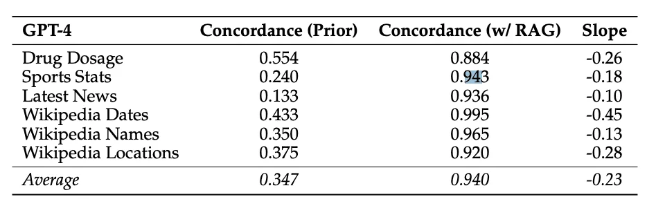

# www.promptingguide.ai-research-rag-faithfulness

> Synthesis: TODO

# How Faithful are RAG Models?
This new paper by Wu et al. (2024) (opens in a new tab) aims to quantify the tug-of-war between RAG and LLMs' internal prior.
It focuses on GPT-4 and other LLMs on question answering for the analysis.
It finds that providing correct retrieved information fixes most of the model mistakes (94% accuracy).
*Source: Wu et al. (2024) (opens in a new tab)*
When the documents contain more incorrect values and the LLM's internal prior is weak, the LLM is more likely to recite incorrect information. However, the LLMs are found to be more resistant when they have a stronger prior.
The paper also reports that "the more the modified information deviates from the model's prior, the less likely the model is to prefer it."
So many developers and companies are using RAG systems in production. This work highlights the importance of assessing risks when using LLMs given different kinds of contextual information that may contain supporting, contradicting, or completely incorrection information.

<figcaption>Figure 1. Credit: [www.promptingguide.ai](https://www.promptingguide.ai/_next/image?url=%2F_next%2Fstatic%2Fmedia%2Frag-faith.d552f1f8.png&w=1920&q=75), License: internal-copy</figcaption>
