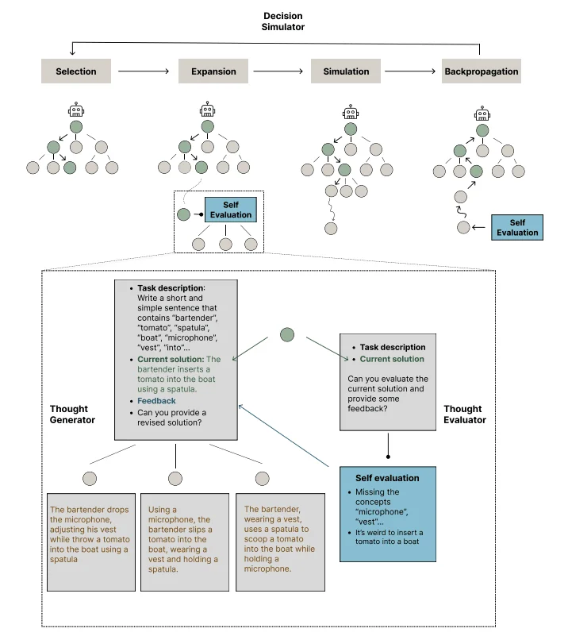

# www.promptingguide.ai-research-thoughtsculpt

> Synthesis: TODO

# Reasoning with Intermediate Revision and Search for LLMs
This work by Chi et al. (2024) (opens in a new tab) presents an approach for general reasoning and search on tasks that can be decomposed into components.
The proposed graph-based framework, THOUGHTSCULPT, incorporates iterative self-revision capabilities and allows an LLM to build an interwoven network of thoughts.
Unlike other approaches such as Tree-of-thoughts that shape the reasoning process using a tree, this new approach incorporates Monte Carlo Tree Search (MCTS) to efficiently navigate the search space.
This new method uses an LLM-powered thought evaluator to provide feedback on candidate partial outputs. Then a thought generator component produces potential solutions. The thought evaluator and thought generator are considered the expansion phase which helps with refining the current solution.
Finally, the decision simulator (which acts as part of the MCTS process) simulates consecutive lines of thought to evaluate the potential value of a path.
Due to its ability for continuous thought iteration, THOUGHTSCULPT is particularly suitable for tasks such as open-ended generation, multip-step reasoning, and creative ideation.
We might be seeing more advanced approaches that use similar concepts and search algorithms to elevate the reasoning capabilities of LLMs and the ability to tackle problems that require complex reason and planning. Great paper to keep track of this research trend.

<figcaption>Figure 1. Credit: [www.promptingguide.ai](https://www.promptingguide.ai/_next/image?url=%2F_next%2Fstatic%2Fmedia%2Fthoughtsculpt.8963b1f6.png&w=1920&q=75), License: internal-copy</figcaption>
