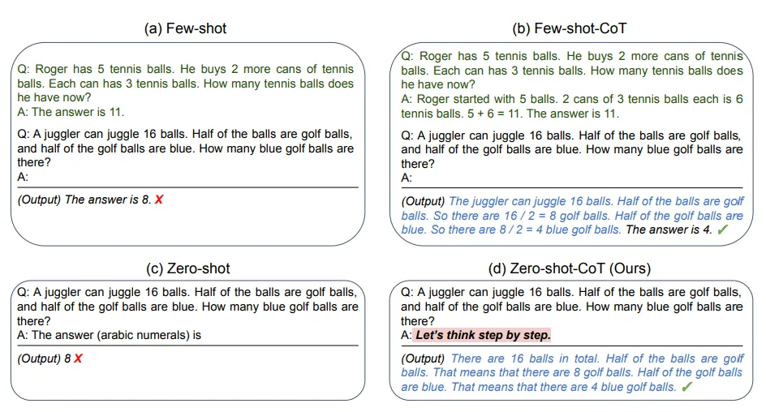
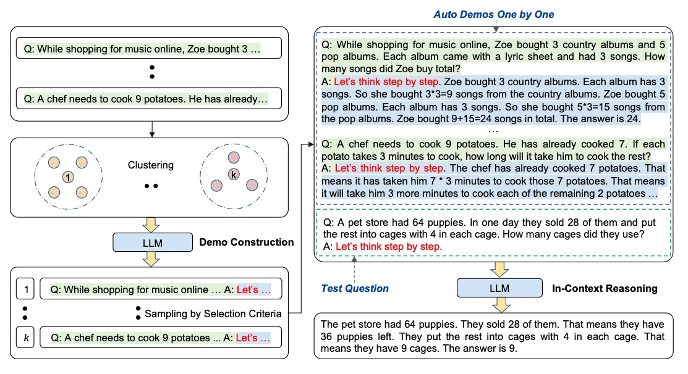

# www.promptingguide.ai-techniques-cot

> Synthesis: TODO

# Chain-of-Thought Prompting
## Chain-of-Thought (CoT) Prompting
Image Source: Wei et al. (2022) (opens in a new tab)
Introduced in Wei et al. (2022) (opens in a new tab), chain-of-thought (CoT) prompting enables complex reasoning capabilities through intermediate reasoning steps. You can combine it with few-shot prompting to get better results on more complex tasks that require reasoning before responding.
*Prompt:*
The odd numbers in this group add up to an even number: 4, 8, 9, 15, 12, 2, 1.
A: Adding all the odd numbers (9, 15, 1) gives 25. The answer is False.
The odd numbers in this group add up to an even number: 17, 10, 19, 4, 8, 12, 24.
A: Adding all the odd numbers (17, 19) gives 36. The answer is True.
The odd numbers in this group add up to an even number: 16, 11, 14, 4, 8, 13, 24.
A: Adding all the odd numbers (11, 13) gives 24. The answer is True.
The odd numbers in this group add up to an even number: 17, 9, 10, 12, 13, 4, 2.
A: Adding all the odd numbers (17, 9, 13) gives 39. The answer is False.
The odd numbers in this group add up to an even number: 15, 32, 5, 13, 82, 7, 1.
A:
*Output:*
Adding all the odd numbers (15, 5, 13, 7, 1) gives 41. The answer is False.
Wow! We can see a perfect result when we provided the reasoning step. In fact, we can solve this task by providing even fewer examples, i.e., just one example seems enough:
*Prompt:*
The odd numbers in this group add up to an even number: 4, 8, 9, 15, 12, 2, 1.
A: Adding all the odd numbers (9, 15, 1) gives 25. The answer is False.
The odd numbers in this group add up to an even number: 15, 32, 5, 13, 82, 7, 1.
A:
*Output:*
Adding all the odd numbers (15, 5, 13, 7, 1) gives 41. The answer is False.
Keep in mind that the authors claim that this is an emergent ability that arises with sufficiently large language models.
Learn more about chain-of-thought prompting and advanced prompting methods in our new AI courses. Join now! (opens in a new tab) Use code PROMPTING20 to get an extra 20% off.
## Zero-shot COT Prompting
Image Source: Kojima et al. (2022) (opens in a new tab)
One recent idea that came out more recently is the idea of zero-shot CoT (opens in a new tab) (Kojima et al. 2022) that essentially involves adding "Let's think step by step" to the original prompt. Let's try a simple problem and see how the model performs:
*Prompt:*
I went to the market and bought 10 apples. I gave 2 apples to the neighbor and 2 to the repairman. I then went and bought 5 more apples and ate 1. How many apples did I remain with?
*Output:*
11 apples
The answer is incorrect! Now Let's try with the special prompt.
*Prompt:*
I went to the market and bought 10 apples. I gave 2 apples to the neighbor and 2 to the repairman. I then went and bought 5 more apples and ate 1. How many apples did I remain with?
Let's think step by step.
*Output:*
First, you started with 10 apples.
You gave away 2 apples to the neighbor and 2 to the repairman, so you had 6 apples left.
Then you bought 5 more apples, so now you had 11 apples.
Finally, you ate 1 apple, so you would remain with 10 apples.
It's impressive that this simple prompt is effective at this task. This is particularly useful where you don't have too many examples to use in the prompt.
## Automatic Chain-of-Thought (Auto-CoT)
When applying chain-of-thought prompting with demonstrations, the process involves hand-crafting effective and diverse examples. This manual effort could lead to suboptimal solutions. Zhang et al. (2022) (opens in a new tab) propose an approach to eliminate manual efforts by leveraging LLMs with "Let's think step by step" prompt to generate reasoning chains for demonstrations one by one. This automatic process can still end up with mistakes in generated chains. To mitigate the effects of the mistakes, the diversity of demonstrations matter. This work proposes Auto-CoT, which samples questions with diversity and generates reasoning chains to construct the demonstrations.
Auto-CoT consists of two main stages:
- Stage 1):
**question clustering**: partition questions of a given dataset into a few clusters
- Stage 2):
**demonstration sampling**: select a representative question from each cluster and generate its reasoning chain using Zero-Shot-CoT with simple heuristics
The simple heuristics could be length of questions (e.g., 60 tokens) and number of steps in rationale (e.g., 5 reasoning steps). This encourages the model to use simple and accurate demonstrations.
The process is illustrated below:
Image Source: Zhang et al. (2022) (opens in a new tab)
Code for Auto-CoT is available here (opens in a new tab).

<figcaption>Figure 1. Credit: [www.promptingguide.ai](https://www.promptingguide.ai/_next/image?url=%2F_next%2Fstatic%2Fmedia%2Fcot.1933d9fe.png&w=1920&q=75), License: internal-copy</figcaption>

<figcaption>Figure 2. Credit: [www.promptingguide.ai](https://www.promptingguide.ai/_next/image?url=%2F_next%2Fstatic%2Fmedia%2Fzero-cot.79793bee.png&w=1920&q=75), License: internal-copy</figcaption>

<figcaption>Figure 3. Credit: [www.promptingguide.ai](https://www.promptingguide.ai/_next/image?url=%2F_next%2Fstatic%2Fmedia%2Fauto-cot.642d9bad.png&w=3840&q=75), License: internal-copy</figcaption>
