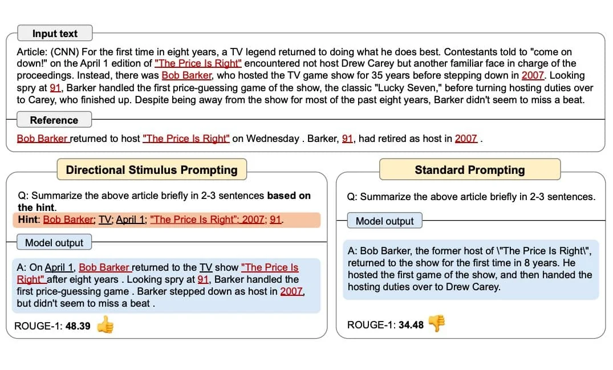

# www.promptingguide.ai-techniques-dsp

> Synthesis: TODO

# Directional Stimulus Prompting
Li et al., (2023) (opens in a new tab) proposes a new prompting technique to better guide the LLM in generating the desired summary.
A tuneable policy LM is trained to generate the stimulus/hint. Seeing more use of RL to optimize LLMs.
The figure below shows how Directional Stimulus Prompting compares with standard prompting. The policy LM can be small and optimized to generate the hints that guide a black-box frozen LLM.
Image Source: Li et al., (2023) (opens in a new tab)
Full example coming soon!
🎓
Learn more about advanced prompting methods in our new AI courses. Join now! (opens in a new tab) Use code PROMPTING20 to get an extra 20% off.

<figcaption>Figure 1. Credit: [www.promptingguide.ai](https://www.promptingguide.ai/_next/image?url=%2F_next%2Fstatic%2Fmedia%2Fdsp.27a0005f.jpeg&w=3840&q=75), License: internal-copy</figcaption>
