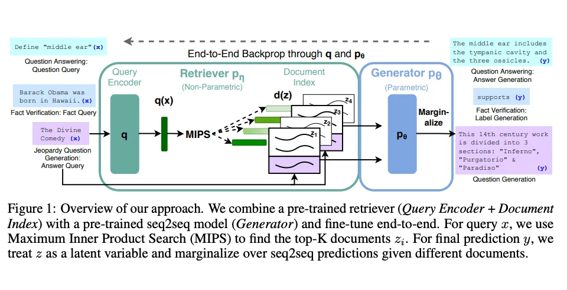

# www.promptingguide.ai-techniques-rag

> Synthesis: TODO

# Retrieval Augmented Generation (RAG)
General-purpose language models can be fine-tuned to achieve several common tasks such as sentiment analysis and named entity recognition. These tasks generally don't require additional background knowledge.
For more complex and knowledge-intensive tasks, it's possible to build a language model-based system that accesses external knowledge sources to complete tasks. This enables more factual consistency, improves reliability of the generated responses, and helps to mitigate the problem of "hallucination".
Meta AI researchers introduced a method called Retrieval Augmented Generation (RAG) (opens in a new tab) to address such knowledge-intensive tasks. RAG combines an information retrieval component with a text generator model. RAG can be fine-tuned and its internal knowledge can be modified in an efficient manner and without needing retraining of the entire model.
RAG takes an input and retrieves a set of relevant/supporting documents given a source (e.g., Wikipedia). The documents are concatenated as context with the original input prompt and fed to the text generator which produces the final output. This makes RAG adaptive for situations where facts could evolve over time. This is very useful as LLMs's parametric knowledge is static. RAG allows language models to bypass retraining, enabling access to the latest information for generating reliable outputs via retrieval-based generation.
Lewis et al., (2021) proposed a general-purpose fine-tuning recipe for RAG. A pre-trained seq2seq model is used as the parametric memory and a dense vector index of Wikipedia is used as non-parametric memory (accessed using a neural pre-trained retriever). Below is a overview of how the approach works:
Image Source: Lewis et el. (2021) (opens in a new tab)
RAG performs strong on several benchmarks such as Natural Questions (opens in a new tab), WebQuestions (opens in a new tab), and CuratedTrec. RAG generates responses that are more factual, specific, and diverse when tested on MS-MARCO and Jeopardy questions. RAG also improves results on FEVER fact verification.
This shows the potential of RAG as a viable option for enhancing outputs of language models in knowledge-intensive tasks.
More recently, these retriever-based approaches have become more popular and are combined with popular LLMs like ChatGPT to improve capabilities and factual consistency.
Learn more about RAG and related prompting techniques in our new AI courses. Join now! (opens in a new tab) Use code PROMPTING20 to get an extra 20% off.
## RAG Use Case: Generating Friendly ML Paper Titles
Below, we have prepared a notebook tutorial showcasing the use of open-source LLMs to build a RAG system for generating short and concise machine learning paper titles:

<figcaption>Figure 1. Credit: [www.promptingguide.ai](https://www.promptingguide.ai/_next/image?url=%2F_next%2Fstatic%2Fmedia%2Frag.c6528d99.png&w=1920&q=75), License: internal-copy</figcaption>
