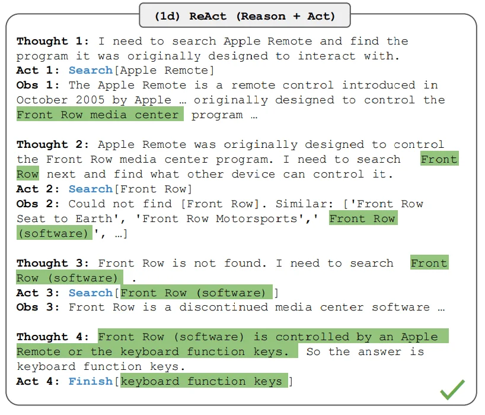
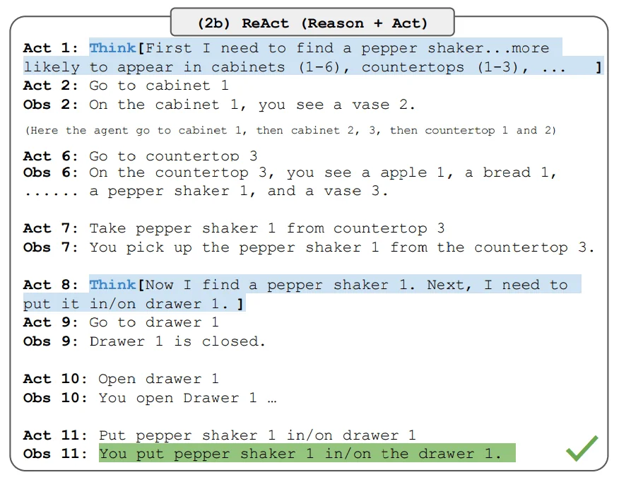

# www.promptingguide.ai-techniques-react

> Synthesis: TODO

# ReAct Prompting
Yao et al., 2022 (opens in a new tab) introduced a framework named ReAct where LLMs are used to generate both
*reasoning traces* and *task-specific actions* in an interleaved manner.
Generating reasoning traces allow the model to induce, track, and update action plans, and even handle exceptions. The action step allows to interface with and gather information from external sources such as knowledge bases or environments.
The ReAct framework can allow LLMs to interact with external tools to retrieve additional information that leads to more reliable and factual responses.
Results show that ReAct can outperform several state-of-the-art baselines on language and decision-making tasks. ReAct also leads to improved human interpretability and trustworthiness of LLMs. Overall, the authors found that best approach uses ReAct combined with chain-of-thought (CoT) that allows use of both internal knowledge and external information obtained during reasoning.
## How it Works?
ReAct is inspired by the synergies between "acting" and "reasoning" which allow humans to learn new tasks and make decisions or reasoning.
Chain-of-thought (CoT) prompting has shown the capabilities of LLMs to carry out reasoning traces to generate answers to questions involving arithmetic and commonsense reasoning, among other tasks (Wei et al., 2022) (opens in a new tab). But its lack of access to the external world or inability to update its knowledge can lead to issues like fact hallucination and error propagation.
ReAct is a general paradigm that combines reasoning and acting with LLMs. ReAct prompts LLMs to generate verbal reasoning traces and actions for a task. This allows the system to perform dynamic reasoning to create, maintain, and adjust plans for acting while also enabling interaction to external environments (e.g., Wikipedia) to incorporate additional information into the reasoning. The figure below shows an example of ReAct and the different steps involved to perform question answering.
Image Source: Yao et al., 2022 (opens in a new tab)
In the example above, we pass a prompt like the following question from HotpotQA (opens in a new tab):
Aside from the Apple Remote, what other devices can control the program Apple Remote was originally designed to interact with?
Note that in-context examples are also added to the prompt but we exclude that here for simplicity. We can see that the model generates
*task solving trajectories* (Thought, Act). Obs corresponds to observation from the environment that's being interacted with (e.g., Search engine). In essence, ReAct can retrieve information to support reasoning, while reasoning helps to target what to retrieve next.
Learn more about ReAct prompting and ReAct agents in our new AI courses. Join now! (opens in a new tab) Use code PROMPTING20 to get an extra 20% off.
## ReAct Prompting
To demonstrate how ReAct prompting works, let's follow an example from the paper.
The first step is to select cases from a training set (e.g., HotPotQA) and compose ReAct-format trajectories. These are used as few-shot exemplars in the prompts. The trajectories consist of multiple thought-action-observation steps as shown in the figure above. The free-form thoughts are used to achieve different tasks such as decomposing questions, extracting information, performing commonsense/arithmetic reasoning, guide search formulation, and synthesizing final answer.
Here is an example of what the ReAct prompt exemplars look like (obtained from the paper and shortened to one example for simplicity):
Question What is the elevation range for the area that the eastern sector of the
Colorado orogeny extends into?
Thought 1 I need to search Colorado orogeny, find the area that the eastern sector
of the Colorado orogeny extends into, then find the elevation range of the
area.
Action 1 Search[Colorado orogeny]
Observation 1 The Colorado orogeny was an episode of mountain building (an orogeny) in
Colorado and surrounding areas.
Thought 2 It does not mention the eastern sector. So I need to look up eastern
sector.
Action 2 Lookup[eastern sector]
Observation 2 (Result 1 / 1) The eastern sector extends into the High Plains and is called
the Central Plains orogeny.
Thought 3 The eastern sector of Colorado orogeny extends into the High Plains. So I
need to search High Plains and find its elevation range.
Action 3 Search[High Plains]
Observation 3 High Plains refers to one of two distinct land regions
Thought 4 I need to instead search High Plains (United States).
Action 4 Search[High Plains (United States)]
Observation 4 The High Plains are a subregion of the Great Plains. From east to west, the
High Plains rise in elevation from around 1,800 to 7,000 ft (550 to 2,130
m).[3]
Thought 5 High Plains rise in elevation from around 1,800 to 7,000 ft, so the answer
is 1,800 to 7,000 ft.
Action 5 Finish[1,800 to 7,000 ft]
...
Note that different prompts setups are used for different types of tasks. For tasks where reasoning is of primary importance (e.g., HotpotQA), multiple thought-action-observation steps are used for the task-solving trajectory. For decision making tasks involving lots of action steps, thoughts are used sparsely.
## Results on Knowledge-Intensive Tasks
The paper first evaluates ReAct on knowledge-intensive reasoning tasks such as question answering (HotPotQA) and fact verification (Fever (opens in a new tab)). PaLM-540B is used as the base model for prompting.
Image Source: Yao et al., 2022 (opens in a new tab)
The prompting results on HotPotQA and Fever using different prompting methods show that ReAct generally performs better than Act (involves acting only) on both tasks.
We can also observe that ReAct outperforms CoT on Fever and lags behind CoT on HotpotQA. A detailed error analysis is provided in the paper. In summary:
- CoT suffers from fact hallucination
- ReAct's structural constraint reduces its flexibility in formulating reasoning steps
- ReAct depends a lot on the information it's retrieving; non-informative search results derails the model reasoning and leads to difficulty in recovering and reformulating thoughts
Prompting methods that combine and support switching between ReAct and CoT+Self-Consistency generally outperform all the other prompting methods.
## Results on Decision Making Tasks
The paper also reports results demonstrating ReAct's performance on decision making tasks. ReAct is evaluated on two benchmarks called ALFWorld (opens in a new tab) (text-based game) and WebShop (opens in a new tab) (online shopping website environment). Both involve complex environments that require reasoning to act and explore effectively.
Note that the ReAct prompts are designed differently for these tasks while still keeping the same core idea of combining reasoning and acting. Below is an example for an ALFWorld problem involving ReAct prompting.
Image Source: Yao et al., 2022 (opens in a new tab)
ReAct outperforms Act on both ALFWorld and Webshop. Act, without any thoughts, fails to correctly decompose goals into subgoals. Reasoning seems to be advantageous in ReAct for these types of tasks but current prompting-based methods are still far from the performance of expert humans on these tasks.
Check out the paper for more detailed results.
## LangChain ReAct Usage
Below is a high-level example of how the ReAct prompting approach works in practice. We will be using OpenAI for the LLM and LangChain (opens in a new tab) as it already has built-in functionality that leverages the ReAct framework to build agents that perform tasks by combining the power of LLMs and different tools.
First, let's install and import the necessary libraries:
%%capture
# update or install the necessary libraries
!pip install --upgrade openai
!pip install --upgrade langchain
!pip install --upgrade python-dotenv
!pip install google-search-results
# import libraries
import openai
import os
from langchain.llms import OpenAI
from langchain.agents import load_tools
from langchain.agents import initialize_agent
from dotenv import load_dotenv
load_dotenv()
# load API keys; you will need to obtain these if you haven't yet
os.environ["OPENAI_API_KEY"] = os.getenv("OPENAI_API_KEY")
os.environ["SERPER_API_KEY"] = os.getenv("SERPER_API_KEY")
Now we can configure the LLM, the tools we will use, and the agent that allows us to leverage the ReAct framework together with the LLM and tools. Note that we are using a search API for searching external information and LLM as a math tool.
llm = OpenAI(model_name="text-davinci-003" ,temperature=0)
tools = load_tools(["google-serper", "llm-math"], llm=llm)
agent = initialize_agent(tools, llm, agent="zero-shot-react-description", verbose=True)
Once that's configured, we can now run the agent with the desired query/prompt. Notice that here we are not expected to provide few-shot exemplars as explained in the paper.
agent.run("Who is Olivia Wilde's boyfriend? What is his current age raised to the 0.23 power?")
The chain execution looks as follows:
> Entering new AgentExecutor chain...
I need to find out who Olivia Wilde's boyfriend is and then calculate his age raised to the 0.23 power.
Action: Search
Action Input: "Olivia Wilde boyfriend"
Observation: Olivia Wilde started dating Harry Styles after ending her years-long engagement to Jason Sudeikis — see their relationship timeline.
Thought: I need to find out Harry Styles' age.
Action: Search
Action Input: "Harry Styles age"
Observation: 29 years
Thought: I need to calculate 29 raised to the 0.23 power.
Action: Calculator
Action Input: 29^0.23
Observation: Answer: 2.169459462491557
Thought: I now know the final answer.
Final Answer: Harry Styles, Olivia Wilde's boyfriend, is 29 years old and his age raised to the 0.23 power is 2.169459462491557.
> Finished chain.
The output we get is as follows:
"Harry Styles, Olivia Wilde's boyfriend, is 29 years old and his age raised to the 0.23 power is 2.169459462491557."
We adapted the example from the LangChain documentation (opens in a new tab), so credit goes to them. We encourage the learner to explore different combination of tools and tasks.
You can find the notebook for this code here: https://github.com/dair-ai/Prompt-Engineering-Guide/blob/main/notebooks/react.ipynb (opens in a new tab)
Learn more about ReAct prompting and ReAct agents in our new AI courses. Join now! (opens in a new tab) Use code PROMPTING20 to get an extra 20% off.

<figcaption>Figure 1. Credit: [www.promptingguide.ai](https://www.promptingguide.ai/_next/image?url=%2F_next%2Fstatic%2Fmedia%2Freact.8e7c93ae.png&w=1920&q=75), License: internal-copy</figcaption>

<figcaption>Figure 2. Credit: [www.promptingguide.ai](https://www.promptingguide.ai/_next/image?url=%2F_next%2Fstatic%2Fmedia%2Ftable1.e25bc12b.png&w=1920&q=75), License: internal-copy</figcaption>

<figcaption>Figure 3. Credit: [www.promptingguide.ai](https://www.promptingguide.ai/_next/image?url=%2F_next%2Fstatic%2Fmedia%2Falfworld.da30656d.png&w=1920&q=75), License: internal-copy</figcaption>
