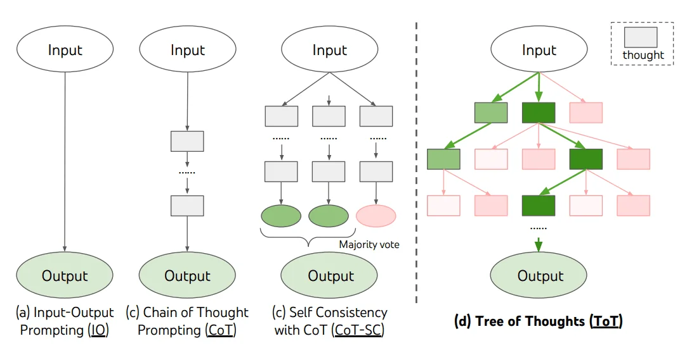
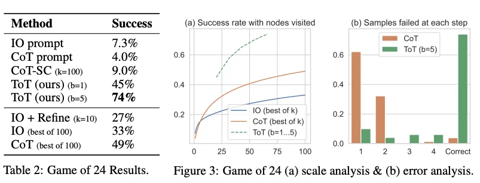

# www.promptingguide.ai-techniques-tot

> Synthesis: TODO

# Tree of Thoughts (ToT)
For complex tasks that require exploration or strategic lookahead, traditional or simple prompting techniques fall short. Yao et el. (2023) (opens in a new tab) and Long (2023) (opens in a new tab) recently proposed Tree of Thoughts (ToT), a framework that generalizes over chain-of-thought prompting and encourages exploration over thoughts that serve as intermediate steps for general problem solving with language models.
ToT maintains a tree of thoughts, where thoughts represent coherent language sequences that serve as intermediate steps toward solving a problem. This approach enables an LM to self-evaluate the progress through intermediate thoughts made towards solving a problem through a deliberate reasoning process. The LM's ability to generate and evaluate thoughts is then combined with search algorithms (e.g., breadth-first search and depth-first search) to enable systematic exploration of thoughts with lookahead and backtracking.
The ToT framework is illustrated below:
Image Source: Yao et el. (2023) (opens in a new tab)
When using ToT, different tasks requires defining the number of candidates and the number of thoughts/steps. For instance, as demonstrated in the paper, Game of 24 is used as a mathematical reasoning task which requires decomposing the thoughts into 3 steps, each involving an intermediate equation. At each step, the best b=5 candidates are kept.
To perform BFS in ToT for the Game of 24 task, the LM is prompted to evaluate each thought candidate as "sure/maybe/impossible" with regard to reaching 24. As stated by the authors, "the aim is to promote correct partial solutions that can be verdicted within few lookahead trials, and eliminate impossible partial solutions based on "too big/small" commonsense, and keep the rest "maybe"". Values are sampled 3 times for each thought. The process is illustrated below:
Image Source: Yao et el. (2023) (opens in a new tab)
From the results reported in the figure below, ToT substantially outperforms the other prompting methods:
Image Source: Yao et el. (2023) (opens in a new tab)
Code available here (opens in a new tab) and here (opens in a new tab)
At a high level, the main ideas of Yao et el. (2023) (opens in a new tab) and Long (2023) (opens in a new tab) are similar. Both enhance LLM's capability for complex problem solving through tree search via a multi-round conversation. One of the main difference is that Yao et el. (2023) (opens in a new tab) leverages DFS/BFS/beam search, while the tree search strategy (i.e. when to backtrack and backtracking by how many levels, etc.) proposed in Long (2023) (opens in a new tab) is driven by a "ToT Controller" trained through reinforcement learning. DFS/BFS/Beam search are generic solution search strategies with no adaptation to specific problems. In comparison, a ToT Controller trained through RL might be able learn from new data set or through self-play (AlphaGo vs brute force search), and hence the RL-based ToT system can continue to evolve and learn new knowledge even with a fixed LLM.
Hulbert (2023) (opens in a new tab) has proposed Tree-of-Thought Prompting, which applies the main concept from ToT frameworks as a simple prompting technique, getting the LLM to evaluate intermediate thoughts in a single prompt. A sample ToT prompt is:
Imagine three different experts are answering this question.
All experts will write down 1 step of their thinking,
then share it with the group.
Then all experts will go on to the next step, etc.
If any expert realises they're wrong at any point then they leave.
The question is...
Sun (2023) (opens in a new tab) benchmarked the Tree-of-Thought Prompting with large-scale experiments, and introduce PanelGPT --- an idea of prompting with Panel discussions among LLMs.
Learn more about advanced prompting methods in our new AI courses. Join now! (opens in a new tab) Use code PROMPTING20 to get an extra 20% off.

<figcaption>Figure 1. Credit: [www.promptingguide.ai](https://www.promptingguide.ai/_next/image?url=%2F_next%2Fstatic%2Fmedia%2FTOT.3b13bc5e.png&w=3840&q=75), License: internal-copy</figcaption>

<figcaption>Figure 2. Credit: [www.promptingguide.ai](https://www.promptingguide.ai/_next/image?url=%2F_next%2Fstatic%2Fmedia%2FTOT2.9eb8f0f9.png&w=1920&q=75), License: internal-copy</figcaption>

<figcaption>Figure 3. Credit: [www.promptingguide.ai](https://www.promptingguide.ai/_next/image?url=%2F_next%2Fstatic%2Fmedia%2FTOT3.bf83699e.png&w=1920&q=75), License: internal-copy</figcaption>
